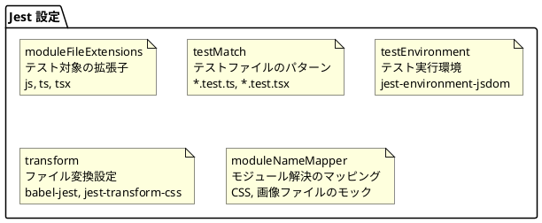
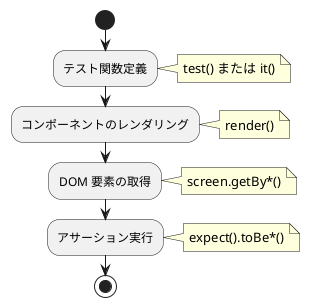

# 第20章: 単体テスト

本章では、React アプリケーションの単体テストについて解説します。Jest と Testing Library を使用したコンポーネントテストの設定と実装パターンを説明します。

## 20.1 テスト環境の構成

### 技術スタック

| パッケージ | バージョン | 用途 |
|-----------|-----------|------|
| jest | 29.7 | テストランナー |
| ts-jest | 29.2 | TypeScript サポート |
| jest-environment-jsdom | 29.7 | DOM 環境シミュレーション |
| @testing-library/react | 16.0 | React コンポーネントテスト |
| @testing-library/jest-dom | 6.5 | DOM アサーション拡張 |
| @testing-library/user-event | 14.5 | ユーザー操作シミュレーション |
| identity-obj-proxy | 3.0 | CSS モジュールモック |

### テスト実行

```bash
# 全テスト実行
npm test

# 特定ファイルのテスト
npm test -- --testPathPattern=App.test.tsx
```

## 20.2 Jest 設定

### jest.config.cjs

```javascript
module.exports = {
    moduleFileExtensions: [
        "js",
        "ts",
        "tsx"
    ],
    testMatch: [
        "**/src/**/*.test.ts",
        "**/src/**/*.test.tsx"
    ],
    roots: [
        "<rootDir>/src"
    ],
    preset: "ts-jest",
    testEnvironment: "jest-environment-jsdom",
    transform: {
        '^.+\\.jsx?$': 'babel-jest',
        '^.+\\.tsx?$': 'babel-jest',
        '\\.css$': 'jest-transform-css',
    },
    moduleNameMapper: {
        '\\.(css|scss)$': 'identity-obj-proxy',
        "\\.(gif|ttf|eot|svg|png)$": "<rootDir>/test/__mocks__/fileMock.js",
    },
};
```

### 設定項目の解説



### Babel 設定

Jest は Babel を使用して TypeScript と JSX をトランスパイルします。

```javascript
// babel.config.js (暗黙的に使用)
module.exports = {
    presets: [
        '@babel/preset-env',
        '@babel/preset-react',
        '@babel/preset-typescript'
    ]
};
```

### package.json のテスト関連設定

```json
{
  "scripts": {
    "test": "jest"
  },
  "devDependencies": {
    "@babel/preset-env": "^7.25.7",
    "@babel/preset-react": "^7.25.7",
    "@babel/preset-typescript": "^7.25.7",
    "@testing-library/jest-dom": "^6.5.0",
    "@testing-library/react": "^16.0.1",
    "@testing-library/user-event": "^14.5.2",
    "@types/jest": "^29.5.13",
    "identity-obj-proxy": "^3.0.0",
    "jest": "^29.7.0",
    "jest-dom": "^4.0.0",
    "jest-environment-jsdom": "^29.7.0",
    "jest-transform-css": "^6.0.1",
    "ts-jest": "^29.2.5"
  }
}
```

## 20.3 コンポーネントテスト

### 基本的なテスト構造

```typescript
// App.test.tsx
import React from 'react';
import '@testing-library/jest-dom'
import {render, screen} from '@testing-library/react';
import {MemoryRouter} from 'react-router-dom';
import App from './App.tsx';

test('renders login page', () => {
    render(
        <MemoryRouter initialEntries={['/']}>
            <App/>
        </MemoryRouter>
    );

    expect(screen.getByText('SMS')).toBeInTheDocument();
});
```

### テスト構造の解説



### Testing Library のインポート

```typescript
// 必須インポート
import '@testing-library/jest-dom'  // DOM マッチャー拡張
import {render, screen} from '@testing-library/react';

// ユーザー操作テスト用
import userEvent from '@testing-library/user-event';

// ルーティングが必要な場合
import {MemoryRouter} from 'react-router-dom';
```

## 20.4 render と screen

### render 関数

コンポーネントを仮想 DOM にレンダリングします。

```typescript
// 基本的な使用法
render(<MyComponent />);

// プロバイダーでラップする場合
render(
    <MemoryRouter>
        <App />
    </MemoryRouter>
);

// 複数のプロバイダー
render(
    <MemoryRouter initialEntries={['/dashboard']}>
        <AuthProvider>
            <App />
        </AuthProvider>
    </MemoryRouter>
);
```

### MemoryRouter の使用

React Router を使用するコンポーネントのテストには `MemoryRouter` が必要です。

```typescript
import {MemoryRouter} from 'react-router-dom';

// 特定のパスでテスト
render(
    <MemoryRouter initialEntries={['/login']}>
        <App />
    </MemoryRouter>
);

// 複数のエントリ（履歴をシミュレート）
render(
    <MemoryRouter initialEntries={['/home', '/dashboard']} initialIndex={1}>
        <App />
    </MemoryRouter>
);
```

### screen オブジェクト

レンダリングされた DOM にアクセスするためのクエリを提供します。

```typescript
// テキストで検索
screen.getByText('ログイン');

// ロールで検索
screen.getByRole('button', { name: '送信' });

// テストIDで検索
screen.getByTestId('submit-button');

// ラベルで検索
screen.getByLabelText('ユーザー名');

// プレースホルダーで検索
screen.getByPlaceholderText('検索...');
```

### クエリの種類

| プレフィックス | 要素がない場合 | 複数要素 | 用途 |
|--------------|--------------|---------|------|
| getBy | エラー | エラー | 確実に存在する要素 |
| queryBy | null | エラー | 存在しないことを確認 |
| findBy | エラー | エラー | 非同期で出現する要素 |
| getAllBy | エラー | 配列 | 複数の要素 |
| queryAllBy | [] | 配列 | 存在しない可能性 |
| findAllBy | エラー | 配列 | 非同期で複数出現 |

## 20.5 アサーション

### jest-dom マッチャー

```typescript
// 要素の存在
expect(element).toBeInTheDocument();
expect(element).not.toBeInTheDocument();

// 可視性
expect(element).toBeVisible();
expect(element).not.toBeVisible();

// テキスト内容
expect(element).toHaveTextContent('期待するテキスト');

// フォーム要素
expect(input).toHaveValue('入力値');
expect(checkbox).toBeChecked();
expect(button).toBeDisabled();
expect(button).toBeEnabled();

// クラス
expect(element).toHaveClass('active');

// 属性
expect(element).toHaveAttribute('href', '/home');
```

### 基本的な Jest マッチャー

```typescript
// 等値比較
expect(value).toBe(expectedValue);
expect(object).toEqual(expectedObject);

// 真偽値
expect(condition).toBeTruthy();
expect(condition).toBeFalsy();

// 配列
expect(array).toContain(item);
expect(array).toHaveLength(3);

// 例外
expect(() => throwingFunction()).toThrow();
```

## 20.6 fireEvent と userEvent

### fireEvent

低レベルの DOM イベントをトリガーします。

```typescript
import {fireEvent, render, screen} from '@testing-library/react';

test('click event', () => {
    render(<Button onClick={handleClick} />);

    fireEvent.click(screen.getByRole('button'));
});

test('input change', () => {
    render(<Input />);

    fireEvent.change(screen.getByRole('textbox'), {
        target: { value: '新しい値' }
    });
});
```

### userEvent

より現実的なユーザー操作をシミュレートします。

```typescript
import userEvent from '@testing-library/user-event';

test('typing text', async () => {
    const user = userEvent.setup();
    render(<Input />);

    await user.type(screen.getByRole('textbox'), 'Hello');
});

test('clicking button', async () => {
    const user = userEvent.setup();
    render(<Button />);

    await user.click(screen.getByRole('button'));
});

test('selecting option', async () => {
    const user = userEvent.setup();
    render(<Select />);

    await user.selectOptions(screen.getByRole('combobox'), 'option1');
});
```

### fireEvent vs userEvent

| 観点 | fireEvent | userEvent |
|-----|-----------|-----------|
| 実行速度 | 高速 | 相対的に遅い |
| 現実性 | 単一イベント | 連続イベント |
| フォーカス | 自動処理なし | 自動処理あり |
| 推奨度 | 単純なケース | 複雑な操作 |

## 20.7 非同期テスト

### findBy クエリ

非同期で出現する要素を待機します。

```typescript
test('async element appears', async () => {
    render(<AsyncComponent />);

    // 要素が出現するまで待機
    const element = await screen.findByText('読み込み完了');
    expect(element).toBeInTheDocument();
});
```

### waitFor

条件が満たされるまで待機します。

```typescript
import {waitFor} from '@testing-library/react';

test('async state update', async () => {
    render(<AsyncComponent />);

    await waitFor(() => {
        expect(screen.getByText('更新済み')).toBeInTheDocument();
    });
});
```

### act

React の状態更新をラップします。

```typescript
import {act} from '@testing-library/react';

test('state update', async () => {
    render(<Counter />);

    await act(async () => {
        fireEvent.click(screen.getByRole('button'));
    });

    expect(screen.getByText('1')).toBeInTheDocument();
});
```

## 20.8 カスタムフックテスト

### renderHook

カスタムフックを単独でテストします。

```typescript
import {renderHook, act} from '@testing-library/react';

test('useCounter hook', () => {
    const {result} = renderHook(() => useCounter());

    expect(result.current.count).toBe(0);

    act(() => {
        result.current.increment();
    });

    expect(result.current.count).toBe(1);
});
```

### Provider でラップ

Context を使用するフックのテスト。

```typescript
test('hook with context', () => {
    const wrapper = ({children}) => (
        <SomeProvider>
            {children}
        </SomeProvider>
    );

    const {result} = renderHook(() => useCustomHook(), {wrapper});

    expect(result.current.value).toBeDefined();
});
```

## 20.9 モック

### 関数モック

```typescript
const mockFn = jest.fn();

test('callback is called', () => {
    render(<Button onClick={mockFn} />);

    fireEvent.click(screen.getByRole('button'));

    expect(mockFn).toHaveBeenCalled();
    expect(mockFn).toHaveBeenCalledTimes(1);
});
```

### モジュールモック

```typescript
// サービスのモック
jest.mock('../services/api', () => ({
    fetchData: jest.fn().mockResolvedValue({data: 'mocked'})
}));

test('uses mocked service', async () => {
    render(<DataComponent />);

    await screen.findByText('mocked');
});
```

### CSS モジュールのモック

`identity-obj-proxy` が CSS モジュールをモックします。

```javascript
// jest.config.cjs
moduleNameMapper: {
    '\\.(css|scss)$': 'identity-obj-proxy',
}
```

## 20.10 テストパターン

### コンポーネントテストの構造

```typescript
describe('MyComponent', () => {
    // セットアップ
    beforeEach(() => {
        jest.clearAllMocks();
    });

    // 基本的なレンダリング
    test('renders correctly', () => {
        render(<MyComponent />);
        expect(screen.getByRole('heading')).toBeInTheDocument();
    });

    // プロップスのテスト
    describe('with props', () => {
        test('displays title', () => {
            render(<MyComponent title="テスト" />);
            expect(screen.getByText('テスト')).toBeInTheDocument();
        });
    });

    // イベントハンドラのテスト
    describe('user interactions', () => {
        test('handles click', async () => {
            const handleClick = jest.fn();
            render(<MyComponent onClick={handleClick} />);

            await userEvent.click(screen.getByRole('button'));

            expect(handleClick).toHaveBeenCalled();
        });
    });
});
```

### テストファイルの配置

```
src/
├── components/
│   ├── Button.tsx
│   └── Button.test.tsx     # コンポーネントと同階層
├── hooks/
│   ├── useAuth.ts
│   └── useAuth.test.ts     # フックと同階層
└── App.tsx
    └── App.test.tsx
```

## まとめ

本章では、単体テストの実装について解説しました。

- **Jest 設定**: ts-jest、jsdom 環境、モジュールマッパー
- **render / screen**: コンポーネントのレンダリングと DOM クエリ
- **アサーション**: jest-dom による DOM 固有のマッチャー
- **ユーザー操作**: fireEvent と userEvent の使い分け
- **非同期テスト**: findBy、waitFor、act
- **カスタムフック**: renderHook によるフックテスト

次章では、Cypress による E2E テストについて詳しく解説します。
