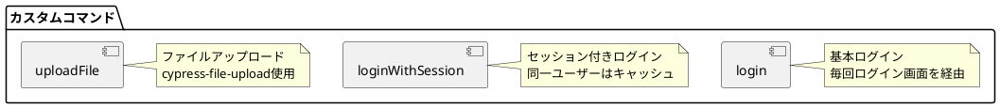
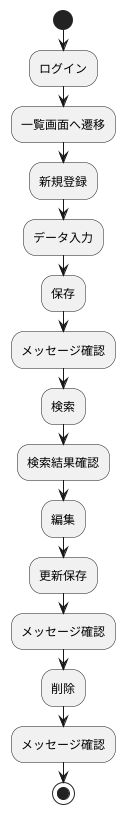
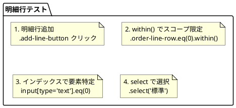
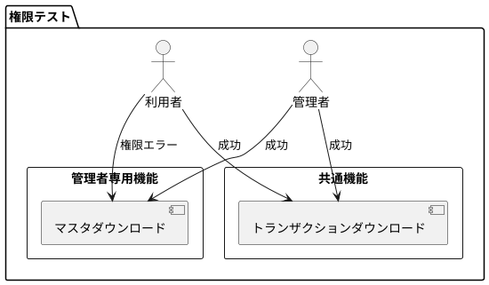

# 第21章: E2E テスト

本章では、Cypress を使用した E2E（End-to-End）テストの実装について解説します。実際のユーザー操作をシミュレートしたテストを通じて、アプリケーション全体の動作検証パターンを説明します。

## 21.1 テスト環境の構成

### 技術スタック

| パッケージ | バージョン | 用途 |
|-----------|-----------|------|
| cypress | 14.5 | E2E テストフレームワーク |
| cypress-file-upload | 5.0 | ファイルアップロードテスト |
| allure-cypress | 3.0 | テストレポート生成 |

### テスト実行コマンド

```bash
# Cypress UI を開く
npm run cypress:open

# ヘッドレスモードで実行
npm run cypress:run
```

### package.json の設定

```json
{
  "scripts": {
    "cypress:open": "cypress open",
    "cypress:run": "cypress run"
  }
}
```

## 21.2 Cypress 設定

### cypress.config.cjs

```javascript
const { allureCypress } = require("allure-cypress/reporter");

module.exports = {
  e2e: {
    setupNodeEvents(on, config) {
      allureCypress(on, config, {
        resultsDir: "allure-results",
      });
      return config;
    },
  },
  viewportWidth: 1920,
  viewportHeight: 1080,
};
```

### 設定項目

| 項目 | 設定値 | 説明 |
|-----|-------|------|
| viewportWidth | 1920 | ブラウザ幅 |
| viewportHeight | 1080 | ブラウザ高さ |
| resultsDir | allure-results | レポート出力先 |

## 21.3 サポートファイル

### e2e.js

グローバル設定とカスタムコマンドのインポートを行います。

```javascript
// cypress/support/e2e.js
import './commands.js'
import "allure-cypress";

// ログインコマンド
Cypress.Commands.add('login', (username, password) => {
    cy.visit('http://127.0.0.1:5173/login');
    cy.get('#userId').clear();
    cy.get('#userId').type(username);
    cy.get('#password').clear();
    cy.get('#password').type(password);
    cy.get('#login').click();
});

// セッション付きログインコマンド
Cypress.Commands.add('loginWithSession', (username, password) => {
    cy.session(
        username,
        () => {
            cy.visit('http://127.0.0.1:5173/login');
            cy.get('#userId').clear();
            cy.get('#userId').type(username);
            cy.get('#password').clear();
            cy.get('#password').type(password);
            cy.get('#login').click();

            cy.contains('HOME').should('be.visible');
        }
    )
});
```

### commands.js

カスタムコマンドを定義します。

```javascript
// cypress/support/commands.js
import 'cypress-file-upload';

// ファイルアップロードコマンド
Cypress.Commands.add('uploadFile', (selector, fileName, fileType = '') => {
    cy.get(selector).attachFile({
        filePath: fileName,
        mimeType: fileType
    });
});
```

### カスタムコマンドの構造



## 21.4 テストファイル構成

### ディレクトリ構造

```
cypress/
├── e2e/
│   ├── master/                    # マスタ管理テスト
│   │   ├── account/
│   │   │   └── Account.cy.js
│   │   ├── code/
│   │   │   └── Region.cy.js
│   │   ├── department/
│   │   │   └── Department.cy.js
│   │   ├── employee/
│   │   │   └── Employee.cy.js
│   │   ├── inventory/
│   │   │   ├── Warehouse.cy.js
│   │   │   └── LocationNumber.cy.js
│   │   ├── partner/
│   │   │   ├── Customer.cy.js
│   │   │   ├── Partner.cy.js
│   │   │   ├── PartnerCategory.cy.js
│   │   │   ├── PartnerGroup.cy.js
│   │   │   └── Vendor.cy.js
│   │   └── product/
│   │       ├── ProductCategory.cy.js
│   │       └── ProductItem.cy.js
│   ├── sales/                     # 販売管理テスト
│   │   ├── invoice/
│   │   │   ├── Invoice.cy.js
│   │   │   └── InvoiceAggregation.cy.js
│   │   ├── order/
│   │   │   ├── Order.cy.js
│   │   │   ├── OrderRule.cy.js
│   │   │   └── OrderUpload.cy.js
│   │   ├── payment/
│   │   │   └── Payment.cy.js
│   │   ├── sales/
│   │   │   ├── Sales.cy.js
│   │   │   └── SalesAggregation.cy.js
│   │   └── shipping/
│   │       ├── Shipping.cy.js
│   │       ├── ShippingConfirmation.cy.js
│   │       └── ShippingOrder.cy.js
│   ├── procurement/               # 調達管理テスト
│   │   ├── order/
│   │   │   ├── PurchaseOrder.cy.js
│   │   │   ├── PurchaseOrderRule.cy.js
│   │   │   └── PurchaseOrderUpload.cy.js
│   │   ├── payment/
│   │   │   └── PurchasePayment.cy.js
│   │   └── purchase/
│   │       ├── Purchase.cy.js
│   │       └── PurchaseRule.cy.js
│   ├── inventory/                 # 在庫管理テスト
│   │   ├── Inventory.cy.js
│   │   ├── InventoryRule.cy.js
│   │   └── InventoryUpload.cy.js
│   └── system/                    # システム機能テスト
│       ├── Auth.cy.js
│       ├── Download.cy.js
│       └── User.cy.js
├── fixtures/                      # テストデータ
└── support/
    ├── commands.js
    └── e2e.js
```

## 21.5 マスタ管理テスト

### 基本的な CRUD テスト構造

```javascript
// cypress/e2e/master/department/Department.cy.js
describe('部門管理', () => {
    beforeEach(() => {
        cy.login('U000003', 'a234567Z');
    })

    // ページ遷移ヘルパー
    const userPage = () => {
        cy.get('#side-nav-menu > :nth-child(1) > :nth-child(4) > .nav-sub-list > :nth-child(1) > #side-nav-department-nav').click();
    }

    context('部門一覧', () => {
        it('部門一覧の表示', () => {
            userPage();
            cy.get('.collection-view-container').should('be.visible');
        });
    });

    context('部門新規登録', () => {
        it('新規登録', () => {
            userPage();
            cy.get('#new').click();
            cy.get('#deptCode').type('99999');
            cy.get('#deptName').type('テスト');
            cy.get('#startDate').type('2021-01-01');
            cy.get('#endDate').type('9999-12-31');
            cy.get('#layer').type('0');
            cy.get('#path').type('99999~');
            cy.get(':nth-child(7) > .single-view-content-item-form-radios > :nth-child(1)').click();
            cy.get(':nth-child(8) > .single-view-content-item-form-radios > :nth-child(1)').click();
            cy.get('#save').click();

            cy.get('#message').contains('部門を作成しました。');
        });
    });

    context('部門検索', () => {
        it('検索', () => {
            userPage();
            cy.get('#search').click();
            cy.get('#search-department-code').type('99999');
            cy.wait(1000);
            cy.get('#search-all').click();
            cy.get(':nth-child(3) > .collection-object-item-content-name').contains('テスト');
        });
    })

    context('部門登録情報編集', () => {
        it('登録情報編集', () => {
            userPage();
            cy.get('#search').click();
            cy.get('#search-department-code').type('99999');
            cy.wait(1000);
            cy.get('#search-all').click();
            cy.wait(1000);
            cy.get('#edit').click();
            cy.get('#deptName').clear();
            cy.get('#deptName').type('テスト更新');
            cy.get('#save').click();

            cy.get('#message').contains('部門を更新しました。');
        });
    });

    context('部門削除', () => {
        it('削除', () => {
            userPage();
            cy.get('#search').click();
            cy.get('#search-department-code').type('99999');
            cy.wait(1000);
            cy.get('#search-all').click();
            cy.wait(1000);
            cy.get('#delete').click();
            cy.get('#message').contains('部門を削除しました。');
        })
    });
});
```

### テストフロー



## 21.6 販売管理テスト

### 受注テスト

明細行を含む複雑なフォームのテストパターンです。

```javascript
// cypress/e2e/sales/order/Order.cy.js
describe('受注管理', () => {
    context('管理者', () => {
        beforeEach(() => {
            cy.login('U000003', 'a234567Z');
        })

        const userPage = () => {
            cy.get('#side-nav-menu > :nth-child(1) > :nth-child(3) > :nth-child(1) > .nav-sub-list > :nth-child(1) > #side-nav-product-nav').click();
        }

        context('受注新規登録', () => {
            it('新規登録', () => {
                userPage();

                // 受注新規画面を開く
                cy.get('#new').click();

                // ヘッダ情報を入力
                cy.get('#orderNumber').type('OD00000009');
                cy.get('#orderDate').type('2024-01-01');
                cy.get('#departmentCode').type('10000');
                // モーダルから選択
                cy.get('.collection-object-container-modal > .collection-object-list > :nth-child(1) > .collection-object-item-actions > .action-button').click();
                cy.get('#customerCode').type('001');
                cy.get(':nth-child(1) > .collection-object-item-actions > #select-customer').click();

                // 明細行を追加
                cy.get('.add-line-button').click();

                // 明細行のデータを入力
                cy.get('.order-line-row').eq(0).within(() => {
                    cy.get('input[type="text"]').eq(0).type('P0001');
                    cy.get('input[type="text"]').eq(1).type('テスト商品');
                    cy.get('input[type="number"]').eq(0).type('1000');
                    cy.get('input[type="number"]').eq(1).type('2');
                    cy.get(':nth-child(5) > .table-input').select('標準');
                    cy.get(':nth-child(9) > .table-input').select('未完了');
                    cy.get(':nth-child(11) > .table-input').type('2024-02-01T12:00');
                });

                // 受注を保存
                cy.get('#save').click();

                // 作成完了メッセージの確認
                cy.get('#message').contains('受注を作成しました。');
            });
        });
    });

    // 利用者権限でのテスト
    context('利用者', () => {
        beforeEach(() => {
            cy.login('U000001', 'a234567Z');
        })

        // 同様のテストを利用者権限で実行
    });
});
```

### 明細行テストのポイント



## 21.7 在庫管理テスト

### 複合キーエンティティのテスト

```javascript
// cypress/e2e/inventory/Inventory.cy.js
describe('在庫管理', () => {
    context('管理者', () => {
        beforeEach(() => {
            cy.login('U000003', 'a234567Z');
        })

        const inventoryPage = () => {
            cy.get('#side-nav-menu > :nth-child(1) > :nth-child(3) > :nth-child(3) > .nav-sub-list > :nth-child(1) > #side-nav-inventory-nav').click();
        }

        context('在庫新規登録', () => {
            it('新規登録', () => {
                inventoryPage();

                cy.get('#new').click();

                // モーダルから倉庫を選択
                cy.get('#warehouseCode').click();
                cy.get(':nth-child(1) > .collection-object-item-actions > #select-warehouse').click();

                // モーダルから商品を選択
                cy.get('#productCode').click()
                cy.get(':nth-child(1) > .collection-object-item-actions > #select-product').click();

                // その他の入力
                cy.get('#lotNumber').type('LOT001');
                cy.get('#stockCategory').select('通常在庫');
                cy.get('#qualityCategory').select('良品');
                cy.get('#actualStockQuantity').type('100');
                cy.get('#availableStockQuantity').type('95');
                cy.get('#lastShipmentDate').type('2024-01-15');

                cy.get('#save').click();
                cy.get('#message').contains('在庫データを登録しました。');
            });
        });

        context('在庫検索', () => {
            it('倉庫コードでの検索', () => {
                inventoryPage();
                cy.get('#search').click();
                cy.get('#search-warehouse-code').click();
                cy.get(':nth-child(1) > .collection-object-item-actions > #select-warehouse').click();
                cy.wait(1000);
                cy.get('#search-all').click();
                cy.get('.collection-object-item-content-name').contains('W01');
            });

            it('在庫区分での検索', () => {
                inventoryPage();
                cy.get('#search').click();
                cy.get('#search-stock-category').select('通常在庫');
                cy.wait(1000);
                cy.get('#search-all').click();
                cy.get('.collection-view-container').should('be.visible');
            });
        });
    });
});
```

## 21.8 システム機能テスト

### ダウンロードテスト

権限による動作の違いをテストします。

```javascript
// cypress/e2e/system/Download.cy.js
describe('アプリケーションデータダウンロード', () => {
    describe('管理者', () => {
        beforeEach(() => {
            cy.login('U000003', 'a234567Z');
        })

        const userPage = () => {
            cy.get('#side-nav-menu > :nth-child(1) > :nth-child(2) > .nav-sub-list > .nav-sub-item > #side-nav-download-nav').click();
        }

        it('ダウンロード画面の表示', () => {
            userPage();
            cy.get('.single-view-container').should('be.visible');
        });

        it('部門データダウンロード', () => {
            userPage();
            cy.get('#downloadTarget').select('部門');
            cy.get('#download').click();
            cy.get('#message').contains('部門 データをダウンロードしました。');
        });

        // 他のダウンロード対象も同様にテスト
    });

    describe('利用者', () => {
        beforeEach(() => {
            cy.login('U000001', 'a234567Z');
        })

        const userPage = () => {
            cy.get('#side-nav-menu > :nth-child(1) > :nth-child(2) > .nav-sub-list > .nav-sub-item > #side-nav-download-nav').click();
        }

        // 管理者権限が必要なダウンロードはエラーになる
        it('部門データダウンロード（権限エラー）', () => {
            userPage();
            cy.get('#downloadTarget').select('部門');
            cy.get('#download').click();
            cy.get('#message').contains('ダウンロードに失敗しました: 権限がありません');
        });

        // 一般ユーザーでもダウンロード可能なデータ
        it('受注データダウンロード', () => {
            userPage();
            cy.get('#downloadTarget').select('受注');
            cy.get('#download').click();
            cy.get('#message').contains('受注 データをダウンロードしました。');
        });
    });
});
```

### 権限テストパターン



## 21.9 テストパターン

### ページ遷移ヘルパー

```javascript
// 各テストスイートで定義
const navigateToPage = () => {
    cy.get('#side-nav-menu > ...')
      .click();
}
```

### モーダルからの選択

```javascript
// 選択モーダルを開く
cy.get('#selectButton').click();

// モーダル内から項目を選択
cy.get(':nth-child(1) > .collection-object-item-actions > #select-item').click();
```

### フォーム入力

```javascript
// テキスト入力
cy.get('#fieldName').type('値');

// クリアしてから入力
cy.get('#fieldName').clear().type('新しい値');

// セレクトボックス
cy.get('#selectField').select('オプション値');

// 日付入力
cy.get('#dateField').type('2024-01-01');

// 日時入力
cy.get('#datetimeField').type('2024-01-01T12:00');
```

### 待機処理

```javascript
// 固定時間待機（非推奨だが確実）
cy.wait(1000);

// 要素が表示されるまで待機
cy.get('#element').should('be.visible');

// テキストが表示されるまで待機
cy.contains('期待するテキスト').should('be.visible');
```

### アサーション

```javascript
// 要素の存在
cy.get('.container').should('be.visible');
cy.get('.container').should('not.exist');

// テキスト内容
cy.get('#message').contains('成功しました');
cy.get('#message').should('have.text', '完全一致テキスト');

// 属性
cy.get('input').should('have.value', '入力値');
cy.get('button').should('be.disabled');
```

## 21.10 ベストプラクティス

### テストの独立性

```javascript
describe('機能テスト', () => {
    // 各テストの前にログイン
    beforeEach(() => {
        cy.login('U000003', 'a234567Z');
    });

    // テストデータの作成と削除を1つのテストで完結
    it('CRUD テスト', () => {
        // Create
        // ...

        // Read / Search
        // ...

        // Update
        // ...

        // Delete（クリーンアップ）
        // ...
    });
});
```

### セレクタの選び方

| 優先度 | セレクタ | 例 |
|-------|--------|-----|
| 1 | id | `#save` |
| 2 | data-testid | `[data-testid="submit"]` |
| 3 | クラス | `.action-button` |
| 4 | nth-child | `:nth-child(1)` |

### テストの命名

```javascript
describe('機能名', () => {
    context('コンテキスト（状態や条件）', () => {
        it('期待する動作', () => {
            // テストコード
        });
    });
});
```

## まとめ

本章では、E2E テストの実装について解説しました。

- **Cypress 設定**: viewportサイズ、Allure レポート
- **カスタムコマンド**: login、loginWithSession、uploadFile
- **テスト構造**: describe/context/it のネスト
- **マスタテスト**: CRUD 操作の一貫したパターン
- **販売テスト**: 明細行を含む複雑なフォーム
- **権限テスト**: 管理者/利用者での動作の違い

E2E テストにより、アプリケーション全体の動作を実際のユーザー操作に近い形で検証できます。
