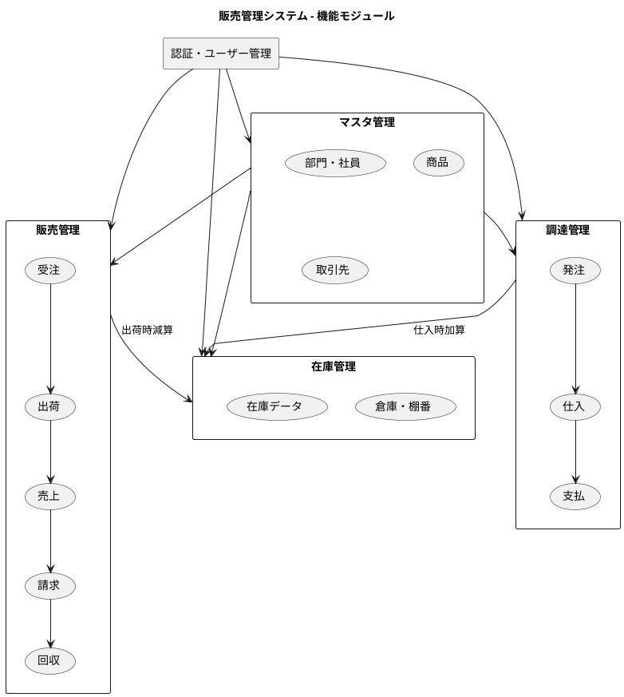

# 販売管理システムのケーススタディ（Java版）

Java + Spring Boot によるエンタープライズアプリケーション開発

---

## 本書について

本書は、13ヶ月間の実際の開発プロジェクトを題材に、販売管理システムの設計・実装・テスト・運用までを体系的に解説します。エクストリームプログラミング（XP）とテスト駆動開発（TDD）を実践しながら、貧血ドメインモデルからリッチドメインモデルへの進化過程を追体験できます。

### 対象読者

- Java による Web アプリケーション開発経験者
- エンタープライズシステム開発に興味のあるエンジニア
- TDD/XP を実践したい開発者
- ドメイン駆動設計（DDD）を学びたいエンジニア

---

## 目次

### 第1部: 導入と基盤

| 章 | タイトル | 概要 |
|----|---------|------|
| [第1章](chapter01.md) | プロジェクト概要 | 販売管理システムの業務概要、システム全体像、開発手法 |
| [第2章](chapter02.md) | 開発環境の構築 | 技術スタックの選定、バックエンド・フロントエンド環境、CI/CD |
| [第3章](chapter03.md) | アーキテクチャ設計 | レイヤードアーキテクチャ、依存関係、パッケージ構造 |

### 第2部: データモデリング

| 章 | タイトル | 概要 |
|----|---------|------|
| [第4章](chapter04.md) | データモデル設計の基礎 | ER モデリング、全体データモデル、JIG-ERD |
| [第5章](chapter05.md) | マスタデータモデル | 組織・商品・取引先・在庫関連マスタ |
| [第6章](chapter06.md) | トランザクションデータモデル | 販売・調達・在庫トランザクション |
| [第7章](chapter07.md) | ドメインモデルとデータモデルの対応 | 貧血からリッチモデルへ、MyBatis マッピング |
| [第8章](chapter08.md) | ドメインに適したデータの作成 | テストデータ設計、テストフィクスチャ |

### 第3部: マスタ管理機能

| 章 | タイトル | 概要 |
|----|---------|------|
| [第9章](chapter09.md) | 認証・ユーザー管理 | 認証ユースケース、Spring Security、JWT |
| [第10章](chapter10.md) | 部門・社員マスタ | 階層構造、CRUD 操作、React コンポーネント |
| [第11章](chapter11.md) | 商品マスタ | 商品分類、顧客別販売単価、バリデーション |
| [第12章](chapter12.md) | 取引先管理 | パーティモデル、顧客・仕入先マスタ |

### 第4部: 販売管理機能

| 章 | タイトル | 概要 |
|----|---------|------|
| [第13章](chapter13.md) | 受注管理 | 受注ワークフロー、受注ルール、CSV インポート |
| [第14章](chapter14.md) | 出荷・売上管理 | 出荷指示、売上計上、ドメインモデル改善 |
| [第15章](chapter15.md) | 請求・回収管理 | 請求データ生成、入金管理、消込処理 |

### 第5部: 調達管理機能

| 章 | タイトル | 概要 |
|----|---------|------|
| [第16章](chapter16.md) | 発注管理 | 発注ワークフロー、ドメインイベント、明細管理 |
| [第17章](chapter17.md) | 仕入・支払管理 | 仕入管理、支払管理、リファクタリング |

### 第6部: 在庫管理機能

| 章 | タイトル | 概要 |
|----|---------|------|
| [第18章](chapter18.md) | 在庫管理 | 倉庫・棚番マスタ、在庫データ、在庫ルール |

### 第7部: 品質とリファクタリング

| 章 | タイトル | 概要 |
|----|---------|------|
| [第19章](chapter19.md) | テスト戦略 | テストピラミッド、TestContainer、受け入れテスト |
| [第20章](chapter20.md) | 継続的リファクタリング | 値オブジェクト、メソッド抽出、ドメインサービス |
| [第21章](chapter21.md) | アーキテクチャの検証 | ArchUnit、JIG、品質メトリクス |

### 第8部: 運用と発展

| 章 | タイトル | 概要 |
|----|---------|------|
| [第22章](chapter22.md) | 非機能要件 | 実行履歴管理、データダウンロード機能 |
| [第23章](chapter23.md) | リリース管理 | バージョニング、CI/CD、JIG アーカイブ |
| [第24章](chapter24.md) | 今後の展望 | 機能拡張、アーキテクチャ進化、AI/ML 統合 |

---

## 技術スタック

| カテゴリ | 技術 |
|---------|------|
| 言語 | Java 25 |
| フレームワーク | Spring Boot 3.x |
| ORM | MyBatis |
| ビルド | Gradle |
| フロントエンド | React + TypeScript |
| ビルドツール | Vite |
| テスト | JUnit 5, Cypress |
| ドキュメント | JIG, JIG-ERD |
| 品質管理 | SonarQube, ArchUnit |

---

## システム概要図

---

## 開発タイムライン

| フェーズ | 期間 | 主な成果物 |
|---------|------|-----------|
| Phase 1 | 2024-10-02 〜 2024-10-10 | 環境構築 |
| Phase 2 | 2024-10-12 〜 2024-11-05 | マスタ管理 |
| Phase 3 | 2025-01 〜 2025-01-31 | 取引先管理 |
| Phase 4 | 2025-02 〜 2025-04 | 受注管理 |
| Phase 5 | 2025-05 〜 2025-08 | 発注管理 |
| Phase 6 | 2025-08-23 〜 2025-09-22 | 在庫管理 |
| Phase 7 | 2025-09 | 出荷・売上管理 |
| Phase 8 | 2025-10-28 〜 2025-11-01 | 仕入・支払管理 |
| Phase 9 | 2025-11-04 〜 2025-11-28 | ドキュメント整備 |

---

## 関連リソース

- [アウトライン](outline.md) - 本書の詳細なアウトライン
- [GitHub リポジトリ](https://github.com/k2works/case-study-sales) - ソースコード

---

## 本書のポイント

1. **実践ベース** - 13ヶ月の実際の開発プロジェクトを題材に、実践的なノウハウを提供
2. **データモデリング重視** - ER 設計からドメインモデルへの対応まで体系的に解説
3. **段階的な成長** - 貧血ドメインモデルからリッチドメインモデルへの進化過程を追体験
4. **テスト重視** - TDD の実践例を豊富に掲載
5. **XP プラクティス** - 小さなコミット、継続的リファクタリングの実践
6. **ツール活用** - JIG、JIG-ERD、ArchUnit など Java エコシステムのツールを紹介
