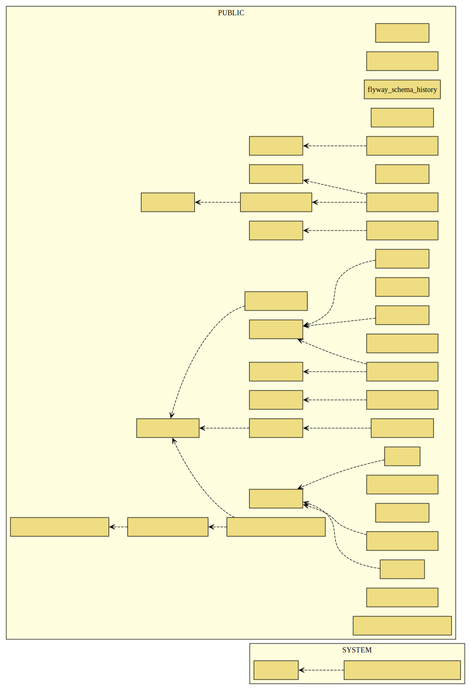

:toc: left
:toclevels: 5
:sectnums:
:stem:
:source-highlighter: coderay

# 開発

## ユースケース

### 認証

[plantuml]
----
@startuml
left to right direction
actor "ユーザー" as member
actor "管理者" as admin
rectangle ユーザー認証 {
  usecase "管理者を認証する" as UC1
  usecase "ユーザーを認証する" as UC2
}
admin --> UC1
member --> UC2
@enduml
----

### ユーザー管理

[plantuml]
----
@startuml
left to right direction
actor "管理者" as admin
rectangle ユーザー管理 {
    usecase "ユーザー一覧を取得する" as UC1
    usecase "ユーザーを新規登録する" as UC2
    usecase "ユーザーを取得する" as UC3
    usecase "登録済みユーザーを更新登録する" as UC4
    usecase "登録済みユーザーを削除する" as UC5
}
admin --> UC1
admin --> UC2
admin --> UC3
admin --> UC4
admin --> UC5
@enduml
----

## 仕様

### 認証

[source,yml]
----
include::./assets/system/Auth.feature[]
----

### ユーザー管理

[source,yml]
----
include::./assets/system/User.feature[]
----

## アーキテクチャ

[plantuml]
----
@startuml
title: Apiアーキテクチャ

package "プレゼンテーション層" as UI {
	class Controller
}

package "サービス層" as APP{
	class Service
}

package "インフラストラクチャ層" as IF {
	class DataSource
}

package "ドメイン層" as DOMAIN{
    package "Model" as MODEL {
        class User
        class Auth
    }
}

database データベース as DB {

}

UI ---> APP
Service -> MODEL
APP ---> IF
DataSource --> DB

@endtuml
----

[source,java]
----
include::./assets/ArchitectureRuleTest.java[]
----

## データモデル

## ドメインモデル

image::./images/business-rule-relation.svg[]

## ユーザーインターフェース

### ビュー

#### 認証

[plantuml]
----
@startsalt
{+
  ログイン画面
  {+
    {
      [  ログイン   ]
      ---------------------
      ユーザーID    | "MyName   "
      パスワード | "****     "
    }
  }
----------------
  ホーム画面
  {+
  {
  ホーム
  ログアウト
  } |
  {
    {
      <b>お知らせ
    }
    ---------------------
    {
        2020/01/01 お知らせ内容
        2020/01/02 お知らせ内容
        2020/01/03 お知らせ内容
    }
  }
  }
}
@endsalt
----

#### ユーザー管理

[plantuml]
----
@startsalt
{+
  ユーザー管理画面（コレクション）
  {+
  {
  ホーム
  ユーザー
  ログアウト
  } |
  {
    {
      <b>ユーザー一覧</b>
    }
    [  新規登録  ]
    ---------------------
    {
      Uxxxxxx | User1    | [  編集  ] | [  削除  ]
      Uxxxxxx | User2    | [  編集  ] | [  削除  ]
      Uxxxxxx | User3    | [  編集  ] | [  削除  ]
    }
  }
  }
  ----------------
    ユーザー管理画面（シングル）
    {+
        {
        [  保存   ]
        ---------------------
        ユーザーID    | "Uxxxxxx"   "
        姓           | "MyName   "
        名           | "MyName   "
        パスワード | "****     "
        役割       | ^Admin     ^^User    ^
        }
    }
}
@endsalt
----

### モデル

#### 認証

[plantuml]
----
@startuml
  class ログイン {
    ユーザーID
    パスワード
    ログイン()
  }

  class ホーム {
    お知らせ
  }

  class ナビゲーション {
    ホーム()
    ログアウト()
  }

  ナビゲーション -* ホーム
@enduml
----

#### ユーザー管理

[plantuml]
----
@startuml
  class ユーザー一覧 {
    新規作成()
    編集()
    削除()
  }

  class ユーザー {
    ユーザーID
    パスワード
    役割
    姓
    名
    保存()
  }

  class ナビゲーション {
    ホーム()
    ユーザー()
    ログアウト()
  }

  ユーザー一覧 *-- ユーザー
  ナビゲーション -* ユーザー一覧
@enduml
----

### インタラクション

#### 認証

[plantuml]
----
@startuml
  ログイン_シングル --> ホーム_シングル
  ホーム_シングル --> ログイン_シングル
@enduml
----

#### ユーザー管理

[plantuml]
----
@startuml
  ログイン_シングル --> ユーザー_コレクション
    ユーザー_コレクション --> ユーザー_シングル
    ユーザー_シングル --> ユーザー_コレクション
  ログイン_シングル <-- ユーザー_コレクション
@enduml
----
