# 販売管理システム 開発履歴

## 概要

本ドキュメントは、販売管理システム（case-study-sales）の開発履歴を時系列でまとめたものです。
docs/journal の作業記録をもとに、開発フェーズ、実装機能、技術的な変遷を整理しています。

## 開発期間

| 項目 | 日付 |
|------|------|
| 開始日 | 2024-10-02 |
| 最新更新 | 2025-11-28 |
| 総開発期間 | 約13ヶ月 |

## 技術スタック

### バックエンド
- **言語**: Java 25
- **フレームワーク**: Spring Boot
- **ORM**: MyBatis
- **データベース**: H2（開発）/ MySQL / PostgreSQL（本番）
- **ビルドツール**: Gradle

### フロントエンド
- **フレームワーク**: React + TypeScript
- **ビルドツール**: Vite
- **UIライブラリ**: React Tabs, React Modal

### 開発手法
- テスト駆動開発（TDD）
- エクストリームプログラミング（XP）
- 継続的インテグレーション（CI/CD）

---

## 開発タイムライン

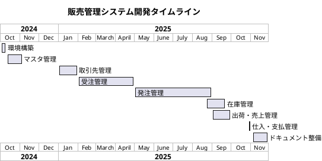

---

## 開発フェーズ詳細

### Phase 1: 環境構築とセットアップ（2024-10-02 〜 2024-10-10）

#### 概要
プロジェクトの基盤となる開発環境を構築。フロントエンド・バックエンド両方の初期セットアップを実施。

#### 主な作業内容
- Vite + React + TypeScript によるフロントエンド環境構築
- Spring Boot によるバックエンド API 環境構築
- ESLint、Gradle などの開発ツール設定
- CI/CD パイプラインの初期構築

#### 代表的なコミット
| コミット | 日付 | 内容 |
|----------|------|------|
| `e7d06554` | 2024-10-02 | build: フロントエンドセットアップ |

#### 成果物
- フロントエンド基盤（React + TypeScript + Vite）
- バックエンド基盤（Spring Boot + Gradle）
- 開発環境設定ファイル群

---

### Phase 2: マスタ管理機能開発（2024-10-12 〜 2024-11-05）

#### 概要
システムの基盤となるマスタデータ管理機能を実装。部門、社員、ユーザー、商品の CRUD 機能を開発。

#### 主な作業内容
- 部門マスタ管理（階層構造対応）
- 社員マスタ管理（部門割当、従業員詳細情報）
- ユーザー管理機能
- 商品マスタ管理（顧客別販売単価対応）

#### アーキテクチャ
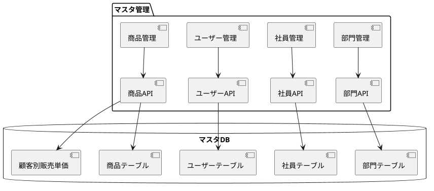

#### 代表的なコミット
| コミット | 日付 | 内容 |
|----------|------|------|
| `b1913fcb` | 2024-10-21 | feat: 部門・社員（フロントエンド実装開始） |
| `7e3b42dd` | 2024-11-01 | feat: 部門・社員（従業員詳細情報拡張） |
| `8274ac90` | 2024-11-01 | feat: 部門・社員（API 従業員管理追加） |
| `dac9fa60` | 2024-11-05 | feat: 商品（顧客別販売単価対応） |

#### 技術的なポイント
- 貧血ドメインモデルでの初期実装
- MyBatis による柔軟なデータアクセス
- React コンポーネントの段階的構築

---

### Phase 3: 取引先管理システム開発（2025-01 〜 2025-01-31）

#### 概要
顧客と仕入先を統合した取引先管理システムを構築。パーティモデルを採用し、同一組織が複数の役割を持てる設計を実装。

#### 主な作業内容
- 取引先グループ管理
- 取引先分類管理
- 地域マスタ管理
- 取引先マスタ（顧客・仕入先統合）
- 顧客マスタ管理
- 仕入先マスタ管理

#### データモデル
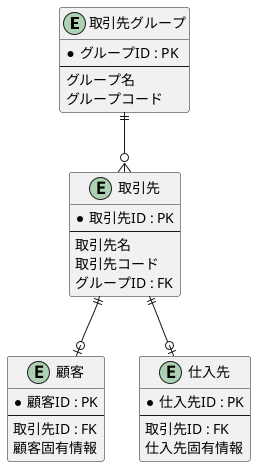

#### 代表的なコミット
| コミット | 日付 | 内容 |
|----------|------|------|
| `c8107799` | 2025-01-31 | docs: TODO（パートナー管理 API/UI 完了マーク） |

#### 成果物
- 取引先管理 API（CRUD 完全実装）
- 取引先管理 UI
- パーティモデルによる柔軟な組織管理

---

### Phase 4: 受注管理システム開発（2025-02 〜 2025-04）

#### 概要
販売プロセスの入口となる受注管理機能を実装。受注から売上計上までのワークフローを構築。

#### 主な作業内容
- 受注一覧・検索・登録・編集・削除
- 受注明細管理
- 受注ステータス管理
- 受注ルール設定

#### ワークフロー
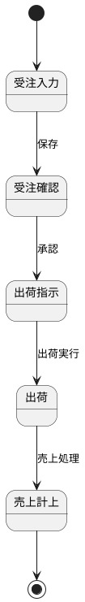

---

### Phase 5: 発注管理システム開発（2025-05 〜 2025-08）

#### 概要
調達プロセスの中核となる発注管理機能を実装。仕入先への発注から入荷までのワークフローを構築。

#### 主な作業内容
- 発注一覧・検索・登録・編集・削除
- 発注ダウンロード機能
- 発注ステータス管理
- ドメインイベントパターンの実装
- ナビゲーションへの調達セクション追加

#### アーキテクチャ改善
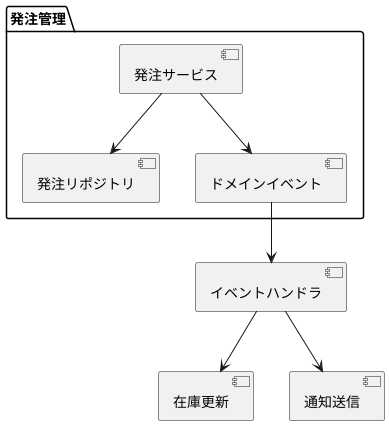

#### 代表的なコミット
| コミット | 日付 | 内容 |
|----------|------|------|
| - | 2025-08-23 | feat: ナビゲーションに調達セクション追加 |
| - | 2025-09-06 | refactor: 発注管理 |

---

### Phase 6: 在庫管理システム開発（2025-08-23 〜 2025-09-22）

#### 概要
倉庫・棚番を含む包括的な在庫管理システムを実装。在庫の追跡、管理、レポーティング機能を構築。

#### 主な作業内容
- 在庫一覧・検索・登録・編集・削除
- 在庫ダウンロード/アップロード機能
- 倉庫マスタ管理
- 棚番管理
- 在庫ルール設定
- E2E テスト実装

#### データモデル
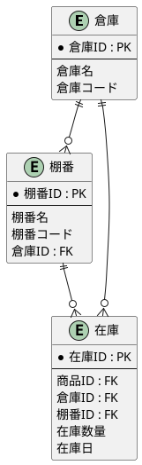

#### 代表的なコミット
| 日付 | 内容 |
|------|------|
| 2025-09-19 | feat: 在庫管理（段階的実装） |
| 2025-09-20 | feat/test/refactor: 在庫管理 |
| 2025-09-22 | feat: 倉庫管理 |

#### 技術的なポイント
- ドメインモデルの参照から値への変更
- CSV インポート/エクスポート機能
- Cypress による E2E テスト

---

### Phase 7: 出荷・売上管理システム開発（2025-09）

#### 概要
受注から出荷、売上計上までの一連のプロセスを管理する機能を実装。

#### 主な作業内容
- 出荷管理機能
- 売上計上管理
- 参照から値への変更によるドメインモデル改善
- E2E テスト実装

#### ワークフロー
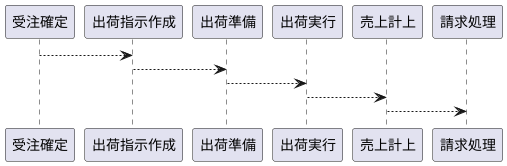

---

### Phase 8: 仕入・支払管理システム開発（2025-10-28 〜 2025-11-01）

#### 概要
**最も集中的な開発期間**。4日間で100以上のコミットを実施し、仕入から支払までの調達プロセス後半を完成。

#### 主な作業内容
- 仕入一覧・検索・登録・編集・削除
- 仕入ステータス管理
- 支払管理・支払実績
- ダウンロード機能
- 広範なテスト実装（単体・統合・E2E）
- メソッド抽出によるリファクタリング

#### コミット統計
| 日付 | コミット数 | 主な作業 |
|------|-----------|----------|
| 2025-10-28 | 30+ | 仕入/支払管理基盤実装 |
| 2025-10-29 | 40+ | 機能拡張、テスト実装 |
| 2025-10-30 | 30+ | バグ修正、リファクタリング |
| 2025-10-31 | 10+ | テスト追加 |
| 2025-11-01 | 10+ | 最終調整、品質向上 |

#### 代表的なコミット
| コミット | 日付 | 内容 |
|----------|------|------|
| `74c99f63` | 2025-11-01 | refactor: 仕入/支払管理 |
| `5abf5a6c` | 2025-11-01 | feat: 仕入/支払管理 |

---

### Phase 9: ドキュメント整備と環境改善（2025-11-04 〜 2025-11-28）

#### 概要
Java 25 対応、ビルドツールの最新化、ドキュメント構成の大幅な見直しを実施。

#### 主な作業内容
- Java 25 アップデート対応
- ビルドツール・プラグインの最新化
  - JIG プラグイン: 2025.10.1
  - ArchUnit: 1.4.1
  - SonarQube プラグイン: 7.0.1.6134
- ドキュメント構成の大幅リファイン
- DevContainer 環境の整備
- 発注管理のユースケース・モデル・UI 仕様追加

#### 代表的なコミット
| コミット | 日付 | 内容 |
|----------|------|------|
| `fabc718a` | 2025-11-04 | fix: ArchUnit を 1.4.1 にアップデート |
| `f751e491` | 2025-11-05 | fix: SonarQube プラグイン更新 |
| `bd8a1ea9` | 2025-11-28 | docs: ドキュメント構成と内容を大幅リファイン |
| `e23b06e9` | 2025-11-28 | docs: 発注管理のユースケース・モデル・UI 仕様を追加 |

---

## 実装機能一覧

| 機能モジュール | 実装期間 | ステータス | 備考 |
|---------------|----------|-----------|------|
| 環境構築 | 2024-10-02 〜 2024-10-10 | 完了 | フロントエンド・バックエンド基盤 |
| 部門管理 | 2024-10-12 〜 2024-11-01 | 完了 | 階層構造対応 |
| 社員管理 | 2024-10-12 〜 2024-11-01 | 完了 | 部門割当、詳細情報 |
| ユーザー管理 | 2024-10-15 〜 2024-11-01 | 完了 | 認証・認可 |
| 商品管理 | 2024-11-05 〜 | 完了 | 顧客別販売単価対応 |
| 取引先管理 | 2025-01 〜 2025-01-31 | 完了 | パーティモデル採用 |
| 受注管理 | 2025-02 〜 2025-04 | 完了 | ワークフロー対応 |
| 発注管理 | 2025-05 〜 2025-08 | 完了 | ドメインイベント実装 |
| 在庫管理 | 2025-08-23 〜 2025-09-22 | 完了 | 倉庫・棚番管理含む |
| 出荷・売上管理 | 2025-09 | 完了 | 受注連携 |
| 仕入・支払管理 | 2025-10-28 〜 2025-11-01 | 完了 | 集中開発 |

---

## 開発パターンと特徴

### 1. 段階的な機能展開
各モジュールは独立して開発され、段階的に統合。モジュール間の依存関係を最小化し、並行開発を可能に。

### 2. テスト重視
TDD アプローチに従い、各フェーズで以下のテストを実装：
- 単体テスト（ドメイン層、サービス層）
- 統合テスト（API 層）
- E2E テスト（Cypress）

### 3. 継続的リファクタリング
ドメインモデルの段階的改善：
- 貧血ドメインモデル → リッチドメインモデル
- 参照 → 値オブジェクトへの変更
- メソッド抽出による複雑度低減

### 4. 密集的なコミット
特に仕入/支払管理フェーズでは1日に30以上のコミットを実施。
小さな変更を頻繁にコミットする XP のプラクティスを徹底。

### 5. ドキュメント同期
機能実装と同時に以下を更新：
- UI 仕様書
- ユースケース定義
- データモデル定義
- API 仕様

---

## 今後の展望

### 短期目標
- 残存する TODO タスクの完了
- テストカバレッジの向上
- パフォーマンス最適化

### 中期目標
- レポーティング機能の強化
- ダッシュボード実装
- モバイル対応

### 長期目標
- マイクロサービス化の検討
- AI/ML による需要予測機能
- 外部システム連携の拡充

---

## リリースバージョン履歴

本プロジェクトでは各マイルストーンごとにリリースバージョンを作成し、JIG および JIG-ERD によるアーキテクチャドキュメントをアーカイブしています。

| バージョン | リリース日 | 主な内容 |
|-----------|-----------|---------|
| v0.1.0 | 2025-04 | 初期リリース（基盤構築、認証機能） |
| v0.2.0 | 2025-04 | マスタ管理（部門・社員） |
| v0.3.0 | 2025-04 | マスタ管理（商品） |
| v0.4.0 | 2025-04 | 取引先管理 |
| v0.5.0 | 2025-04 | 受注管理（基盤） |
| v0.6.0 | 2025-04 | 受注管理（完成） |
| v0.7.0 | 2025-06 | 発注管理 |
| v0.8.0 | 2025-09 | 出荷・売上管理 |
| v0.9.0 | 2025-09 | 在庫管理（基盤） |
| v0.10.0 | 2025-09 | 在庫管理（完成） |
| v0.11.0 | 2025-11 | 仕入・支払管理 |

### リリース成果物

各バージョンには以下のアーカイブが含まれています：

```
docs/assets/release/
├── v0_1_0/
│   ├── jig/           # アプリケーション構造分析
│   │   ├── application.html    # サービスメソッド一覧
│   │   ├── architecture.svg    # アーキテクチャ図
│   │   ├── business-rule.xlsx  # ビジネスルール一覧
│   │   ├── composite-usecase.svg   # ユースケース複合図
│   │   ├── domain.html         # ドメインモデル一覧
│   │   └── term.html           # 用語集
│   └── jig-erd/       # ER図
│       ├── library-er-overview.svg   # 概要ER図
│       ├── library-er-summary.svg    # サマリーER図
│       └── library-er-detail.svg     # 詳細ER図
├── v0_2_0/
│   └── ...
└── v0_11_0/
    └── ...
```

### リリース手順

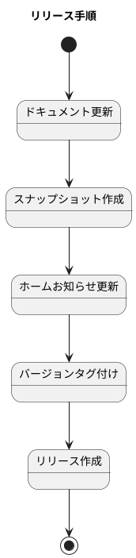

**チェックリスト：**
1. ドキュメントの更新（ユースケース、ドメインモデル、データモデル、UI）
2. スナップショットの作成（JIG/JIG-ERD アーカイブ）
3. バージョンタグ付け
4. リリースの作成

---

## ユースケース定義

本システムのユースケースは `docs/dev.adoc` に定義されています。

### 主要ユースケース一覧

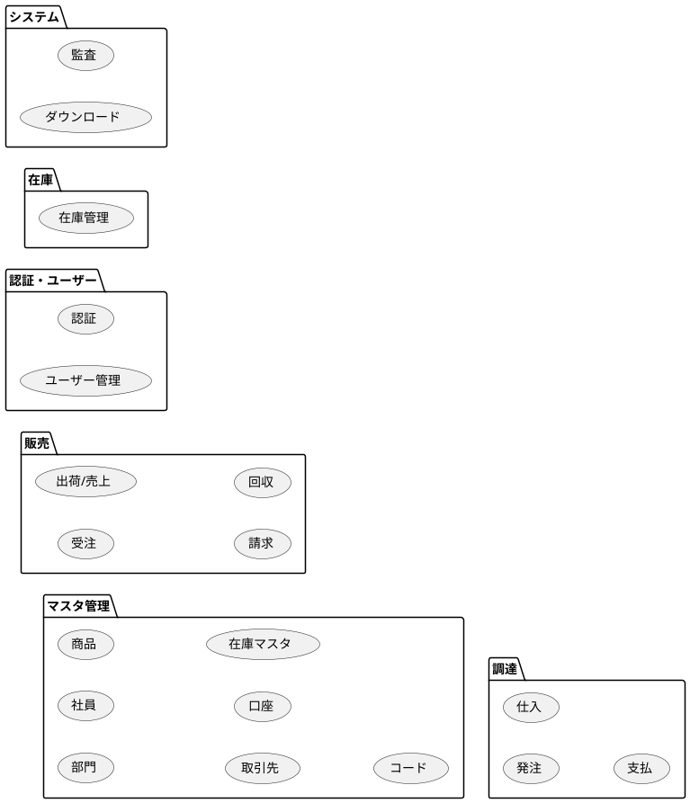

詳細なユースケース定義は以下のファイルを参照してください：
- **ユースケース図・仕様**: `docs/dev.adoc`
- **Gherkin 仕様**: `docs/assets/` 配下の各 `.feature` ファイル

---

## 開発環境構築

開発環境の構築手順は `docs/build.adoc` に詳細に記載されています。

### セットアップ概要

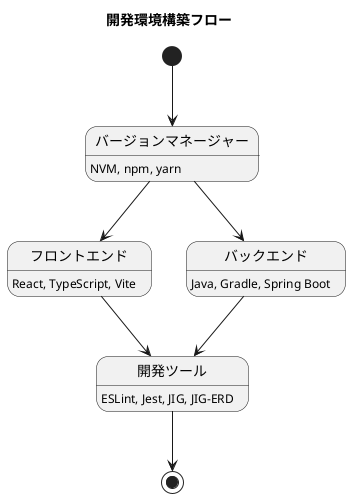

### フロントエンド環境

| ツール | 説明 |
|-------|------|
| NVM | Node.js バージョン管理 |
| Vite | 高速ビルドツール |
| React | UI フレームワーク |
| TypeScript | 型安全な JavaScript |
| Jest | テストフレームワーク |
| Cypress | E2E テストフレームワーク |

### バックエンド環境

| ツール | 説明 |
|-------|------|
| Java 25 | プログラミング言語 |
| Gradle | ビルドツール |
| Spring Boot | アプリケーションフレームワーク |
| MyBatis | O/R マッパー |
| Flyway | データベースマイグレーション |
| JIG | アーキテクチャドキュメント生成 |
| JIG-ERD | ER 図自動生成 |

詳細な構築手順は `docs/build.adoc` を参照してください。

---

## 開発ドキュメント

### アーキテクチャ

本システムのアーキテクチャ設計は以下のドキュメントに記載されています：

- **アーキテクチャ概要**: `docs/wiki/開発/アーキテクチャ.md`
- **開発手法**: `docs/wiki/開発/XP.md`, `docs/wiki/開発/アジャイル開発.md`
- **アプリケーション開発手順**: `docs/wiki/開発/アプリケーション開発手順.md`

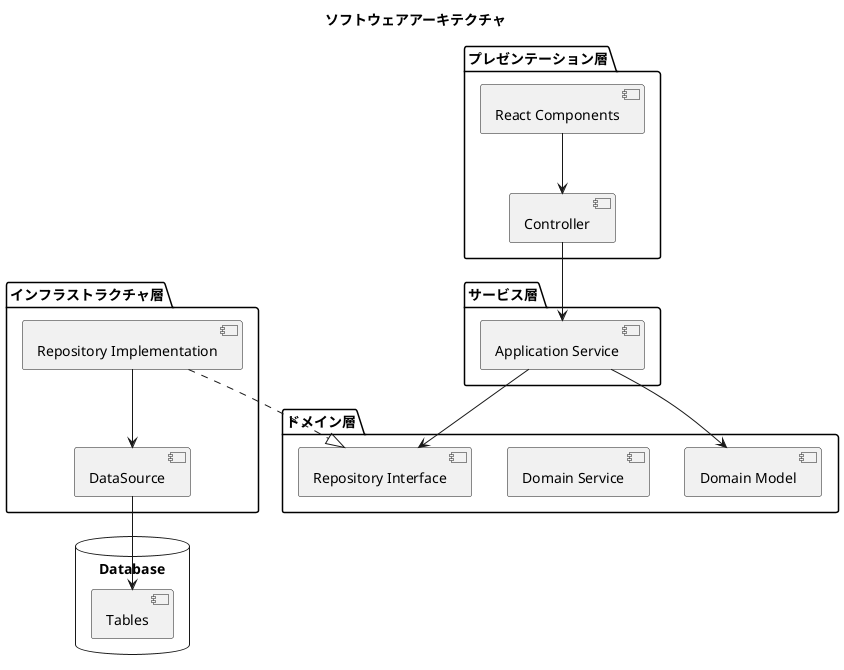

### 設計ドキュメント

イテレーションごとの設計ドキュメント：

| ファイル | 内容 |
|---------|------|
| `docs/wiki/開発/設計/Take01.md` | 認証・ユーザー管理 |
| `docs/wiki/開発/設計/Take02.md` | 部門・社員管理 |
| `docs/wiki/開発/設計/Take03.md` | 商品管理 |
| `docs/wiki/開発/設計/Take04.md` | 取引先管理（基盤） |
| `docs/wiki/開発/設計/Take05.md` | 取引先管理（完成） |
| `docs/wiki/開発/設計/Take06.md` | 受注管理（基盤） |
| `docs/wiki/開発/設計/Take07.md` | 受注管理（完成） |
| `docs/wiki/開発/設計/Take08.md` | 発注管理 |
| `docs/wiki/開発/設計/Take09.md` | 出荷・売上管理 |
| `docs/wiki/開発/設計/Take10.md` | 在庫管理 |
| `docs/wiki/開発/設計/Take11.md` | 仕入管理 |
| `docs/wiki/開発/設計/Take12.md` | 支払管理 |

### 実装手順

| ファイル | 内容 |
|---------|------|
| `docs/wiki/開発/実装/バックエンド実装手順.md` | バックエンド全体の実装フロー |
| `docs/wiki/開発/実装/データアクセス実装手順.md` | リポジトリ・マッパーの実装 |
| `docs/wiki/開発/実装/サービス実装手順.md` | サービス層の実装 |
| `docs/wiki/開発/実装/プレゼンテーション実装手順.md` | コントローラの実装 |
| `docs/wiki/開発/実装/ドメインサービス実装手順.md` | ドメインサービスの実装 |
| `docs/wiki/開発/実装/フロントエンド実装手順.md` | React コンポーネントの実装 |
| `docs/wiki/開発/実装/フロントエンド実装詳細手順.md` | 詳細なフロントエンド実装 |
| `docs/wiki/開発/実装/受け入れテスト実装手順.md` | 受け入れテストの作成 |
| `docs/wiki/開発/実装/E2Eテスト実装手順.md` | Cypress E2E テスト |
| `docs/wiki/開発/実装/データダウンロード実装手順.md` | CSV ダウンロード機能 |
| `docs/wiki/開発/実装/データアップロード実装手順.md` | CSV アップロード機能 |
| `docs/wiki/開発/実装/DBカラム追加実装手順.md` | データベース変更手順 |
| `docs/wiki/開発/実装/実行履歴実装手順.md` | 監査ログの実装 |

### 作業履歴

イテレーションごとの作業履歴：

| ファイル | 期間 | 内容 |
|---------|------|------|
| `docs/wiki/開発/作業履歴/take01-history.md` | Take 01 | 認証・ユーザー管理 |
| `docs/wiki/開発/作業履歴/take02-history.md` | Take 02 | 部門・社員管理 |
| `docs/wiki/開発/作業履歴/take03-history.md` | Take 03 | 商品管理 |
| `docs/wiki/開発/作業履歴/take04-history.md` | Take 04 | 取引先管理（基盤） |
| `docs/wiki/開発/作業履歴/take05-history.md` | Take 05 | 取引先管理（完成） |
| `docs/wiki/開発/作業履歴/take06-history.md` | Take 06 | 受注管理 |
| `docs/wiki/開発/作業履歴/take07-history.md` | Take 07 | 発注管理 |
| `docs/wiki/開発/作業履歴/take08-history.md` | Take 08 | 仕入・支払管理 |

---

## 参考情報

### ドキュメントディレクトリ

| パス | 内容 |
|-----|------|
| `docs/journal/` | 日次作業履歴（自動生成） |
| `docs/development/` | 開発履歴・サマリー |
| `docs/assets/release/` | リリースアーカイブ |
| `docs/wiki/開発/` | 開発 Wiki |
| `docs/reference/` | リファレンスガイド |

### 主要ファイル

| ファイル | 内容 |
|---------|------|
| `docs/build.adoc` | 開発環境構築ガイド |
| `docs/dev.adoc` | ユースケース・仕様定義 |
| `docs/wiki/開発/アーキテクチャ.md` | アーキテクチャ概要 |
| `docs/wiki/開発/リリース手順.md` | リリース手順・チェックリスト |

### ビジネス要件

- `docs/wiki/開発/設計/ビジネス要件.md` - システムのビジネス要件定義

### 実装テクニック

- `docs/wiki/開発/実装/安全性を確立する実装テクニック.md` - セキュアコーディング
- `docs/wiki/開発/実装/安全性を考えた例外失敗時の対策.md` - 例外処理パターン
- `docs/wiki/開発/実装/フィーチャートグル.md` - 機能フラグの実装
