# セットアップ

[Adding diagrams to your Astro site with MermaidJS and Playwright](https://agramont.net/blog/diagraming-with-mermaidjs-astro/)

```
npx astro add astro-expressive-code
npm install remark-mermaidjs
npx playwright install --with-deps chromium
‼ astro-expressive-code is not an official Astro package.
√ Continue? ... yes
√ Resolving with third party packages...

  Astro will run the following command:
  If you skip this step, you can always run it yourself later

 ╭────────────────────────────────────────────╮
 │ npm install astro-expressive-code@^0.38.3  │
 ╰────────────────────────────────────────────╯

√ Continue? ... yes
√ Installing dependencies...

  Astro will make the following changes to your config file:

 ╭ astro.config.mjs ────────────────────────────────────────╮
 │ // @ts-check                                             │
 │ import { defineConfig } from 'astro/config';             │
 │ import mdx from '@astrojs/mdx';                          │
 │ import sitemap from '@astrojs/sitemap';                  │
 │                                                          │
 │ import expressiveCode from 'astro-expressive-code';      │
 │                                                          │
 │ // https://astro.build/config                            │
 │ export default defineConfig({                            │
 │     site: 'https://example.com',                         │
 │     integrations: [mdx(), sitemap(), expressiveCode()],  │
 │ });                                                      │
 ╰──────────────────────────────────────────────────────────╯

√ Continue? ... yes
  
   success  Added the following integration to your project:
  - astro-expressive-code
  
║ WARNING: It looks like you are running 'npx playwright install' without first ║
║ installing your project's dependencies.                                       ║
║                                                                               ║
║ To avoid unexpected behavior, please install your dependencies first, and     ║
║ then run Playwright's install command:                                        ║
║                                                                               ║
║     npm install                                                               ║
║     npx playwright install                                                    ║
║                                                                               ║
║ If your project does not yet depend on Playwright, first install the          ║
║ applicable npm package (most commonly @playwright/test), and                  ║
║ then run Playwright's install command to download the browsers:               ║
║                                                                               ║
║     npm install @playwright/test                                              ║
║     npx playwright install                                                    ║
║                                                                               ║
╚═══════════════════════════════════════════════════════════════════════════════╝
npm install @playwright/test
npx playwright install  
```

`astro.config.mjs` に `expressiveCode` を追加します。

```javascript
// @ts-check
import { defineConfig } from 'astro/config';
import mdx from '@astrojs/mdx';
import expressiveCode from "astro-expressive-code";
import remarkMermaid from 'remark-mermaidjs'

// https://astro.build/config
export default defineConfig({
    site: 'https://example.com',
    markdown: {
        // Applied to .md and .mdx files
        remarkPlugins: [remarkMermaid],
    },
    integrations: [expressiveCode(), mdx()]
});
```

# 業務分析サンプル

## ビジネスモデル

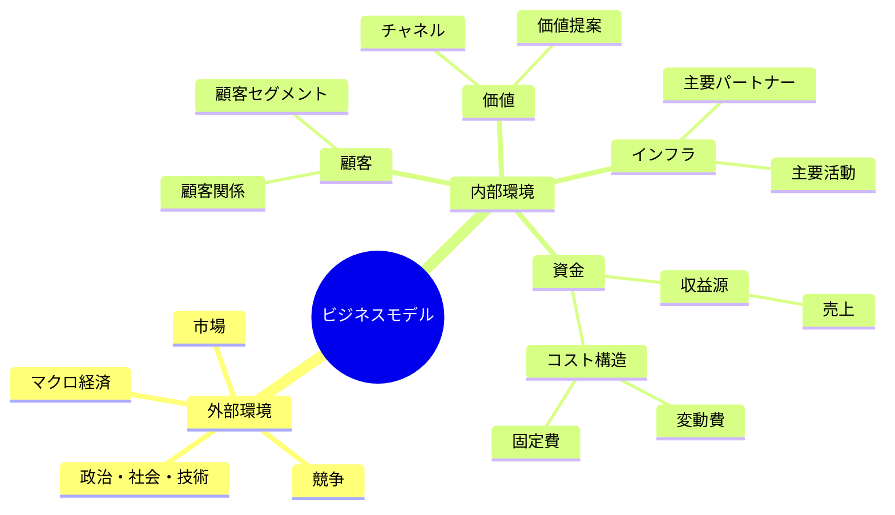

## インパクトマップ

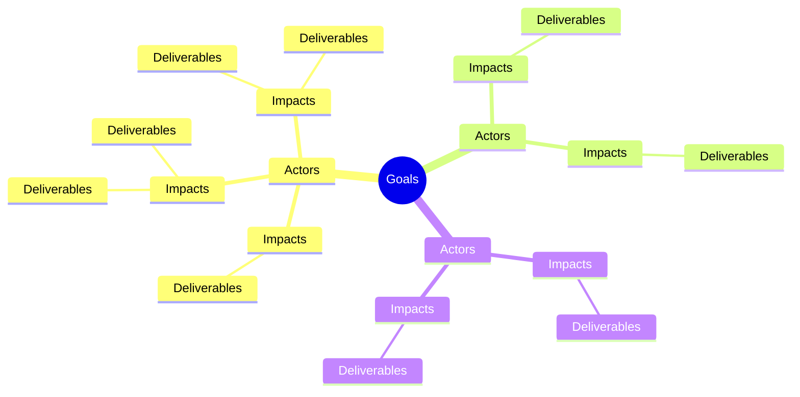

## ドメイン

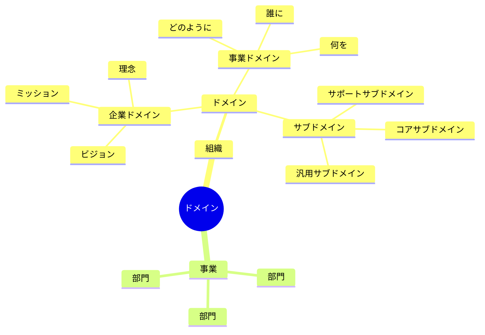

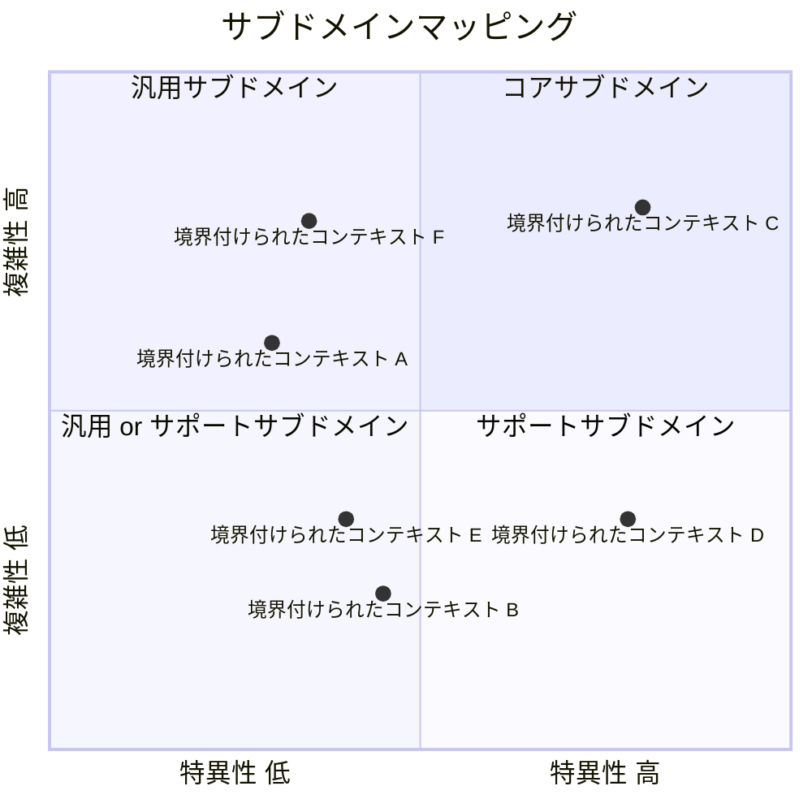

### 組織構造

### 企業ドメイン

### 事業ドメイン

### サブドメイン

#### コアサブドメイン

#### 汎用サブドメイン

#### サポートサブドメイン

## ビジネスコンテキスト

### サブドメイン

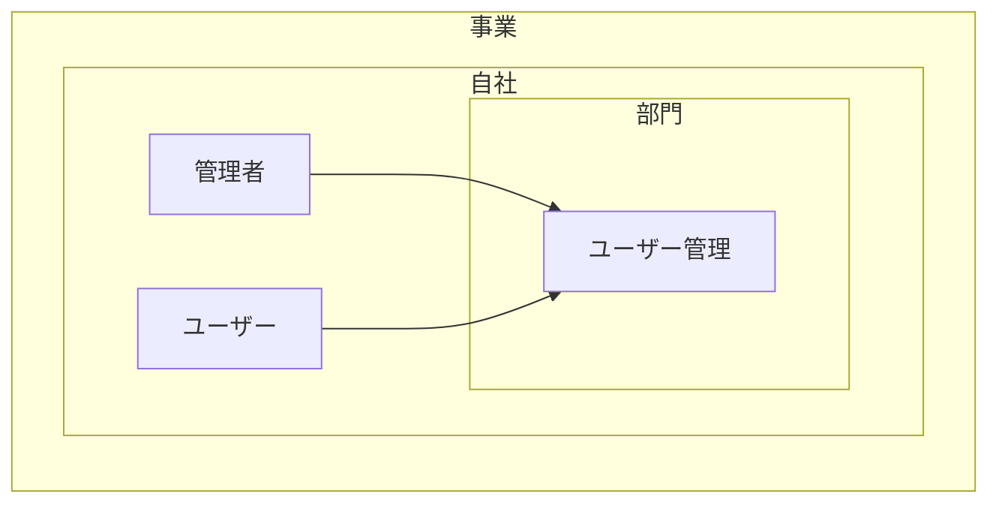

## ビジネスユースケース

### ユーザー管理

#### ユースケース図

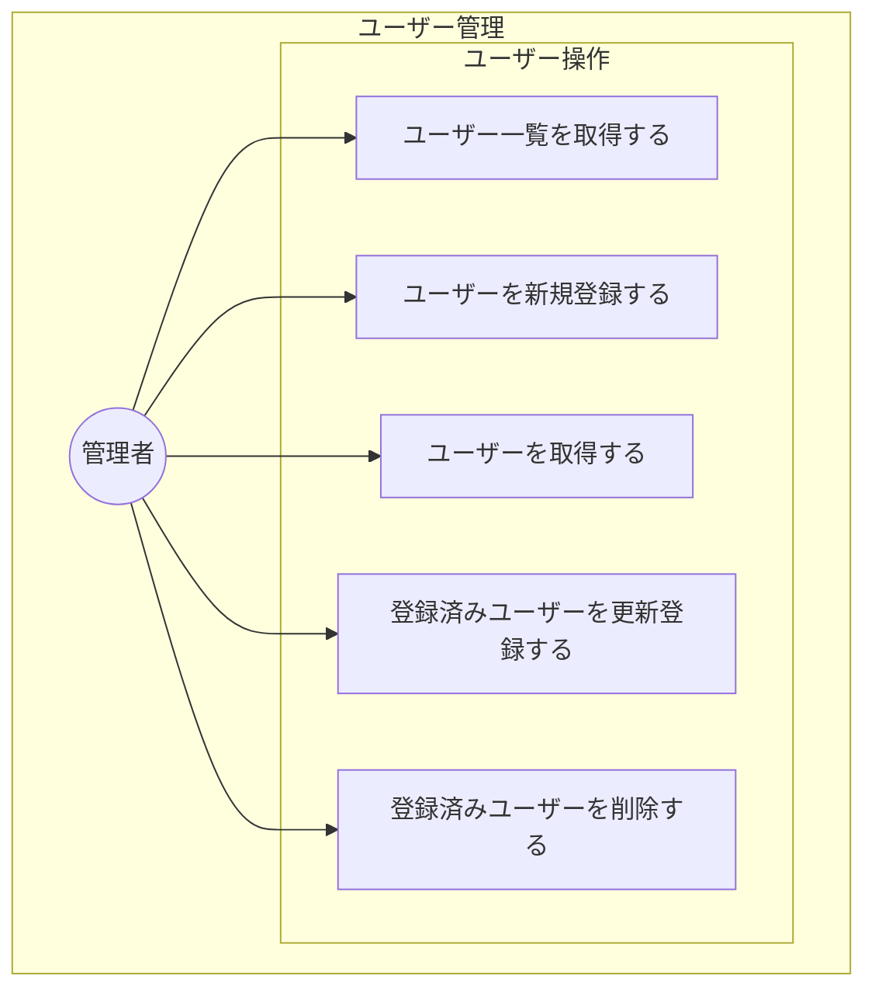

#### シーケンス図

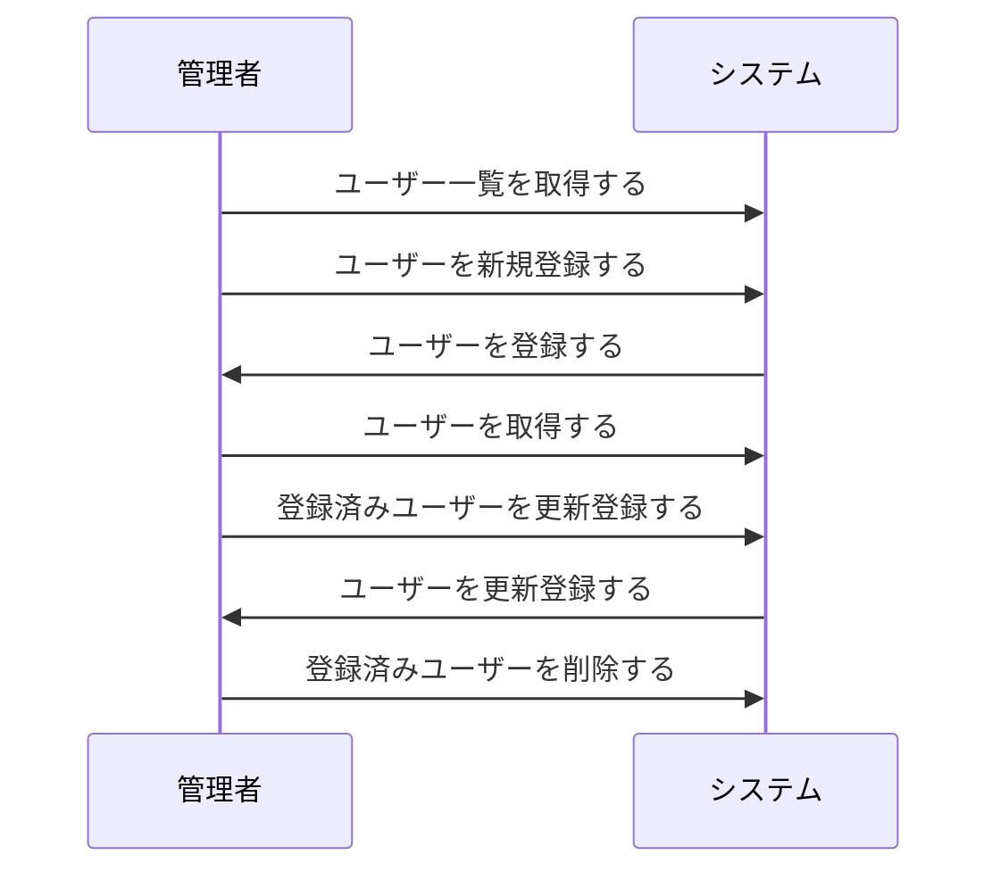

#### 業務フロー図

##### ユーザー一覧取得

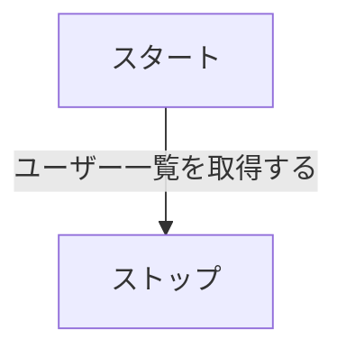

##### ユーザー新規登録

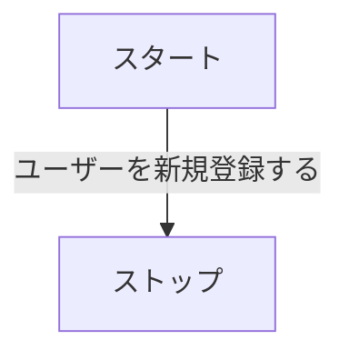

##### ユーザー取得

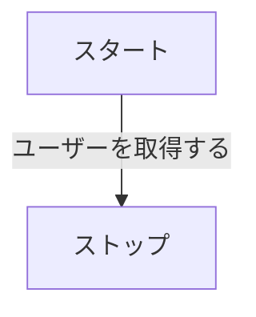

##### ユーザー更新登録

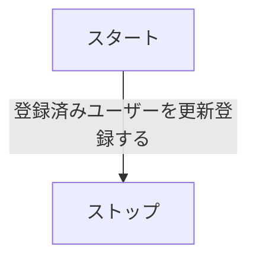

##### ユーザー削除

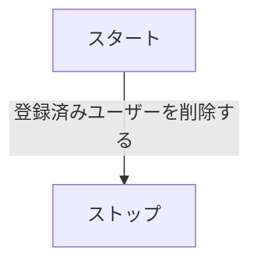
