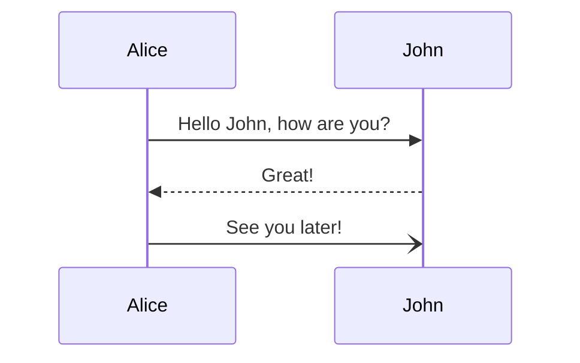

GitHubActinsでビルドしてデプロイすると `ダイアグラムやチャート描画できるようにする` の記事内容が反映されない。
ローカルからビルドしてデプロイすると反映される。どうやら生成されるHTMLファイルサイズに問題があるみたい。

ためしに小さいMermaidJSのダイアグラムを表示して確認してみる。
````markdown

````

やってみたらダメだったのでサイズは関係ないみたい

GitHubActionsのコンテナ側の問題っぽい。
- [vercel_preview](../../../../../.github/workflows/vercel_preview.yml)

```yaml
name: Vercel Preview Deployment
env:
  VERCEL_ORG_ID: ${{ secrets.VERCEL_ORG_ID }}
  VERCEL_PROJECT_ID: ${{ secrets.VERCEL_PROJECT_ID }}
on:
  push:
    branches-ignore:
      - main
jobs:
  deploy:
    runs-on: ubuntu-latest
    steps:
      - uses: actions/checkout@v2

      - name: Start Database Services
        uses: hoverkraft-tech/compose-action@v2.0.1
        with:
          compose-file: "./docker-compose.yml"
          services: |
            db_postgresql

      - name: Setup Graphviz
        uses: tlylt/install-graphviz@main
      - name: Setup JDK
        uses: actions/setup-java@v3
        with:
          java-version: '21'
          distribution: 'temurin'
      - name: Grant execute permission for Gradle wrapper
        run: chmod +x ./gradlew
        working-directory: app/backend/api
      - name: Run migrations
        run: |
          ./gradlew assemble
          ./gradlew flywayMigrate
        working-directory: app/backend/api

      - name: Install Vercel CLI
        run: npm install --global vercel@latest
      - name: Pull Vercel Environment Information
        run: vercel pull --yes --environment=preview --token=${{ secrets.VERCEL_TOKEN }}
      - name: Build Project Artifacts
        run: vercel build --token=${{ secrets.VERCEL_TOKEN }}
      - name: Deploy Project Artifacts to Vercel
        run: vercel deploy --prebuilt --token=${{ secrets.VERCEL_TOKEN }}
```
 
とりあえず、ダイアグラムを生成する場合はローカルからビルドしてデプロイすることにする。

```bash
npx vercel build 
npx vercel deploy --prebuil
```

別途 `npx playwright install --with-deps` をインストールする必要があった。

対応するGitHubActionに以下のコードを追加して対応。

```yaml
- name: Install Playwright Browsers
  run: npx playwright install --with-deps
```