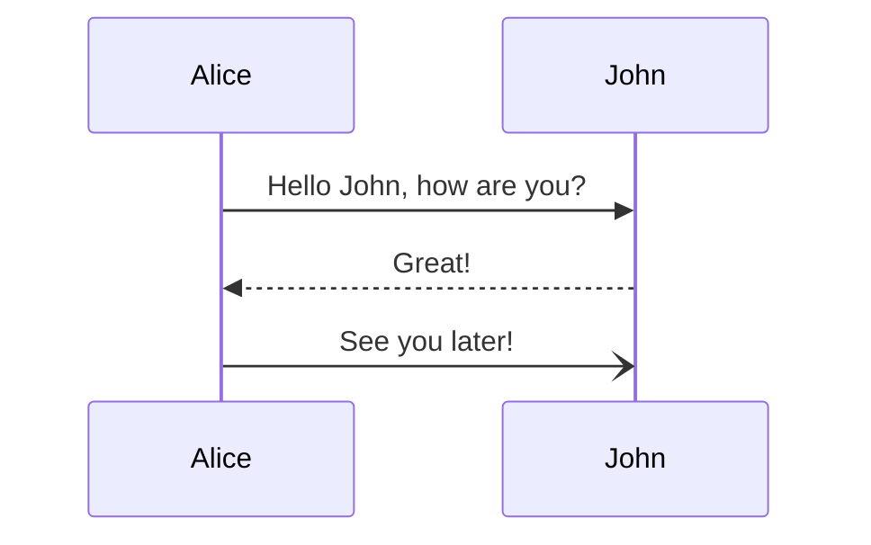

GitHubActinsでビルドしてデプロイすると `ダイアグラムやチャート描画できるようにする` の記事内容が反映されない。
ローカルからビルドしてデプロイすると反映される。どうやら生成されるHTMLファイルサイズに問題があるみたい。

ためしに小さいMermaidJSのダイアグラムを表示して確認してみる。



とりあえず、大きなHTMLファイルを生成する場合はローカルからビルドしてデプロイすることにする。

```bash
npx vercel build 
npx vercel deploy --prebuil
```