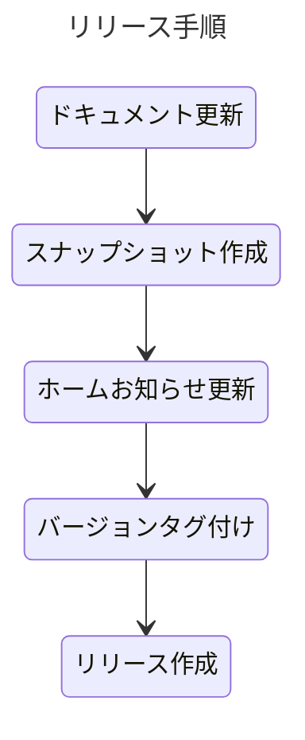

## リリース手順

## チェックリスト

1. [ ] ドキュメントの更新
   - [ ] ユースケースの更新
   - [ ] ドメインモデルの更新
   - [ ] データモデルの更新
   - [ ] ユーザーインターフェースの更新
2. [ ] スナップショットの作成
   - [ ] jig のアーカイブ
   - [ ] jig-erd のアーカイブ
   - [ ] ナビゲーションページにリンク追加
3. [ ] ホームのお知らせを更新
4. [ ] バージョンタグ付け
5. [ ] リリースの作成
   - [ ] 残タスク確認
   - [ ] プルリクエストのマージ
