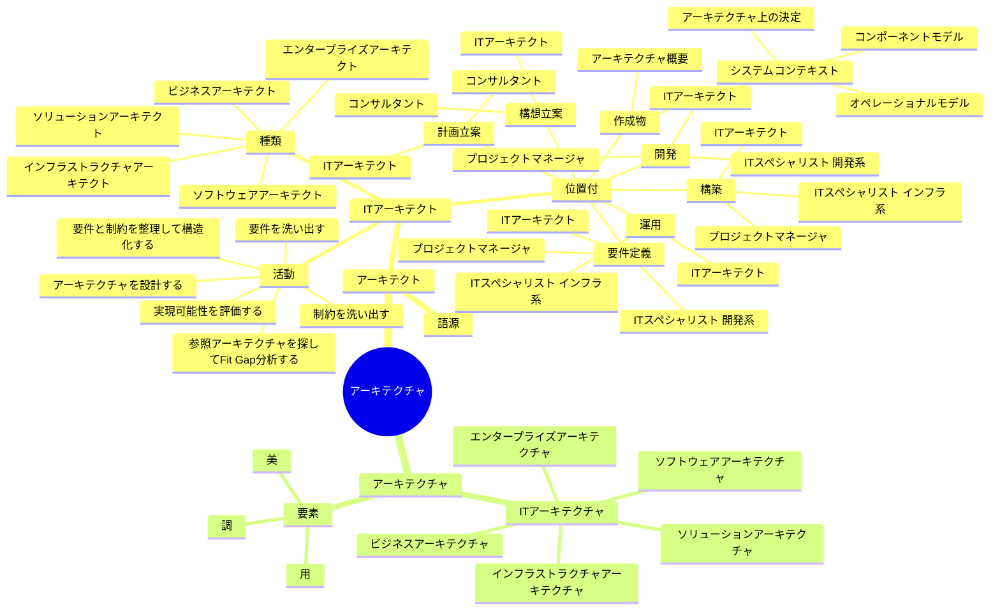
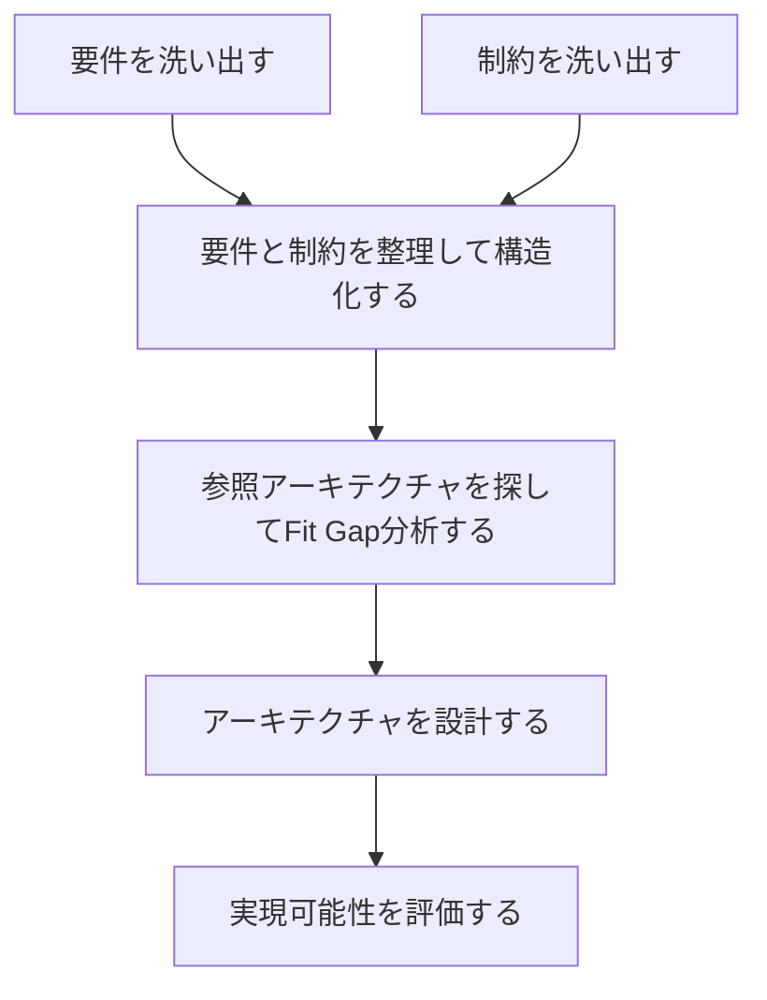
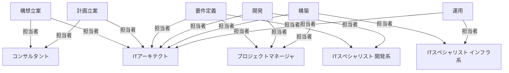
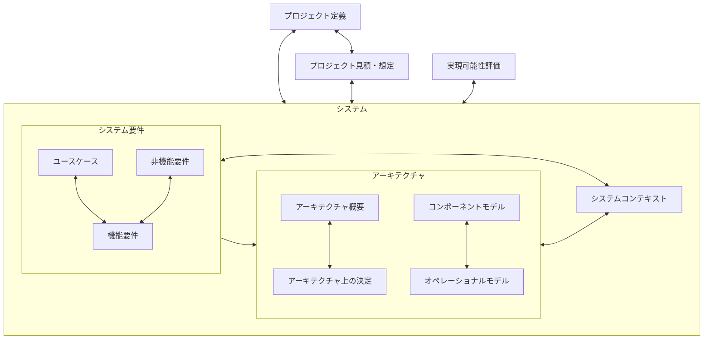
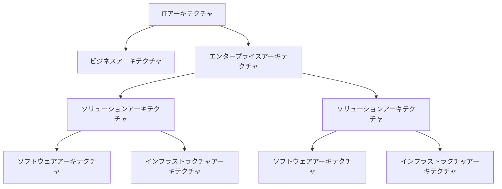
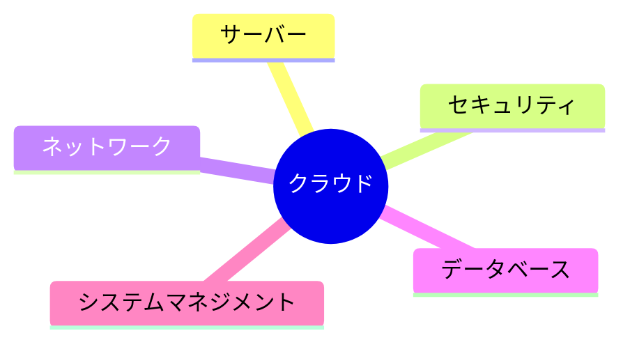

## アーキテクト

### 語源

ギリシャ語の「Architectus」が語源で、建築家を意味する。

古代ギリシアでは重要な建物の設計と施工両方に責任を持つ人物を指し、美学と建築の両方に精通していた。

### ITアーキテクト

重要なITシステムの設計と施工（構築）に責任を持つ人物を指す。

#### 種類

##### ソフトウェアアーキテクト

ソフトウェアシステム全体の設計と構造を計画し、開発チームが効率的かつ効果的に働けるように指導する専門家。

##### インフラストラクチャアーキテクト

企業や組織のITインフラストラクチャを設計、構築、管理する専門家。

##### ソリューションアーキテクト

企業や組織の課題を解決するために、適切なソフトウェアや技術的ソリューションを設計および実装する専門家。

##### ビジネスアーキテクト

顧客に価値を届けるための流れとそれを支える企業の能力（ケイパビリティ）を定義しビジネスプロセスを設計する担当者。

##### エンタープライズアーキテクト

企業全体に関わる広い領域でのITアーキテクチャ設計を主としてIT戦略の策定やシステムの設計・統合、業務プロセスの最適化などに携わる担当者。

#### 活動

#### 位置付

#### 作成物

## アーキテクチャ

建築学ではアーキテクチャは建築の様式を示す。

建築の様式とは、建築物の構造や設計方法、工法を含めた全体を意味する用語。

### 要素

建築学ではアーキテクチャには次の3つの要素が重要と言われている。

- 用 : 住むために必要な用途・機能を備えていること
- 調 : 周辺環境に配慮し、気候と調和していること
- 美 : 姿、形、色彩が美しいこと

### ITアーキテクチャ

#### エンタープライズアーキテクチャ

企業全体のITシステムを統合的に設計することを目的としたアーキテクチャ。

企業全体におけるポリシーや基本原則を定め、エンタープライズ全体が最適なIT投資を行い、ビジネス目標を達成できるように全体のアーキテクチャを設計する活動。

#### ビジネスアーキテクチャ

ビジネスプロセスやビジネスモデルを設計するアーキテクチャ。

エンタープライズがどのように価値を生み出し、それを顧客に提供するかの構造を表現するもの。

#### ソリューションアーキテクチャ

特定の問題や課題に対する解決策を設計するアーキテクチャ。

個々のシステムやサービスに関するアーキテクチャ。

#### ソフトウェアアーキテクチャ

ソフトウェアシステムの設計を行うアーキテクチャ。

> システムの構成要素、構成要素間の関係性、そしてシステムの設計や進化の指針となる原理原則の中に織り込まれた、対象となるシステムの根幹をなす考え方や特徴のこと

> ビジネスやオペレーションの要求に基づく望ましい性質や機能への期待を抽出し、その期待に答えられるよう、構造を持って動くソフトウェアへと仕立て上げるプロセスのこと

> ソフトウェアアーキテクチャとは、システムの構造とそこに組み込まれたシステムが備えるべきアーキテクチャの性質（「○○性」）、アーキテクチャに関する決定、および設計のための原理原則のこと

#### インフラストラクチャアーキテクチャ

ITインフラストラクチャの設計を行うアーキテクチャ。

## 参考

- [ITアーキテクト入門](https://www.amazon.co.jp/IT%E3%82%A2%E3%83%BC%E3%82%AD%E3%83%86%E3%82%AF%E3%83%88%E5%85%A5%E9%96%80-%E8%87%BC%E6%9D%B5%E7%BF%94%E6%A2%A7/dp/4863544502/ref=tmm_pap_swatch_0?_encoding=UTF8&dib_tag=se&dib=eyJ2IjoiMSJ9.AWit_NO8CcycJ8Ucxr6cP3eq20nnd1M9Ka1pq7spXvRXqoJG48P71Ev06fMK9m3NvPI_mnBiyYhT2ajqJSw8e-rwTEK9fxptDWzCrBa0yOYt1S0LhTFk5N-74cOQ23bqzXFX4o48m-G2IP3DlbftFgOkBr_ftndpsDzznyZMIYFU5VLmbuN4pRgQY5pGZD9Ty5ABpUx4wqVZyprpK6tEUu9SaDkQbREtjeAeFmaKODMW-73hBagGehxme98c4zKo-ZTlt2UXKl2TE7WpwIVPI22gBKaIuifokAU6oZe2IFOMjelkEVVQh4_BESi0Vc2G5aveCoEVRGXv5MVixUCl21xa6GdGBbTpPbf03vg-3NFhV9M7lZY9QQHMCUU7oA60NvR8GAwG4gtFttwVQRho51NP256egiHMbJldwqRxoJqF-C8A62kGJRW_PVWKMdsP.mqaFKbOY08JyL29ts3I5HogEyRETANOFU-n_ZWT85Hg&qid=1735455618&sr=8-1)