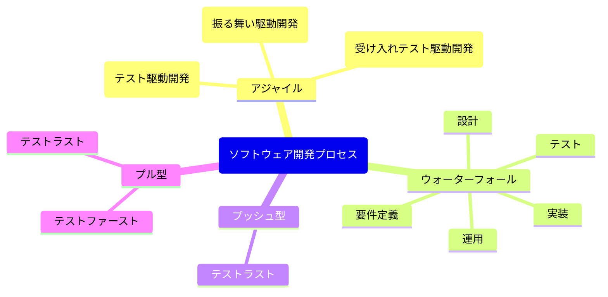
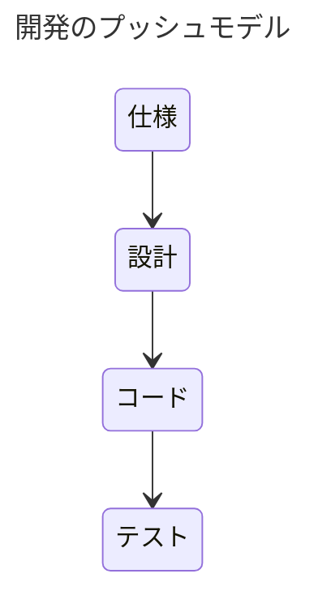
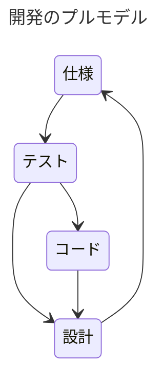

## アジャイル
アジャイル開発は、**レスポンシブ**で柔軟なソフトウェア開発を重視する手法です。小さな反復(improvements)を繰り返しながら成果物を構築していくアプローチで、以下のような方法があります。
### 1. TDD (テスト駆動開発: Test-Driven Development)
- 開発の最初にテストを書き、そのテストを満たすコードを実装します。
- 後続のバグを防ぎやすくなるため、高いコード品質が維持されます。

#### 特徴
- **「Red-Green-Refactor」サイクル**:
    1. **Red**: テストが失敗する状態から始める。
    2. **Green**: 最小限のコードを書いてテストを通過させる。
    3. **Refactor**: コードをリファクタリングし改善する。

### 2. BDD (振る舞い駆動開発: Behavior-Driven Development)
- システムの**振る舞い(behavior)**に焦点を当て、ビジネス価値に直結する実装を行う手法です。
- 利用者の視点でシナリオ形式のテストを書きます。

#### 特徴
- **Gherkin形式**: 「Given-When-Then」というシナリオで仕様を書く。
    - **Given**: 初期状態
    - **When**: 行動
    - **Then**: 期待される結果

### 3. ATDD (受け入れテスト駆動開発: Acceptance Test-Driven Development)
- システムの**顧客要求を反映**した「受け入れテスト」からコードを書き始めます。
- 開発者、テスター、および非技術者(クライアントなど)が共同でテストを設計します。

#### 特徴
- **顧客満足度の向上**: 顧客が定義した要件に基づき開発が進む。

## ウォーターフォール
ウォーターフォールは、順序立てた進行手順に基づく手法です。開発フローが明確であり、以下のような段階を経ます。
### 1. 要件定義
システム開発の目的・目標を果たすため、開発の対象となる業務や製品の範囲・内容を明確化し、当システムが備えるべき機能や性質を明確化していく工程です。
企業によるシステム開発であれば、企業の収益向上やコスト削減、顧客満足度の向上につながるシステム開発の目的を、どの業務を対象として、どのような機能をもって実現するのか、業務に携わる関係者を中心に定義してきます。

### 2. 設計
#### 2-1. 基本設計
定められた要件を実現するため、当システムで実装されるべき機能や性質を具体化してく工程です。当システムで実装されるべき機能や性質を具体化していく工程です。システムの機能を洗い出し、処理の流れ、必要なデータ、ユーザーが利用する画面のレイアウト、およびこれらの機能の配置などを、開発を担当するIT関係者が、業務関係者の理解できる言葉で設計書に表していきます。

システムを利用することになる業務関係者は、作成された基本設計書によりシステムの仕様を理解し、必要に応じて設計の見直しを要求することで、より要件に適合した設計となっていきます。

システムの外側に位置する業務関係者から見たシステムの構造が表されるため、この工程は「外部設計」と呼ばれることもあります。

#### 2-2. 詳細設計
基本設計で決定されたシステムの仕様を、この後の工程でエンジニアやプログラマーが実装できるようにするため、内部処理仕様や設定値などの詳細に落とし込み、技術的な用語やモデリングの記法を用いて記述してきます。

システムの内部構造を明らかにしてくことになるため、この工程は「内部設計」と呼ばれることもあります。

### 3. 実装
詳細設計に基づき、ソフトウェアおよびそれが稼働するインフラストラクチャを開発します。ソフトウェアについては、プログラミング言語を利用してプログラムを書いていきます。工程としては「コーディング」や「プログラミング」と呼ばれることもあります。インフラストラクチャについては、調達されたハードウェア製品やソフトウェア製品を導入の上で組み合わせ、設定の調整を行っていきます。

### 4. テスト
#### 4-1. 単体テスト
実装工程では、実装と並行しながら、実装された各機能が正常に動作することを個別に検証していく「単体テスト」も行われます。

#### 4-2. 結合テスト
個別に機能することが確認されたソフトウェア群やインフラストラクチャを組み合わせ、機能間の連携が正しく取れることを検証する工程です。
基本設計で定義された仕様を満たせているかどうかを確認することが目的となります。

#### 4-3. 総合テスト
開発されたシステムが全体として正しく機能することを検証する工程です。要件定義で定義された要件を満たせるかどうかを確認することが目的となります。

#### 4-4. 受入テスト
開発されたシステムが実際のユーザーの利用に耐えられるものであるかどうか、業務に従事する関係者を中心に最終的な確認を行っていく工程です。

### 5. 運用
システムが正常に稼働するように、システムの運用を開始します。システムの運用には、システムの監視や障害対応、ユーザーサポートなどが含まれます。

## プッシュ型とプル型
### プッシュ型

プッシュ型は、従来の「上意下達」的なアプローチを指します。
- **テストラスト**:
    - コード完成後にテストを書く手法。
    - バグの発見が遅れるという課題がある。

### プル型

プル型は、チームや顧客の要求を引き出しながら進める形式です。
- **テストファースト**:
    - 開発前にテストケースを設計し、テストを通過するためのコードを書く。
    - 高品質コードの実現。

- **テストラスト**:
    - コード完成後にテストを行うが、バグ処理にコストがかさむ恐れがある。

## アジャイルとウォーターフォールの関連

|  | プッシュ型 | プル型                |
| --- |------|--------------------|
| **アジャイル** | テストラスト | テストファースト           |
| **ウォーターフォール** | テストラスト | -                  |

### 説明
- **プッシュ型**（テストラスト）:
    - テストを書く工程が後回しになる手法。
    - 開発工程の最後でテストが追加されるため、バグ検出が遅く、コストがかさみやすい。
    - **例**: ウォーターフォールモデルでよく用いられる。

- **プル型**（テストファースト）:
    - テストファーストでは、最初にテストを記述し、そのテストに基づいてコードを書く手法。
    - 高品質なコードを維持するのに適しており、アジャイル開発で多用される。
    - **例**:
        - **TDD (テスト駆動開発)**: テスト記述後、コードを書く。
        - **BDD (振る舞い駆動開発)**: 振る舞い仕様を基に進める。
        - **ATDD (受け入れテスト駆動開発)**: 顧客の要求を受け入れ基準に反映。

| 手法 | 柔軟性 | コスト効率 | 導入の難易度 | 主な使用場面 |
| --- | --- | --- | --- | --- |
| アジャイル | 高い | 中程度 | 高い | 小規模～中規模プロジェクト |
| ウォーターフォール | 低い | 高い | 低い | 規模の大きいプロジェクト |
| テストファースト | 中～高 | 高効率 | 高い | 高品質を求める開発 |
| テストラスト | 低～中 | 非効率 | 低い | とりあえずの開発 |

## アジャイルとウォーターフォールの比較

### アジャイル開発
#### メリット
- **柔軟性**: 要件変更に迅速に対応可能。
- **早期リリース**: 小規模で反復的な開発により、短期間で価値を提供。
- **高い顧客満足**: チームと顧客が密に連携しながら進める。
- **継続的改善**: テスト駆動やフィードバックで品質向上。
- **チームのコラボレーション強化**: 開発者やテスターとのコミュニケーションが活発。

#### デメリット
- **スコープの曖昧さ**: 開発途中で要件が変わりやすい。
- **計画の困難さ**: 明確な終着点が見えにくく、スケジュールがあいまい。
- **高いリソース要求**: 熟練者が必要で学習曲線が急。
- **ドキュメント作成軽視**: 後々のメンテナンスが難しくなる場合がある。

---

### ウォーターフォール
#### メリット
- **手順の明確さ**: 各フェーズが順序立って進むため計画が立てやすい。
- **管理のしやすさ**: 明確なマイルストーンと進捗管理。
- **完成像が明確**: 最初に要件を詳細に固めるため、何を作るかが明確。
- **ドキュメント重視**: 詳細な記録が残るため、保守や引き継ぎがしやすい。

#### デメリット
- **柔軟性の欠如**: 開発途中での要件変更が難しい。
- **後戻り困難**: 各段階が終了しないと次に進めないため、変更コストが大きい。
- **遅い顧客フィードバック**: 完成品ができるまでユーザーが試せない。
- **リスクの増大**: 問題が後半で発覚し、全工程に影響を及ぼす可能性。

---

### 比較表

| 特徴            | アジャイル                        | ウォーターフォール                |
|------------------|-----------------------------------|------------------------------------|
| **柔軟性**      | 高い                              | 低い                               |
| **要件変更対応** | 容易                              | 難しい                             |
| **スケジュール** | 可変的                            | 固定的                             |
| **完成品の確認** | 頻繁なプロトタイプで早期に確認可能 | 完成後に確認                       |
| **適用範囲**    | 小規模～中規模プロジェクト向け    | 大規模プロジェクト向け             |
| **ドキュメント**| 最小限で開発重視                  | 詳細な書類を重視                   |

---

### 指針
- **アジャイル**は、短期間で高い柔軟性を求めるプロジェクトや、要件が頻繁に変わる場合に適しています。
- **ウォーターフォール**は、大規模で要件が安定しているプロジェクトや、大規模な組織の一貫したフローが必要な場合に適しています。

## 参照
- [DS-120 デジタル・ガバメント推進標準ガイドライン実践ガイドブック](https://www.digital.go.jp/assets/contents/node/basic_page/field_ref_resources/e2a06143-ed29-4f1d-9c31-0f06fca67afc/d85eeb55/20240605_resources_standard_guidelines_guideline_05.pdf)
- [DS-121 アジャイル開発実践ガイドブック](https://www.digital.go.jp/assets/contents/node/basic_page/field_ref_resources/e2a06143-ed29-4f1d-9c31-0f06fca67afc/9fc931f7/20220422_resources_standard_guidelines_guidebook_01.pdf)
