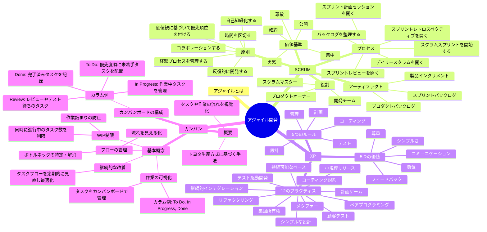
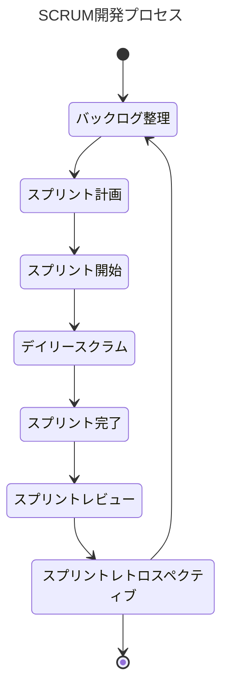
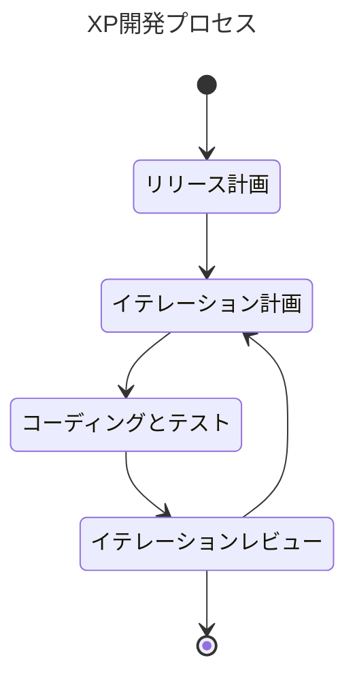
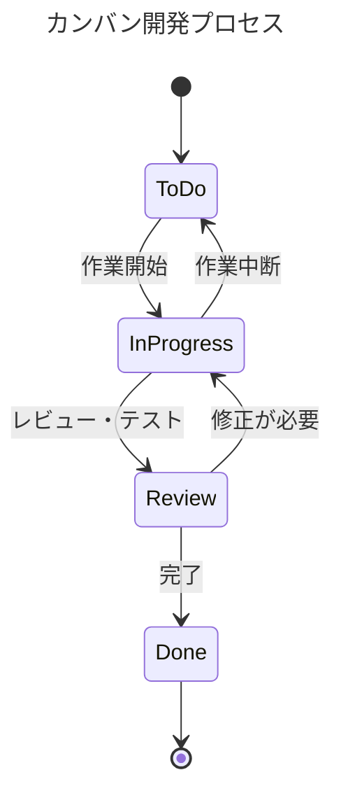

## アジャイルとは

アジャイルマニフェスト

- プロセスやツールよりも**個人と対話を**
- 包括的なドキュメントよりも**動くソフトウェアを**
- 契約交渉よりも**顧客との協調を**
- 計画に従うことよりも**変化への対応を**

>アジャイルとは、プロジェクトをイテレーションに分割するプロセスだ。各イテレーションのアウトプットを計測して、スケジュールを継続的に評価する。
最も価値のあるものが最初に実装されるように、ビジネスの価値の順番で機能を実装していく。クオリティは可能な限り高める。スケジュールはスコープの調整によって管理する。
これがアジャイルだ。
> 
> Clean Agile

> 「アジャイル」はソフトウェア開発の進め方のひとつだ。アジャイルなソフトウェア開発が私たちに言い聞かせていることは、コードを実行するのはコンピュータかもしれないが、そのコードを生み出し、保守するのは私たち人間なんだということだ。
> 
> 「アジャイル」はフレームワークであり、心構えであり、ソフトウェアを無駄なく、早く届ける手法だ。しかも、現場で実際に使える。
> 
> アジャイルサムライ

## 1. SCRUM（スクラム）
### 特徴
短い期間（スプリント）で繰り返し仕事を進めるやり方。
チーム全員が協力し、改善を重ねながら進めるプロセス。
### 大事なポイント
#### 1. 原則
- チームで自主的に動き、協力してゴールを目指す。
- 短い期間（スプリント）で目標を達成する。
- 毎回の振り返りで進め方を良くしていく。

#### 2. 価値基準
- **確約**: チーム全員で約束を守る。
- **勇気**: 難しいことにも勇気を持つ。
- **集中**: 目標に集中する。
- **公開**: 状況をみんなに透明にする。
- **尊敬**: メンバーを尊重する。

#### 3. やることの流れ
1. **バックログを整理する**: やるべきタスクをリストにまとめて、優先順位を決める。
2. **スプリント計画**: 次のスプリントでやることを決定する。
3. **スクラムスプリント開始**: 決めた仕事を短期間で進める。
4. **デイリースクラム**: 毎日短いミーティングを行う。
5. **スプリントレビュー**: 完成した成果物をみんなで確認。
6. **スプリントレトロスペクティブ**: 振り返りをして次に活かす。

#### 4. 役割
- **スクラムマスター**: チームを支援する役割。
- **プロダクトオーナー**: 何を作るかを決める人。
- **開発チーム**: 実際に作業を進めるメンバー。

## 2. XP（エクストリームプログラミング）
### 特徴
シンプルな作り方を意識しながら、早めにテストをして品質を上げて進める方法。
### 大事なポイント
#### 1. 価値観（大事にすること）
- **シンプルさ**: 必要な作業のみに集中し、複雑さを避ける。
- **コミュニケーション**: チームで話し合いながら進める。
- **フィードバック**: 継続的に評価して改善を続ける。
- **勇気**: 問題に恐れず向き合う。
- **尊重**: メンバー間でお互いを尊重する。

#### 2. やるべきこと
- 計画を立てて進める。
- 必要以上に複雑な設計を避ける。**シンプルな設計の重視**。
- 常にテストを意識する（テスト駆動開発）。
- **ペアプログラミング**（2人1組で作業）などを活用。

## 3. カンバン（Kanban）
### 特徴
タスクや仕事の状況を「目で見てわかりやすく」整理する方法。
トヨタ生産方式を基に作られました。
### 大事なポイント
#### 1. 作業の見える化
- タスクをカンバンボードに配置して進捗を把握。
  （例: 「To Do」「In Progress」「Done」などの状態に整理）

#### 2. WIP制限
- 一度に進行中のタスクを制限することで、作業の詰まりを防止。

#### 3. 継続的な改善
- タスクの流れや手順を定期的に見直して、作業効率を上げる。

### カンバンボードの例
- **To Do**: やるべきタスクを優先度順にまとめる。
- **In Progress**: 今取り組んでいるタスクを記録。
- **Review**: チェック待ちやテスト中のタスク。
- **Done**: 完了したタスクを管理。

## 簡単にまとめると
- **SCRUM**:
  チームが協力して短期間（スプリント）で仕事を進め、繰り返し改善をする方法。
- **XP**:
  シンプルにテストを重視し、すぐに改善を進めるやり方。
- **カンバン**:
  タスクを「見える化」して流れを整理し、効率的に作業を進める方法。

それぞれの手法を適切に活用することで、開発プロセスがスムーズになります！
