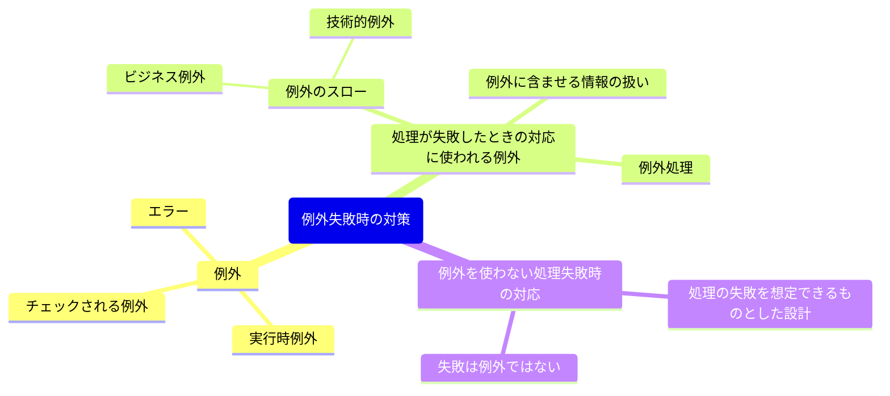

# 例外失敗時の対策

## 例外
- **チェックされる例外(checked exception)**
    - 呼び出し元が適切に回復できるような状況に対して使う。
    - Javaプログラム内で発生する可能性があり、事前に処理が要求される例外。
    - 例: ファイルの読み込み中に発生する `IOException`。
    - `try-catch`ブロックで捕捉するか、メソッドシグニチャに `throws` を付けて宣言する必要がある。

- **実行時例外(runtime exception)**
    - プログラミングエラーを表すのに使う。
    - プログラムの実行中に予期しない条件に遭遇した場合に発生する。
    - 例: `NullPointerException`, `ArrayIndexOutOfBoundsException` など。
    - チェックされないので、開発者の意識的チェックが必要。通常、プログラムのバグが原因である。
    - 実装するすべてのチェックされない例外は `RuntimeException` をサブクラス化する。

- **エラー(error)**
    - JVMやシステムレベルで発生する深刻な問題。
    - 例: `OutOfMemoryError`, `StackOverflowError`。
    - 基本的には回復を試みるべきではなく、プログラムの停止が一般的。

---

## 処理が失敗したときの対応に使われる例外

### 例外のスロー
- **ビジネス例外**
    - アプリケーション上で発生する業務的な失敗を表す例外。
    - 例: クレジットカードの検証が失敗した場合。
    - `InvalidCreditCardException`, `OrderProcessingException` など。

- **技術的例外**
    - システムやプラットフォームレベルでの障害に使用される例外。
    - 例: データベース接続障害 (`SQLException`)、API呼び出しの失敗。
    - 構成エラー、連携エラーなどに分類されることも。

#### 同じ型を使ってビジネス例外と技術例外の両方を表現している例
```java
public class AccountRepository {
    private final AccountDatabase accountDatabase;
    
    ...
    
    public Account fetchAccountFor(final Customer customer, final AccountNumber accountNumber) {
        notNull(cutoerm);
        notNull(accountNumber);

        try {
            return accountDatabase.selectAccountFor(customer)
                    .stream()
                    .filter(
                        account -> account.getAccountNumber().equals(accountNumber))
                    .findFirst()
                    .orElseThrow(
                            () -> new IllegalStateException(
                            String.format("Account not found for customer: %s", customer)));
        } catch (SQLException e) {
            throw new IllegalStateException(String.format("Unable to retrive account %s for %s", accountNumber.value(), customer), e);
        }
    } 
}
```

### 例外処理
- `try-catch` ブロックを使用して安全に例外を処理する。
- キャッチした例外を適切にログ出力する (`log.error`) ことで、障害の原因を特定可能。
- 必要に応じて再スロー (`throw`) して上位層で処理を委譲する。

#### メッセージの内容をもとにビジネス例外と技術的例外を区別する例
```java
private final AccountRepository accountRepository;

public Balance accountBalance(final Customer customer, final AccountNumber accountNumber) {
    notNull(customer);
    notNull(accountNumber);
    
    try {
        return accountRepository.fetchAccountFor(customer, accountNumber).balance();
    } catch (IllegalStateException e) {
        if (e.getMessage().contains("No account matching")) {
            return Balance.unknown(accountNumber);
        } else {
            throw e;
        }
    }
}
```

#### 対処となる銀行口座が見つからなかっとを明示的に示すビジネス例外のクラス
```java
public abstract class AccountException extends RuntimeException {}
```
```java
public class AccountNotFound extends AccountException {
    private final AccountNumber = accountNumber;
    private final Customer customer;
    
    public AccountNotFound(final AccountNumber accountNumber, final Customer customer) {
        this.accountNumber = notNull(accountNumber);
        this.customer = notNull(customer);
    }
    
    ...
}
```

#### 銀行口座が見つからなかったことを表現するビジネス例外を明示的にスローするように修正したメソッド

```java
    import javax.security.auth.login.AccountNotFoundException;
import java.nio.channels.AcceptPendingException;

public Account fetchAccountFor(final Customer customer, final AccountNumber accountNumber) {
    notNull(cutoerm);
    notNull(accountNumber);

    try {
        return accountDatabase.selectAccountFor(customer)
                .stream()
                .filter(
                        account -> account.getAccountNumber().equals(accountNumber))
                .findFirst()
                .orElseThrow(
                        () -> new AccountNotFoun(accountNumber, customer));
    } catch (SQLException e) {
        throw new IllegalStateException(String.format("Unable to retrive account %s for %s", accountNumber.value(), customer), e);
    }
} 
```

#### 明示的なドメインに属する例外を扱うように修正されたビジネス・ロジックのメソッド
```java
public Balance accountBalance(final Customer customer, final AccountNumber accountNumber) {
    notNull(customer);
    notNull(accountNumber);
    
    try {
        return accountRepository.fetchAccountFor(customer, accountNumber).balance();
    } catch (AccountNotFound e) {
        return Balance.unknown(accountNumber);
    } catch (IllegalStateException e) {
        if (e.getMessage().contains("No account matching")) {
        return Balance.unknown(accountNumber);
        } else {
                throw e;
        }
    }
}
```

### 例外に含ませる情報の扱い
- **エラーメッセージ**
    - ユーザ向けとシステム向けのメッセージを分ける。
    - 例: "Invalid user input." (ユーザ向け)、"Parameter X cannot be null." (システム向け)

- **追加情報**
    - 発生した例外に関連するデータやコンテキストを添付する。
    - 例: スタックトレースに具体的なフィールドやトランザクションIDを含める。
    - カスタム例外を使った柔軟な情報展開。

#### 技術的例外に含まれる気密性の高いデータ

```java
catch (SQLException e) {
        throw new IllegalArgumentException(
                String.format("Unable to retrive account %s for %s", accountNumber.value(), customer), e);
}
```

---

## 例外を使わない処理失敗時の対応

### 失敗は例外ではない
- 処理の失敗を例外として処理するのではなく、通常の制御フローの一部として扱うべきケースがある。
- 検証処理のように、失敗が事前に予測可能な場合に適用。
- 例: 戻り値を使用してエラーを伝える (`Optional`, `Result` パターン)。

#### ビジネス・ロジックで例外を使うようにした場合
```java
public final class Account {
    
    public void transfer(final Account amount, final Account toAccount) {
        notNull(amount);
        notNull(toAccount);
        
        if (balance().isLessThan(amount)) {
            throw new InsufficientFundsExeption();
        }
        
        executeTransfer(amount, toAccount);
    }
    
    public Amount balance() {
        return calculateBalance();
    }
}
```

```java
public final class Amount implements Comparable<Amount> {
    
    private final long value;
    
    public Amount(final long value) {
        isTrue(value >= 0, "A price cannot be negative.");
        this.value = value;
    }
    
    @Override
    public int compareTo(final Amount that) {
        notNull(that);
        return Long.compare(value, that.value);
    }
    
    public boolean isLessThan(final Amount that) {
        return compareTo(that) < 0;
    }
}
```

### 処理の失敗を想定できるものとした設計
- **戻り値の使用**
    - メソッドが例外の代わりに失敗を表す値を返す。
    - 例: メソッドが `null` を返す場合、事前チェックを行う。

- **フラグ値**
    - 成功/失敗を示すフラグ (`boolean`) を用いる。
    - 例: `boolean success = processRequest();`

- **オブジェクト型で結果をラップ**
    - 失敗を表すオブジェクトを返却する設計。
    - 例: `Either<Success, Failure>` パターン (関数型プログラミングでよく用いられる)。

- **処理分岐の注意**
    - 必ず処理分岐 (`if-else`) を設け、失敗時のフォローアップ処理を記述。
    - 発生しうるケースを網羅したコード設計が必須。

#### 例外を使わずに失敗を想定できる結果として設計した場合
```java
public final class Account {

    public void transfer(final Account amount, final Account toAccount) {
        notNull(amount);
        notNull(toAccount);

        if (balance().isLessThan(amount)) {
            return INSUFFICIENT_FUNDS.failure();
        }

        executeTransfer(amount, toAccount);
    }

    public Amount balance() {
        return calculateBalance();
    }
}
```

```java
public final class Result {
    public enum Failure {
        INSUFFICIENT_FUNDS,
        SERVICE_NOT_AVAILABLE;
        
        public Result failure() {
            return new Result(this);
        }
    }
    
    public static Result success() {
        return new Result(null);
    }
    
    private final Failure failure;
    
    private Result(final Failure failure) {
        this.failure = failure;
    }
    
    public boolean isFailure() {
        return failure != null;
    }
    
    public boolean isSuccess() {
        return !isFailure();
    }
    
    public Optional<Failure> failure() {
        return Optional.ofNullable(failure);
    }
}
```


