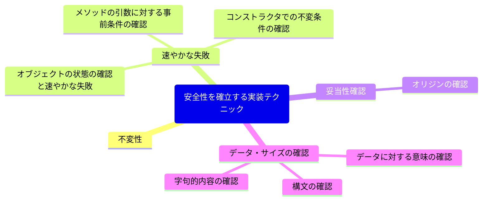

# 安全性を確立する実装テクニック

## 不変性

### 可変(mutable)のCustomerクラス

```java
public class Customer {
    private static final int MIN_INVOICE_SCORE = 500;
    
    private Id id;
    private Name name;
    private Order order;
    private CreditScore creditScore;
    
    public synchronized Id getId() {
        return id;
    }
    
    public synchronized Name getName() {
        return name;
    }
    
    public synchronized void setName(Name name) {
        this.name = name;
    }
    
    public synchronized Order getOrder() {
        return order;
    }
    
    public synchronized void setOrder(Order order) {
        this.order = order;
    }
    
    public synchronized CreditScore getCreditScore() {
        return creditScore;
    }
    
    public synchronized void setCreditScore(CreditScore creditScore) {
        this.creditScore = creditScore;
    }
    
    public synchronized boolean isAcceptedForInvoicePayment() {
        return creditScore.getScore() >= MIN_INVOICE_SCORE;
    }
    
    ...
}
```

### 不変(immutable)のCustomerクラス

```java
import static org.apache.commons.lang3.Validate.notNull;

...

public final class Customer {
    private final Id id;
    private final Name name;
    private final Order order;
    private final CreditScore creditScore;
    
    public Customer(final Id id, final Name name, final Order order, final CreditScore creditScore) {
        this.id = notNull(id);
        this.name = notNull(name);
        this.order = notNull(order);
        this.creditScore = notNull(creditScore);
    }
    
    public Id id() {
        return id;
    }
    
    public Name name() {
        return name;
    }
    
    public Order order() {
        return order;
    }
    
    public boolean isAcceptedForInvoicePayment() {
        return creditScore.getScore() >= MIN_INVOICE_SCORE;
    }
}
```

### 可変のCustomerクラスにおける信用スコア(credit score)のロジック

```java
import javax.security.auth.login.CredentialException;

public class Customer {
    private static final int MIN_INVOICE_SCORE = 500;

    private CredittScore creditScore;
    ...

    public synchronized void setCreditScore(CreditScore creditScore) {
        this.creditScore = creditScore;
    }
    
    public synchronized void getCreditScore() {
        return creditScore;
    }
    
    public synchronized boolean isAcceptedForInvoicePayment() {
        return creditScore.compute() > MIN_INVOICE_SCORE;
    }
    
    ...
}
```

```java
public class CreditScore {
    private Id id;
    
    public synchronized void setCustomeId(Id id) {
        this.id = id;
    }
    
    public synchronized int compute() {
        List<Record> history = BillingService.fetchBillingHistory(id);
        Membership membership = MembershipService.fetchMembership(id);
        return CreditScoreEngine.compute(id, history, membership);
    }
    
    ...
}
```
### 不変となるように修正したCreditScoreクラス

```java
import static org.apache.commons.lang3.Validate.isTrue;
...

public class CreditScore {
    private static final int MIN_INVOICE_SCORE = 500;
    private final int score;
    
    public CreditScore(final int computedCreditScore) {
        ifTrue(computedCreditScore > -1, "Credit score must be > -1");
        this.score = computedCreditScore;
    }
    
    public boolean isAcceptedForInvoicePayment() {
        return score > MIN_INVOICE_SCORE;
    }
    
    ...
}
```

## 速やかな失敗

#### 子猫に付ける名前の候補を管理するCatNameListクラス

```java
import java.util.ArrayList;

public class CatNameList {
    private final List<String> catNames = new ArrayList<String>();

    public void queueCatName(String name) {
        catNames.add(name);
    }
    
    public String nextCatName() {
        return catNames.get(0);
    }
    
    public void dequeueCatName() {
        catNames.remove(0);
    }
    
    public int size() {
        return catNames.size();
    }
}
```

### メソッドの引数に対する事前条件の確認

#### 契約の事前条件を満たさない場合は速やかに失敗させる

```java
public void queueCatName(String name) {
    if (name == null)
        throw new NullPointerException();
    if (!name.matches(".*x.*"))
        throw new IllegalArgumentException("Must contain s");
    if (catNames.contains(name))
        throw new IllegalArgumentException("Already queued");
    
    catNames.add(name);
}
```

#### Validateクラスを使った事前条件の確認

```java
import static org.apache.commons.lang3.Validate.*;
...

public void queueCatName(String name) {
    notNull(name);
    matchesPattern(name, ".*x.*", "Name must contain x");
    isTrue(!catNames.contains(name), "Cat name already queued");
    
    catNames.add(name);
}
```

### コンストラクタでの不変条件の確認

#### コンストラクタでの契約の実装

```java
import static org.apache.commons.lang3.Validate.*;
...

enum Sex { MALE, FEMALE;}

public class Cat {
    private String name;
    private final Sex sex;
    
    public Cat(String name, Sex sex) {
        notNull(name);
        matchesPattern(name, ".*x.*", "Name must contain x");
        
        notNull(sex);
        
        this.name = name;
        this.sex = sex;
    }
    
    ...
}
```

#### さらに簡潔に実装されたコンストラクタ

```java
public Cat(String name, Sex sex) {
    this.name = notNull(name);
    this.sex = notNull(sex);
    matchesPattern(name, ".*x.*", "Name must contain x");
}
```

### オブジェクトの状態の確認と速やかな失敗

#### 子猫の名前を取り出す際にCatNameListオブジェクトの状態を確認する

```java
public Strintg nextCatName() {
    validState(!catNames.isEmpty());
    return catNames.get(0);
}
```

#### 速やかに失敗することで契約を遵守するようにしたCatNameListクラス

```java
import org.apache.commons.lang3.Validate.*;

import java.util.List;
...

public class CatNameList {
    private final List<String> catNames = new ArrayList<String>();
    
    public void queueCatName(String name) {
        notNull(name);
        matchesPattern(name, ".*x.*", "Name must contain x");
        isTrue(!catNames.contains(name), "Cat name already queued");
        
        catNames.add(name);
    }
    
    public String nextCatName() {
        validState(!catNames.isEmpty());
        return catNames.get(0);
    }
    
    public void dequeueCatName() {
        validState(!catNames.isEmpty());
        catNames.remove(0);
    }
    
    public int size() {
        return catNames.size();
    }
}
```

## 妥当性確認

### オリジンの確認

### データ・サイズの確認

#### ISBNが適切なサイズなのかを確認するようになっているISBNクラス

```java
import static org.apache.commons.lang3.Validate.*;
...

public class ISBN {
    private final String isbn;
    
    public ISBN(final String isbn) {
        notNull(isbn);
        inclusiveBetween(10, 10, isbn.length());
        
        this.isbn = isbn;
    }
    
    ...
}

```

### 字句的内容の確認

#### 字句内容の確認を正規表現を使って行うようにしたISBNクラス

```java
import java.util.List;

import static org.apache.commons.lang3.Validate.*;
...

public class ISBN {
    private final String isbn;

    public ISBN(final String isbn) {
        notNull(isbn);
        inclusiveBetween(10, 10, isbn.length());
        isTrue(isbn.matches("[0-9X]"));

        this.isbn = isbn;
    }
    
    ...
}
```

### 構文の確認

#### 構文の確認を加えたISBNクラス

```java
import static org.apache.commons.lang3.Validate.*;
...

public class ISBN {
    private final String isbn;
    
    public ISBN(final String isbn) {
        notNull(isbn);
        inclusiveBetween(10, 10, isbn.length());
        isTrue(isbn.matches("[0-9X]"));
        isTrue(isbn.matches("[0-9]{9}[0-9X]"));
        isTrue(checksumValid(isbn));
        
        this.isbn = isbn;
    }
    
    private boolean checksumValid(final String isbn) {
        ...
    }
}
```

#### 字句内容の確認と構文の確認を1つにしたISBNクラス

```java
import static org.apache.commons.lang3.Validate.*;
...

    
    public ISBN(final String isbn) {
        notNull(isbn);
        inclusiveBetween(10, 10, isbn.length());
        isTrue(isbn.matches("[0-9X]"));
        isTrue(isbn.matches("[0-9]{9}[0-9X]"));
        isTrue(checksumValid(isbn));
        
        this.isbn = isbn;
    }
}
```

### データに対する意味の確認