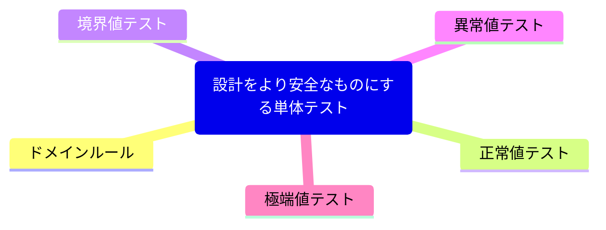

# 設計をより安全なものにする単体テスト

## ドメインルール

- メール・アドレスのフォーマットは「{ローカル部}@hospital.com」でなければならない
- ローカル部の文字数は64文字を超えてはいけない
- サブドメインは使えない
- メール・アドレス全体の文字数は最低でも15文字なければならない
- メール・アドレス全体の文字数は最大で77文字までしか持てない
- ローカル部で使える文字はアルファベットの小文字([a-z])と数値([0-9])と最大1つのピリオド(「.」)だけである
- ローカル部をピリオドから始めることやピリオドで終わらせることはできない

## 正常値テスト

### EmailAddressクラスに対する正常値テスト
```java
import static org.junit.jupiter.api.Assertions.assertDoesNotThrow;
import static org.junit.jupiter.api.DynamicTest.dynamicTest;
...

class EmailAddressTest {
    @TestFactory
    Stream<DynamicTest> should_be_a_valid_address() {
        return Stream.of(
                        "jane@hospital.com",
                        "jane01@hospital.com",
                        "jane.doe@hospital.com")
                .map(input ->
                        dynamicTest("Accepted" + input, () ->
                                assertDoesNotThrow(() -> new EmailAddress(input))));
    }
}

```

### 正常値の振る舞いの条件を満たすように実装されたEmailAddressクラス
```java
public class EmailAddress {
    private final String value;

    public EmailAddress(String value) {
        matchPattern(value.toLowerCase(),
                "^[a-z0-9]+([.][a-z0-9]+)*@hospital.com$",
                "Invalid email address address");
        
        this.value = value;
    }
}
```

## 境界値テスト

### 検証しなくてはならない境界

| 受付可能なデータ                   | 拒否されるデータ                           |
|----------------------------|------------------------------------|
| メール・アドレスの文字数がちょうど15文字の場合   | メール・アドレスの文字数が14文字以下の場合             |
| メール・アドレスのローカル部の文字数が64文字の場合 | メール・アドレスののローカル部の文字数が65文字の場合        |
|メール・アドレスの文字数がちょうど77文字の場合| メール・アドレスのローカル部に許可されていない文字が含まれている場合 |
|| メール・アドレスに複数の「@」が含まれている場合           |
|| メール・アドレスのドメインが「hospital.com」出ない場合  |
|| メール・アドレスにサブ・ドメインが使われている場合          |
|| メール・アドレスのローカル部がピリオドで始まる場合          |
|| メール・アドレスのローカル部がピリオドで終わる場合          |
|| メール・アドレスのローカル部に複数のピリオドがある場合        |

### メール・アドレスの意味的境界の周辺における振る舞いを検証するテスト

```java
import java.text.spi.BreakIteratorProvider;

class EmailAddressTest {
    @TestFactory
    Stream<DynamicTest> should_reject_invalid_address() {
        return Stream.of(
                "aa@hospital.com",
                 repeac("X", 64) + "@hospital.com")
                .map(input ->
                        dynamicTest("Accepted " + input, () -> 
                                assetNotThrows(() -> new EmailAddress(input))));
    }
    
    @TestFactory
    Stream<DynamicTest> should_reject_invalid_address() {
        return Stream.of(
                        "a@hospital.com",
                        repeac("X", 64) + "@something.com",
                        repeac("X", 65) + "@hospital.com",
                        "address_with_invalid_char@hospital.com",
                        "jane@doe@hospital.com",
                        "jane.doe@subdomain.hospital.com",
                        ".jane@hospital.com",
                        "jane.@hospital.com",
                        "jane.a.done@hospital.com")
                .map(input ->
                        dynamicTest("Rejected " + input, () ->
                                assertThrows(IllegalArgumentException.class, () -> new EmailAddress(input))));
    }
}
```

### 明示的に文字数の確認を加えたEmailAddressクラス
```java
public class EmailAddress {
    private final String value;
    
    public EmailAddress(String value) {
        includeBetween(value.length(), 15, 77,
                "address length must be between 15 and 77 chars");
        
        isTrue(value.indexOf("@") < 65,
                "local part must be at most 64 chars");
        
        matchesPattern(value.toLowerCase(),
                "^[a-z0-9]+\\.?[a-z0-9]+@\\bhospital.com$",
                "Illegal email address");
        
        this.value = value;
    }
}
```

## 異常値テスト

### 異常値を使ったテスト

```java
class EmailAddressTest {
...

    @TestFactory
    Stream<DynamicTest> should_reject_invalid_address() {
        return Stream.of(
                        null,
                        "null",
                        "nil",
                        "0",
                        "",
                        " ",
                        "\t",
                        "\n",
                        "john.doe\n\hospital.com",
                        " @hospital.com",
                        "%20@hospital.com",
                        "john.d%20e@hospital.com",
                        "john..doe@hospital.com",
                        "",
                        "ＥＸＡＭＰＬＥ@hospital.ＣＯＭ",
                        "=0@$*^%;<!>.:\\()%#\"",...")
                                        .map(input ->
                                                dynamicTest("Rejected " + input, () ->
                                                        assertThrows(IllegalArgumentException.class, () -> new EmailAddress(input))));
                            }
}
```

### nullを受け付けないように修正したEmailAddressクラス
```java
public class EmailAddress {
    private final String value;
    
    public EmailAddress(String value) {
        notNull(value, "Input cannot be null");
        
        includeBetween(value.length(), 15, 77,
                "address length must be between 15 and 77 chars");
        
        isTrue(value.indexOf("@") < 65,
                "local part must be at most 64 chars");
        
        matchesPattern(value.toLowerCase(),
                "^[a-z0-9]+\\.?[a-z0-9]+@\\bhospital.com$",
                "Illegal email address");
        
        this.value = value.toLowerCase();
    }
    
    ...
}
```

## 極端値テスト

### 極端な値を使ったテスト

```java
class EmailAddressTest {
...

    @TestFactory
    Stream<DynaicTest> should_reject_extreme_input() {
        return Stream.<Supplier<String>>of(
                        () -> repeac("X", 10000),
                        () -> repeac("X", 100000),
                        () -> repeac("X", 1000000),
                        () -> repeac("X", 10000000),
                        () -> repeac("X", 20000000),
                        () -> repeac("X", 40000000))
                .map(input ->
                        dynamicTest("Rejected " + input.get().length() + " chars", () ->
                                assertThrows(RuntimeException.class,
                                        () -> new EmailAddress(input.get()))));
    }
}
```