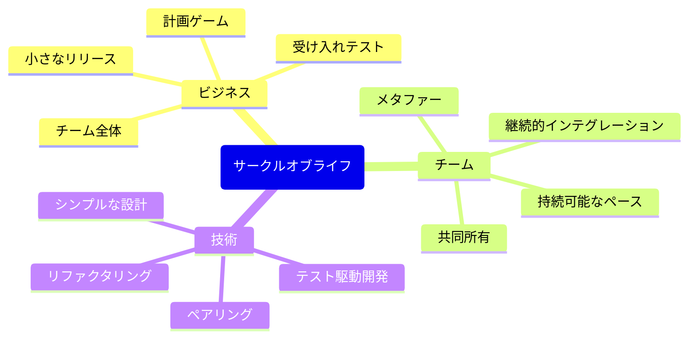
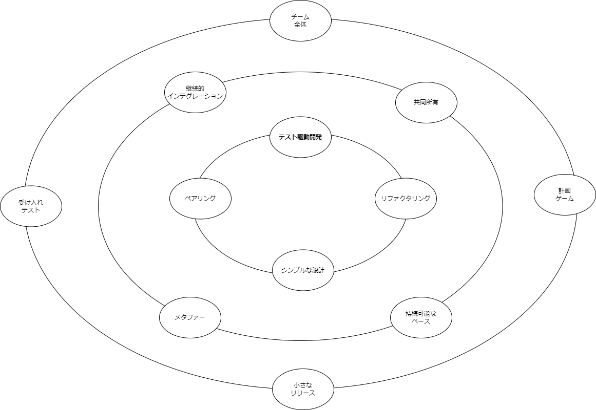
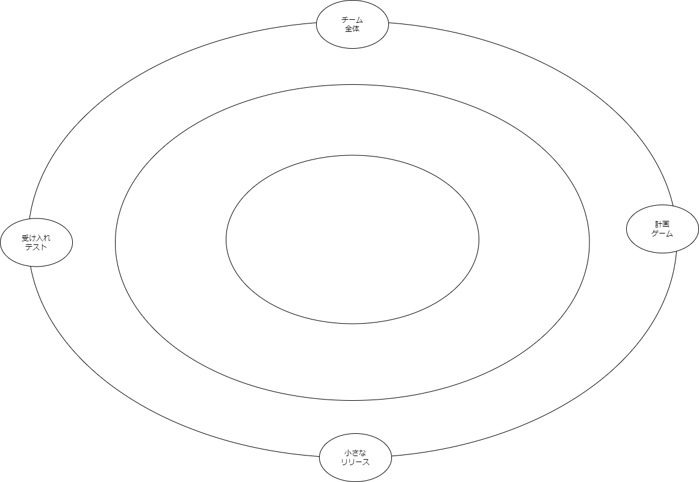
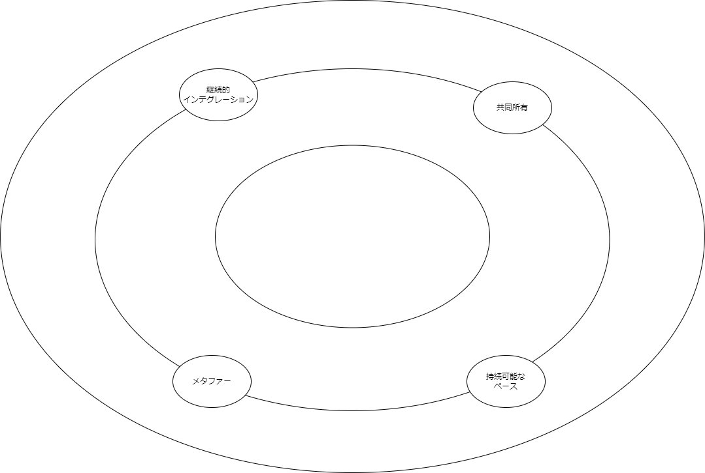
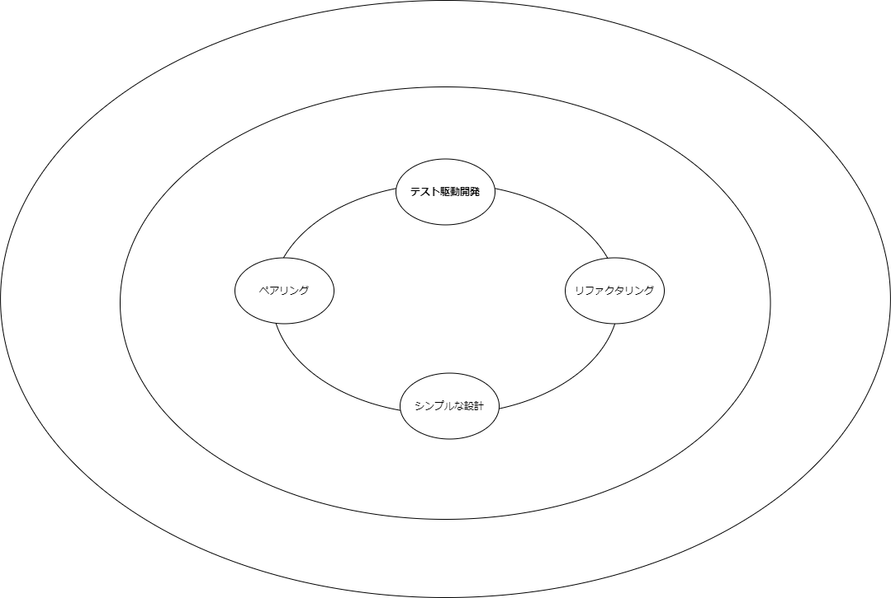
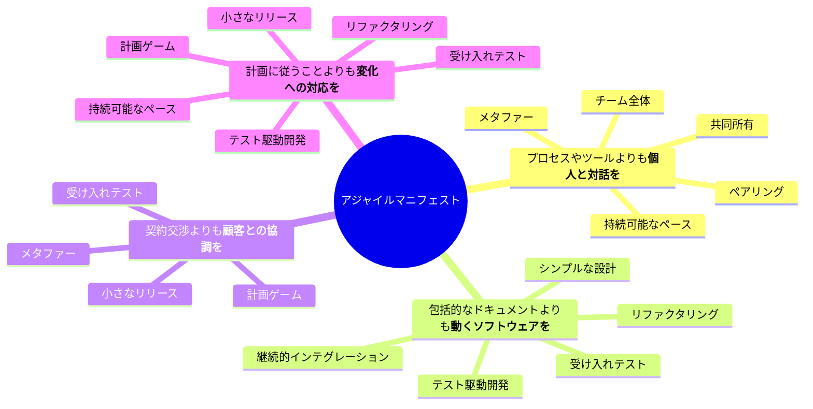
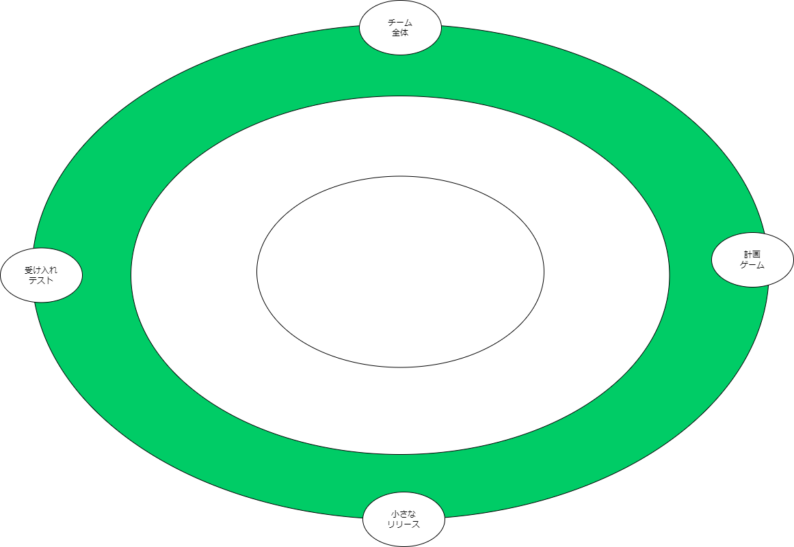
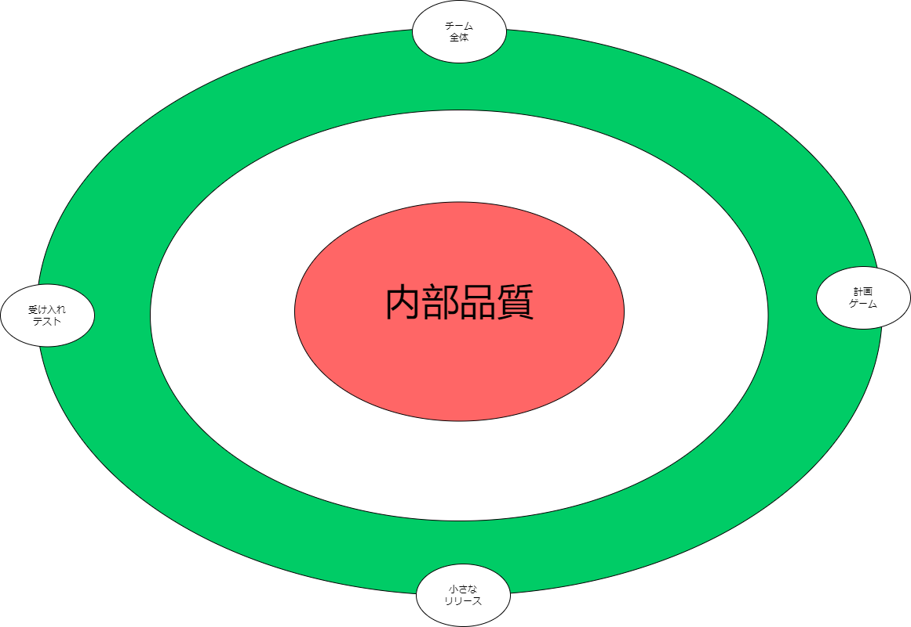

## サークルオブライフ

ロン・ジェフリーズがXPのプラクティスを描いた図で、サークルオブライフと呼ばれている。

## 構造

サークルオブライフは３つのリングに分割できる。

## ビジネス

最も外側にあるのが、ビジネス向けのXPプラクティスだ。これはスクラムのプロセスに相当する。これらのプラクティスは、ソフトウェア開発チームがビジネス側とコミュニケーションするためのフレームワークと、ビジネス側と開発チームの両方がプロジェクトをマネジメントするための原則を提供している。

- 計画ゲームは、このリングの中心的な役割を果たす。これは、プロジェクトを機能、ストーリー、タスクに分割する方法を示している。また、これらの機能、ストーリー、タスクの見積り、優先順位付け、スケジューリングのガイダンスを提供している。
- 小さなリリースは、小さな単位で作業するようにチームをガイドする。
- 受け入れテストは、機能、ストーリー、タスクの「DONE」の定義を提供する。明確な完成基準の設定方法をチームに示す。
- チーム全体は、ソフトウェア開発チームはさまざまな職種（プログラマー、テスター、マネージャーなど）で構成されており、共通のゴールを目指してみんなで協力するものだという考えを示している。

## チーム

「サークルオブライフ」の中間のリングは、チームのプラクティスを示している。これらのプラクティスは、開発チームがチーム内のマネージャーとコミュニケーションするためのフレームワークと原則を提供する。

- 持続可能なペースは、開発チームがリソースをすぐに消費してしまい、ゴールの手前で力尽きないようにするためのプラクティスである。
- 共同所要は、プロジェクトにおいてチームに「知識の断絶」が起きないようにするためのプラクティスである。
- 継続的インテグレーションは、チームが現在地を常に把握できるように、フィードバックループを何度も閉じることにフォーカスするプラクティスである。
- メタファーは、チームとビジネス側がシステムについてコミュニケーションするための語彙や言語を作成し、広めるためのプラクティスである。

## 技術

「サークルオブライフ」の最も内側のリングは、最高の技術品質を保証するために、プログラマーをガイドおよび強制するための技術プラクティスを示している。

- ペアリングは、革新性と正確性を促進するレベルで、技術チームが知識の共有、レビュー、協力ができるようになるためのプラクティスである。
- シンプルな設計は、チームがムダなことをしないようにガイドするするためのプラクティスである。
- リファクタリングは、すべての作成物の継続的な改善と改良を促進する。
- テスト駆動開発は、技術チームが高品質を維持しながらすばやく進むための命綱である。

## アジャイルマニフェストとの関連

## スクラム

> スクラム(名詞):複雑で変化の激しい問題に対応するためのフレームワークであり、可能な限り価値の高いプロダクトを生産的かつ創造的に届けるためのものである。
> 
> スクラムガイド

## [へろへろスクラム](https://bliki-ja.github.io/FlaccidScrum)

ソフトウェアの内部品質に気を配らずビジネス向けのプラクティスだけを取り入れた結果、ズルズルと技術負債に陥りスクラムがへろへろになった状態。

