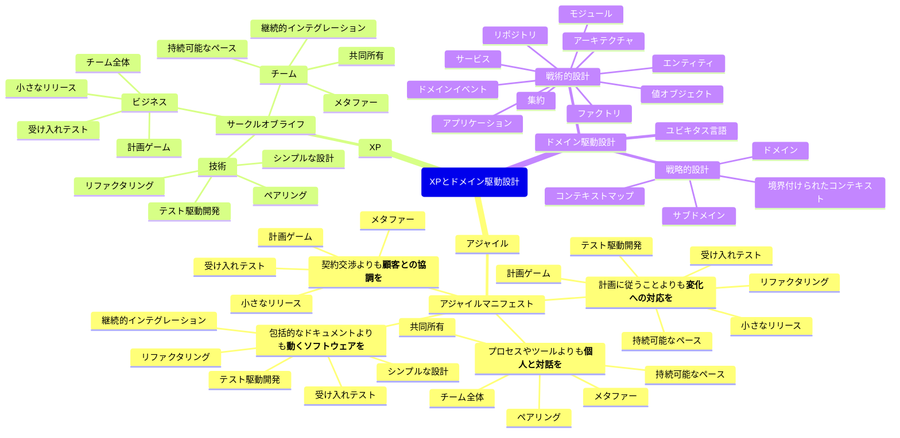
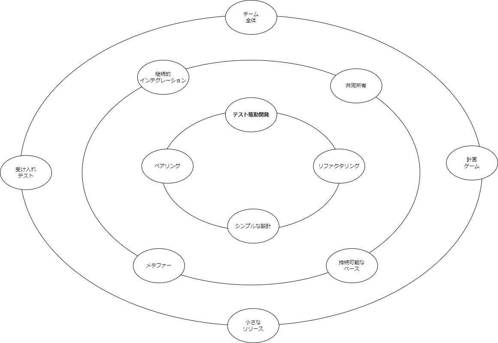

## XPとドメイン駆動設計

### アジャイル

> アジャイルとは、プロジェクトをイテレーションに分割するプロセスだ。各イテレーションのアウトプットを計測して、スケジュールを継続的に評価する。
最も価値のあるものが最初に実装されるように、ビジネスの価値の順番で機能を実装していく。クオリティは可能な限り高める。スケジュールはスコープの調整によって管理する。
これがアジャイルだ。
> 
> Clean Agile

### XP

### ドメイン駆動設計

> 革新的な著書「エリック・エヴァンスのドメイン駆動設計」にいおいて、エリック・エヴァンスはメタファーの問題を解決し、我々の居心地の悪さを排除してくれた。彼はこの本の中でユビキタス言語という用語をつくった。
> これはメタファーのプラクティスに与えられるべき名前だった。チームに必要なのは問題領域のモデルであり、それを全員が合意した語彙で記述するのである。
> 
> Clean Agile