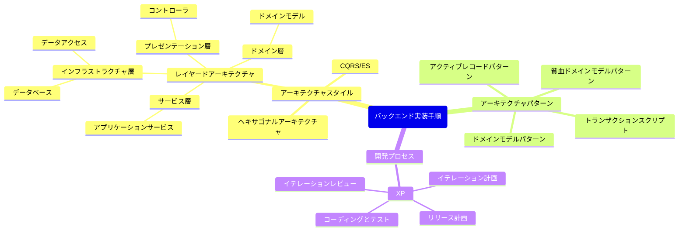
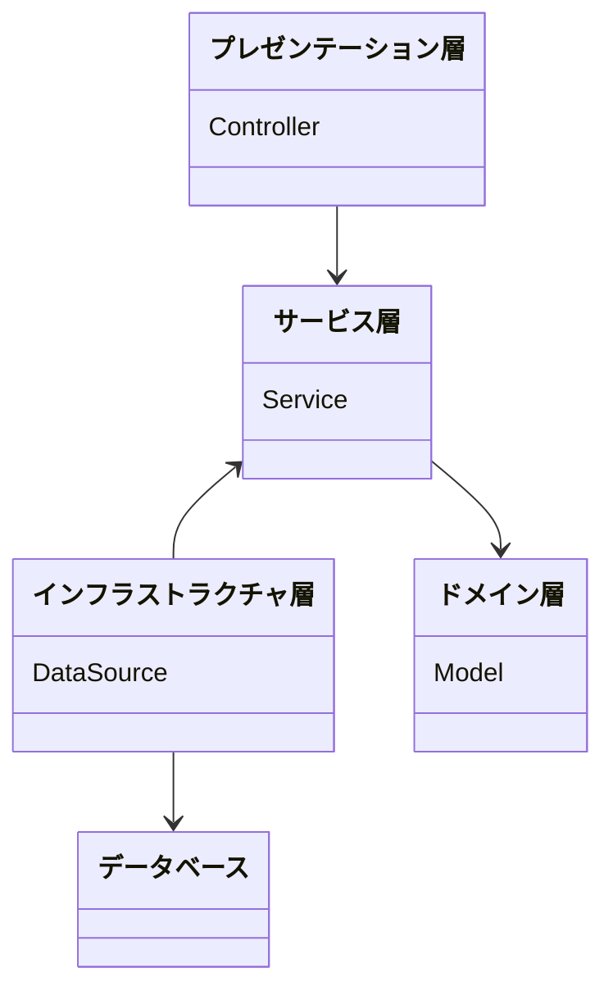
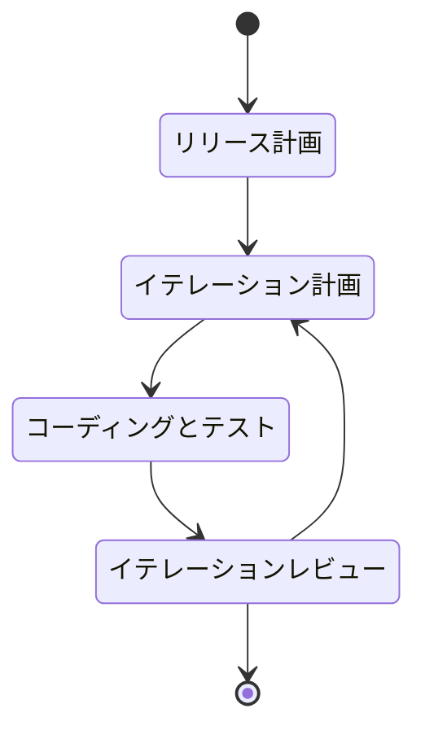
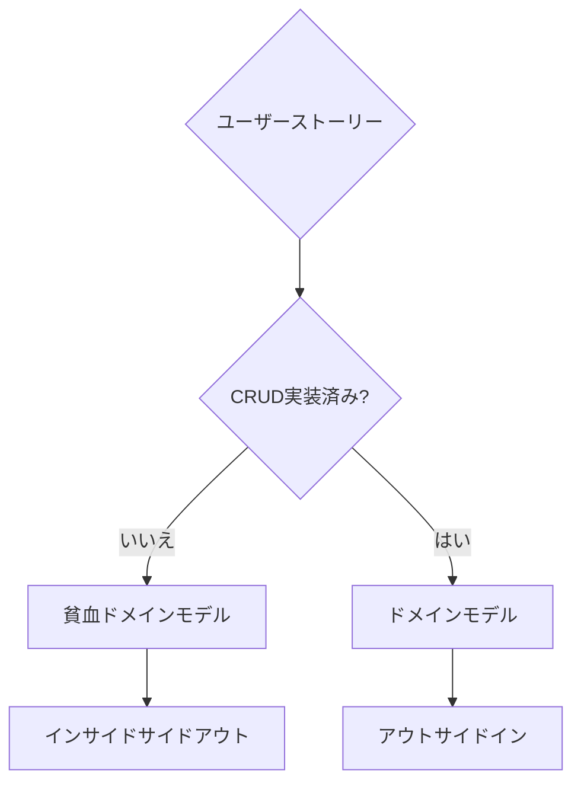
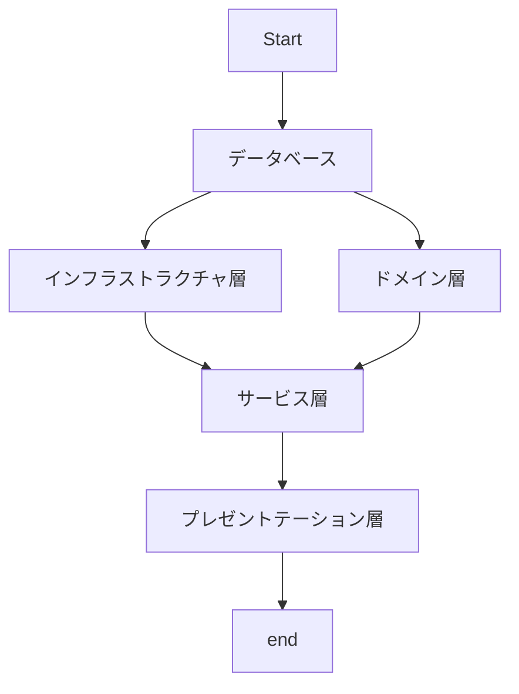
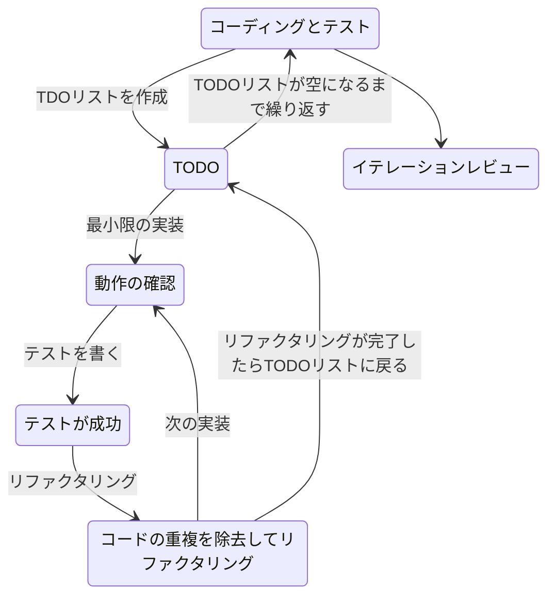
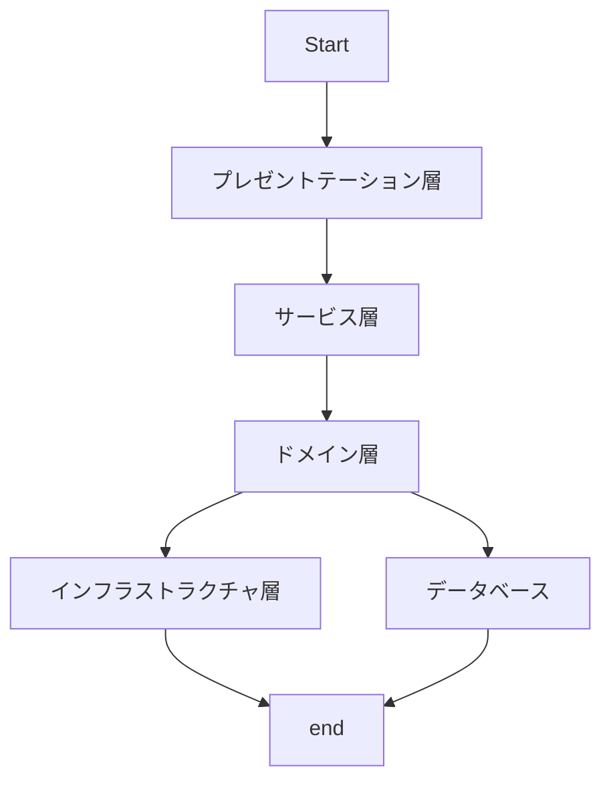
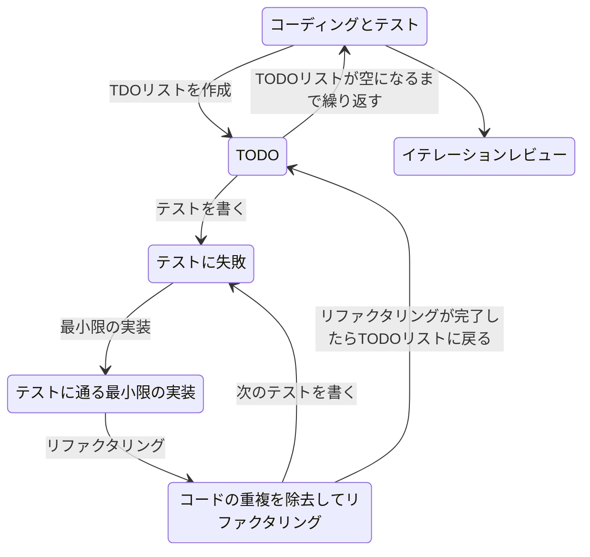

## アーキテクチャスタイル

### データベース

- データベースマイグレーションでデータベーススキーマを定義する。
- サンプルデータをデータベースに投入する。

### インフラストラクチャ層

- MyBatisGeneratorを使用して、データアクセスオブジェクトを生成する。
- テストコンテナを使った単体テストを実装する。

### サービス層

- アプリケーションサービスを実装する。
- アプリケーションサービスの単体テストを実装する。

### プレゼンテーション層

- コントローラを実装する。
- 受入テストを実装する。

### ドメイン層

- ドメインモデルを実装する。
- ドメインモデルの単体テストを実装する。

## 開発プロセス

### コーディングとテスト

#### インサイドアウト

#### アウトサイドイン

