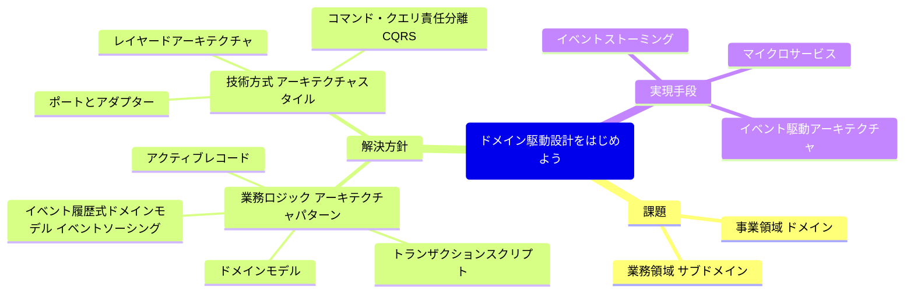
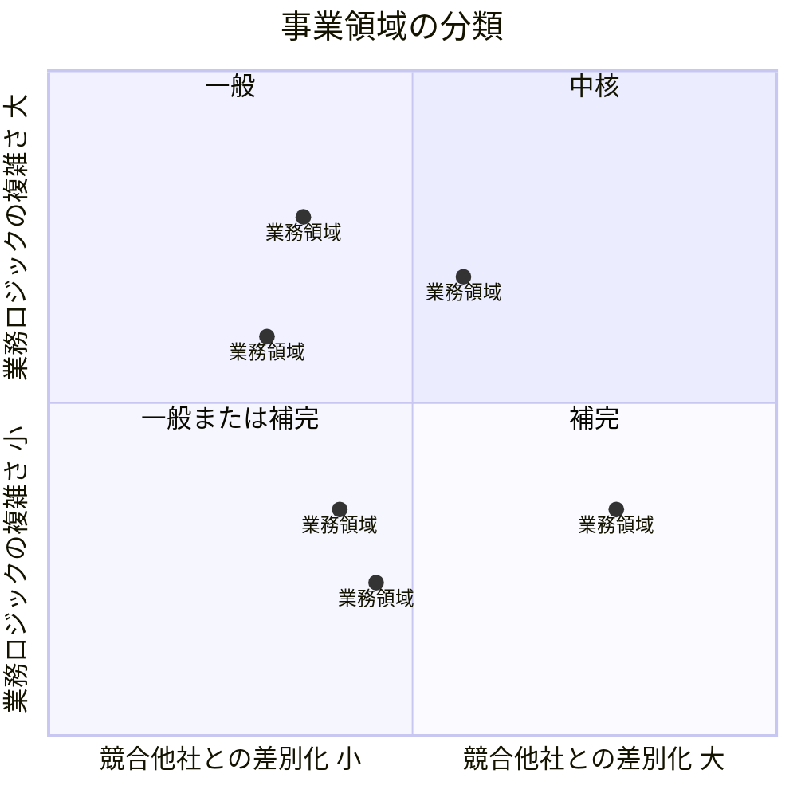
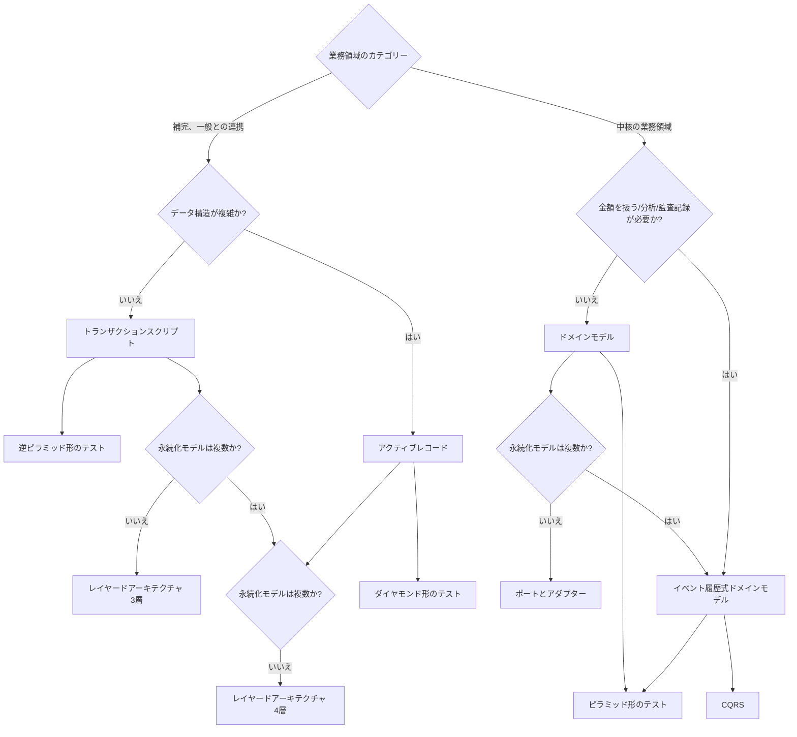

## 課題

- 私たちが取り組んでいる事業活動は何か
- 事業目標は何か
- 事業目標を達成するための戦略は何か

| カテゴリ- | 競争優位性 | 複雑さ | 変化  | 実現手段            | 課題の特性     |
|-------|-------|-----|-----|-----------------|-----------|
| 中核    | 〇     | 大きい | 多い  | 社内で開発           | 複雑で興味深い   |
| 一般    | ×     | 大きい | 少ない | パッケージや外部サービスを利用 | 既存の解決策がある |
| 補完    | ×     | 小さい | 少ない | 内部または外部委託       | 単純        |

## 解決方針

## 実現手段

- イベントストーミング
- マイクロサービス
- イベント駆動アーキテクチャ
