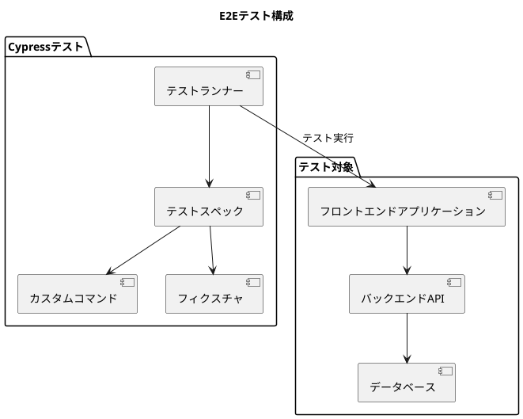
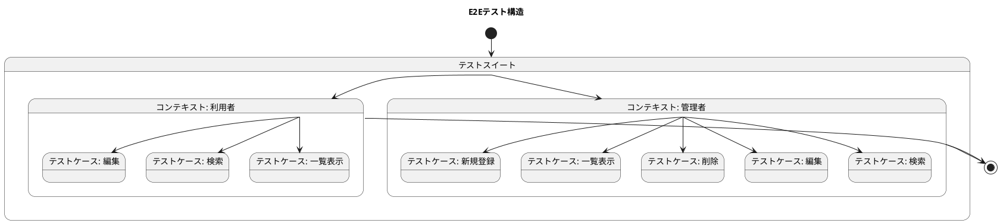
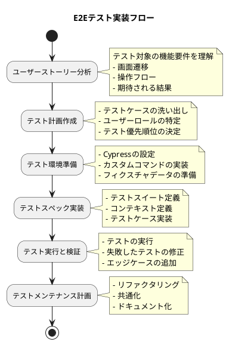

# E2Eテスト実装手順

## アーキテクチャ



### 1. ディレクトリ構成

```
cypress/
├── e2e/                # テストスペックファイル
│   └── sales/          # 売上関連のテスト
│       ├── Sales.cy.js       # 売上管理テスト
│       ├── Order.cy.js       # 受注管理テスト
│       ├── Invoice.cy.js     # 請求管理テスト
│       └── SalesAggregation.cy.js # 売上集計テスト
├── fixtures/           # テストデータ
│   └── example.json
├── support/            # サポートファイル
│   ├── commands.js     # カスタムコマンド
│   └── e2e.js          # E2E設定
└── downloads/          # ダウンロードファイル
```

### 2. テスト構造



## 開発プロセス

### 実装フロー



### テスト実装手順

1. **テスト対象の分析**
   - 対象機能の仕様を理解する
   - 画面遷移と操作フローを把握する
   - テスト要件を特定する

2. **テストケースの設計**
   - ユーザーロール別のテストケースを洗い出す
   - 正常系と異常系のシナリオを検討する
   - テストの優先順位を決定する

3. **テストスペックの実装**
   - テストスイートを定義する
   - コンテキスト（ユーザーロールなど）を定義する
   - 各テストケースを実装する

4. **テストの実行と検証**
   - テストを実行する
   - 失敗したテストを修正する
   - エッジケースを追加する

5. **テストのメンテナンス**
   - 共通処理をリファクタリングする
   - テストコードを最適化する
   - テストドキュメントを更新する

## 実装例

### 1. テストスイートの基本構造

```javascript
// テストスイート
describe('機能名', () => {
  // コンテキスト（ユーザーロールなど）
  context('ユーザーロール', () => {
    // 前処理
    beforeEach(() => {
      // ログインなどの共通処理
    });

    // 共通関数
    const navigateToPage = () => {
      // ページ遷移の処理
    };

    // テストケース
    context('機能の一部', () => {
      it('テストケース名', () => {
        // テスト手順
        // 検証
      });
    });
  });
});
```

### 2. 請求管理テストの実装例

```javascript
describe('請求管理', () => {
  context('管理者', () => {
    beforeEach(() => {
      cy.login('U000003', 'a234567Z');
    });

    const userPage = () => {
      cy.get('#side-nav-menu > :nth-child(1) > :nth-child(3) > :nth-child(1) > :nth-child(6) > :nth-child(1) > #side-nav-billing-nav').click();
    };

    context('請求一覧', () => {
      it('請求一覧の表示', () => {
        userPage();
        cy.get('.collection-view-container').should('be.visible');
      });
    });

    context('請求新規登録', () => {
      it('新規登録', () => {
        userPage();
        
        // 請求新規画面を開く
        cy.get('#new').click();
        
        // ヘッダ情報を入力
        cy.get('#invoiceNumber').type('IV00000001');
        cy.get('#invoiceDate').type('2024-01-01');
        cy.get('#customerCode').type('001');
        cy.get(':nth-child(1) > .collection-object-item-actions > #select-customer').click();
        cy.get('#previousPaymentAmount').type('5000');
        cy.get('#currentMonthSalesAmount').type('10000');
        cy.get('#currentMonthPaymentAmount').type('2000');
        cy.get('#currentMonthInvoiceAmount').type('8000');
        cy.get('#consumptionTaxAmount').type('800');
        cy.get('#invoiceReconciliationAmount').type('0');
        
        // 明細行を追加
        cy.get('.add-line-button').click();
        
        // 明細行1のデータを入力
        cy.get('.sales-line-row').eq(0).within(() => {
          // 売上番号
          cy.get('input[type="text"]').eq(0).type('SA00000001');
          // 売上行番号
          cy.get('input[type="number"]').eq(0).type('1');
        });
        
        // 請求を保存
        cy.get('#save').click();
        
        // 作成完了メッセージの確認
        cy.get('#message').contains('請求を作成しました。');
      });
    });

    // 他のテストケース...
  });

  context('利用者', () => {
    // 利用者向けのテストケース...
  });
});
```

### 3. セレクタの特定方法

E2Eテストでは、UIの要素を特定するためのセレクタが重要です。以下の方法でセレクタを特定します：

1. **ID属性の利用**
   ```javascript
   cy.get('#invoiceNumber').type('IV00000001');
   ```

2. **クラス属性の利用**
   ```javascript
   cy.get('.collection-view-container').should('be.visible');
   ```

3. **複合セレクタの利用**
   ```javascript
   cy.get(':nth-child(1) > .collection-object-item-actions > #select-customer').click();
   ```

4. **要素の階層構造を利用**
   ```javascript
   cy.get('.sales-line-row').eq(0).within(() => {
     cy.get('input[type="text"]').eq(0).type('SA00000001');
   });
   ```

### 4. アサーションの実装

テストでは、期待される結果を検証するためのアサーションが重要です：

1. **要素の存在確認**
   ```javascript
   cy.get('.collection-view-container').should('exist');
   ```

2. **要素の表示確認**
   ```javascript
   cy.get('.collection-view-container').should('be.visible');
   ```

3. **テキスト内容の確認**
   ```javascript
   cy.get('#message').contains('請求を作成しました。');
   ```

4. **要素の数の確認**
   ```javascript
   cy.get('.sales-line-row').should('have.length', 1);
   ```

## 実装手順の詳細

### 1. 新規テストファイルの作成

1. 既存のテストファイルを参考にする（例：Sales.cy.js）
2. 新しいテストファイルを作成する（例：Invoice.cy.js）
3. テストスイートの基本構造を実装する

```javascript
describe('請求管理', () => {
  context('管理者', () => {
    beforeEach(() => {
      cy.login('U000003', 'a234567Z');
    });

    const userPage = () => {
      // ナビゲーション処理
    };

    // テストケースを追加
  });

  context('利用者', () => {
    beforeEach(() => {
      cy.login('U000001', 'a234567Z');
    });

    const userPage = () => {
      // ナビゲーション処理
    };

    // テストケースを追加
  });
});
```

### 2. ナビゲーションセレクタの特定

1. 対象画面へのナビゲーションパスを特定する
2. 要素のセレクタを特定する（開発者ツールを使用）
3. ナビゲーション関数を実装する

```javascript
const userPage = () => {
  cy.get('#side-nav-menu > :nth-child(1) > :nth-child(3) > :nth-child(1) > :nth-child(6) > :nth-child(1) > #side-nav-billing-nav').click();
};
```

### 3. テストケースの実装

1. 各機能のテストケースを定義する
2. テスト手順を実装する
3. 期待される結果を検証するアサーションを追加する

```javascript
context('請求一覧', () => {
  it('請求一覧の表示', () => {
    userPage();
    cy.get('.collection-view-container').should('be.visible');
  });
});

context('請求検索', () => {
  it('検索', () => {
    userPage();
    cy.get('#search').click();
    cy.get('#search-billing-number').type('IV00000001');
    cy.wait(1000);
    cy.get('#search-all').click();
    cy.get(':nth-child(2) > .collection-object-item-content-name').contains('IV00000001');
  });
});
```

### 4. フォーム入力のテスト実装

1. フォーム要素のセレクタを特定する
2. 入力操作を実装する
3. 送信操作を実装する
4. 結果の検証を実装する

```javascript
context('請求新規登録', () => {
  it('新規登録', () => {
    userPage();
    
    // 請求新規画面を開く
    cy.get('#new').click();
    
    // ヘッダ情報を入力
    cy.get('#invoiceNumber').type('IV00000001');
    cy.get('#invoiceDate').type('2024-01-01');
    // その他の入力...
    
    // 請求を保存
    cy.get('#save').click();
    
    // 作成完了メッセージの確認
    cy.get('#message').contains('請求を作成しました。');
  });
});
```

### 5. テーブル操作のテスト実装

1. テーブル要素のセレクタを特定する
2. 行の追加操作を実装する
3. セル内の入力操作を実装する

```javascript
// 明細行を追加
cy.get('.add-line-button').click();

// 明細行1のデータを入力
cy.get('.sales-line-row').eq(0).within(() => {
  // 売上番号
  cy.get('input[type="text"]').eq(0).type('SA00000001');
  // 売上行番号
  cy.get('input[type="number"]').eq(0).type('1');
});
```

## ベストプラクティス

1. **テストの独立性を保つ**
   - 各テストは他のテストに依存せず、独立して実行できるようにする
   - beforeEach で初期状態をリセットする

2. **セレクタの堅牢性を確保する**
   - ID属性を優先的に使用する
   - データ属性（data-cy など）を活用する
   - 複雑なセレクタは変数化して再利用する

3. **待機処理を適切に実装する**
   - 明示的な待機（cy.wait）は最小限にする
   - 暗黙的な待機（should）を活用する
   - カスタムコマンドで待機処理をラップする

4. **テストデータの管理**
   - フィクスチャを活用してテストデータを管理する
   - テスト間でデータの競合が起きないようにする
   - APIモックを活用してデータを制御する

5. **エラーハンドリング**
   - 予期せぬエラーに対処するための処理を実装する
   - スクリーンショットを活用してデバッグする
   - 詳細なログを出力する

## 参照

- [Cypress 公式ドキュメント](https://docs.cypress.io/)
- [フロントエンド実装手順](./フロントエンド実装手順.md)
- [受け入れテスト実装手順](./受け入れテスト実装手順.md)