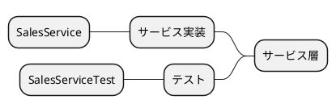
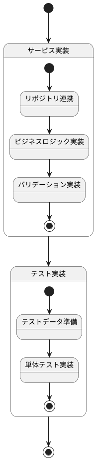
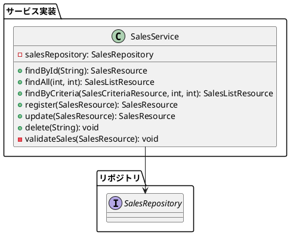
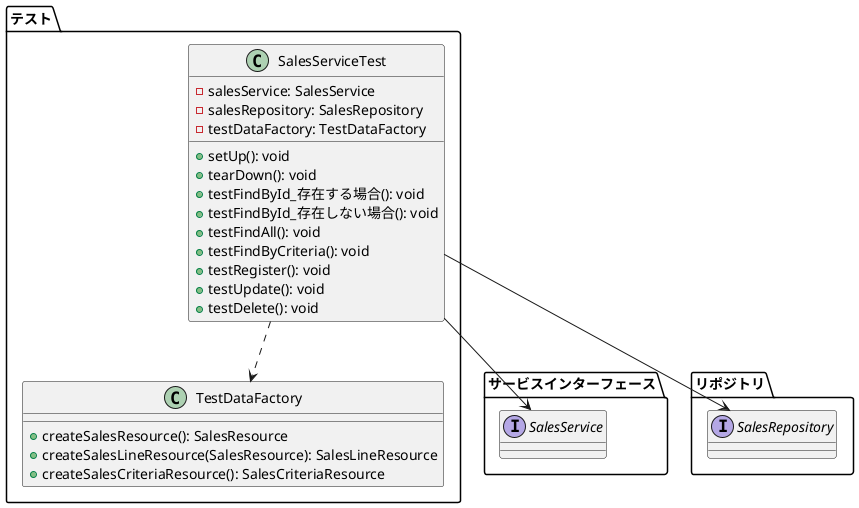
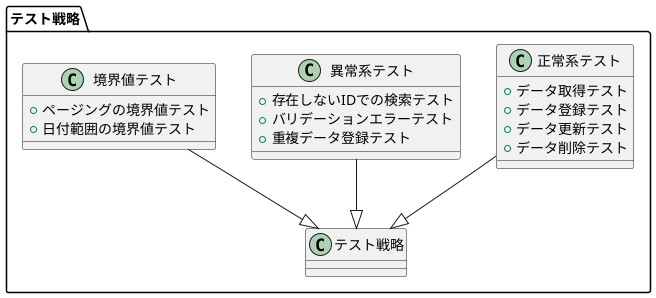

## サービス実装手順

売上管理機能のサービス部分は、以下の手順で実装されました。各ステップは特定の責務を持つコンポーネントを追加し、全体として堅牢なサービス層を構築しています。

## 実装ステップ

以下は実装ステップの状態遷移を示すステートチャートです：

### 2. サービス実装

次に、サービスインター実装クラスを作成します。このクラスはリポジトリを使用してデータアクセスを行い、ビジネスロジックを実行します。

### 4. テスト実装

最後に、サービス層のテストを実装します。これにより、サービス層の機能が正しく動作することを確認できます。

## サービス実装のポイント

1. **レイヤー分離**: サービス層はアプリケーション層とドメイン層の間の橋渡しをし、各層の責務を明確に分離しています。
2. **例外処理**: 適切な例外クラスを定義し、エラー状況を明確に伝えています。
3. **テスト駆動開発**: サービス層の機能を検証するテストケースを実装しています。

## テスト戦略

サービス層のテストは、以下の方針で実施されています：

### テスト実装のポイント

1. **モック利用**: リポジトリをモック化し、サービス層のロジックのみをテストしています。
2. **テストデータファクトリ**: テストデータの作成を一元管理し、テストコードの可読性と保守性を向上させています。
3. **CRUD操作の網羅**: 全てのサービス操作（検索、登録、更新、削除）に対するテストを実装しています。
4. **エッジケースのテスト**: 存在しないIDでの検索や、バリデーションエラーなど、エラーケースも適切にテストしています。

## 実装手順のまとめ

売上管理機能のサービス部分の実装は、以下の4つのステップで行われました：

1. **サービス実装**: リポジトリを使用したサービスインターフェースの実装
2. **テスト実装**: サービス層の機能を検証するテストケースの作成

この実装アプローチにより、保守性が高く、拡張性のあるサービス層が実現されています。
