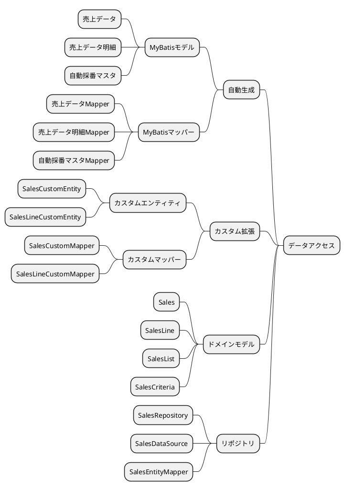
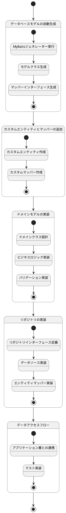
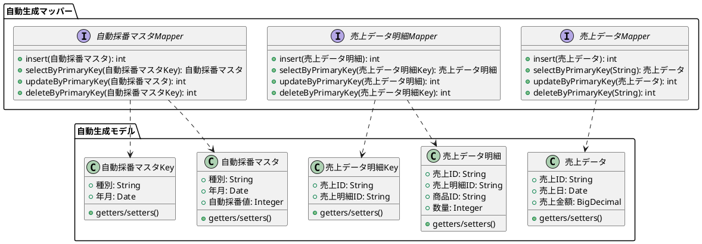
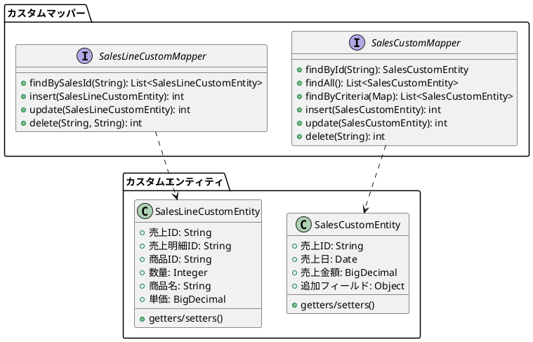
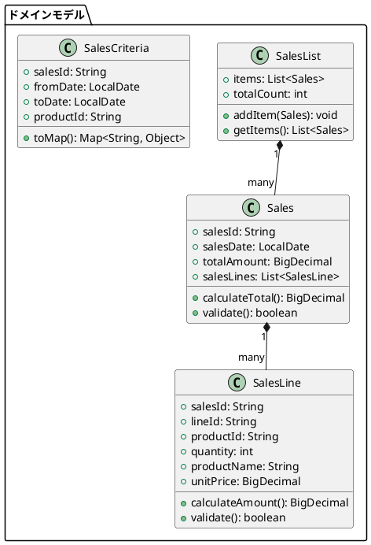
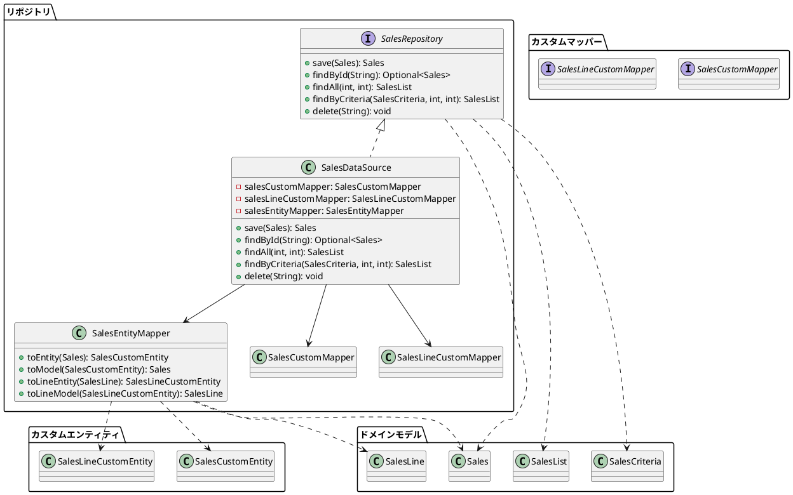
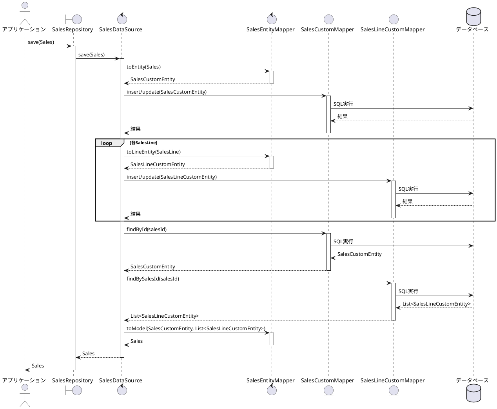
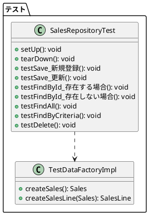

## データアクセス実装手順

売上管理機能のデータアクセス部分は、以下の手順で実装されました。各ステップは特定の責務を持つコンポーネントを追加し、全体として堅牢なデータアクセス層を構築しています。

## 実装ステップ

以下は実装ステップの状態遷移を示すステートチャートです：

### 1. データベースモデルの自動生成

最初のステップでは、MyBatisジェネレーターを使用してデータベーステーブルに対応するJavaモデルクラスとマッパーを自動生成します。

### 2. カスタムエンティティとマッパーの追加

次に、自動生成されたモデルを拡張するカスタムエンティティとマッパーを作成します。これにより、アプリケーション固有の要件に対応できます。

### 3. ドメインモデルの実装

ドメインモデルは、ビジネスロジックを含むクラスで、データアクセス層とアプリケーション層の間の橋渡しをします。

### 4. リポジトリの実装

リポジトリは、ドメインモデルとデータベースの間の変換を担当し、データアクセスの抽象化を提供します。

### 5. データアクセスフロー

以下の図は、アプリケーションからデータベースまでのデータフローを示しています。

## データアクセス実装のポイント

1. **レイヤー分離**: データベースアクセス、ドメインモデル、アプリケーションロジックを明確に分離しています。
2. **自動生成コードの活用**: MyBatisジェネレーターを使用して基本的なCRUD操作を自動生成し、開発効率を向上させています。
3. **カスタム拡張**: 自動生成されたコードを拡張して、アプリケーション固有の要件に対応しています。
4. **ドメインモデル中心設計**: ビジネスロジックをドメインモデルに集約し、データアクセス層との依存関係を最小限に抑えています。
5. **リポジトリパターン**: データアクセスの詳細をリポジトリに隠蔽し、アプリケーションからは単純なインターフェースでアクセスできるようにしています。

## テスト戦略

データアクセス層のテストは、以下の方針で実施されています：

### テスト実装のポイント

1. **テストデータファクトリ**: テストデータの作成を一元管理し、テストコードの可読性と保守性を向上させています。
2. **CRUD操作の網羅**: 全てのリポジトリ操作（作成、読取、更新、削除）に対するテストを実装しています。
3. **エッジケースのテスト**: 存在しないIDでの検索など、エラーケースも適切にテストしています。
4. **独立したテスト環境**: 各テストは独立して実行でき、他のテストの影響を受けないように設計されています。

## 実装手順のまとめ

売上管理機能のデータアクセス部分の実装は、以下の5つのステップで行われました：

1. **データベースモデルの自動生成**: MyBatisジェネレーターを使用して基本的なモデルとマッパーを生成
2. **カスタムエンティティとマッパーの追加**: アプリケーション固有の要件に対応するための拡張
3. **ドメインモデルの実装**: ビジネスロジックを含むモデルクラスの作成
4. **リポジトリの実装**: データアクセスを抽象化するリポジトリパターンの適用
5. **テストの実装**: リポジトリの機能を検証するテストケースの作成

この実装アプローチにより、保守性が高く、拡張性のあるデータアクセス層が実現されています。
