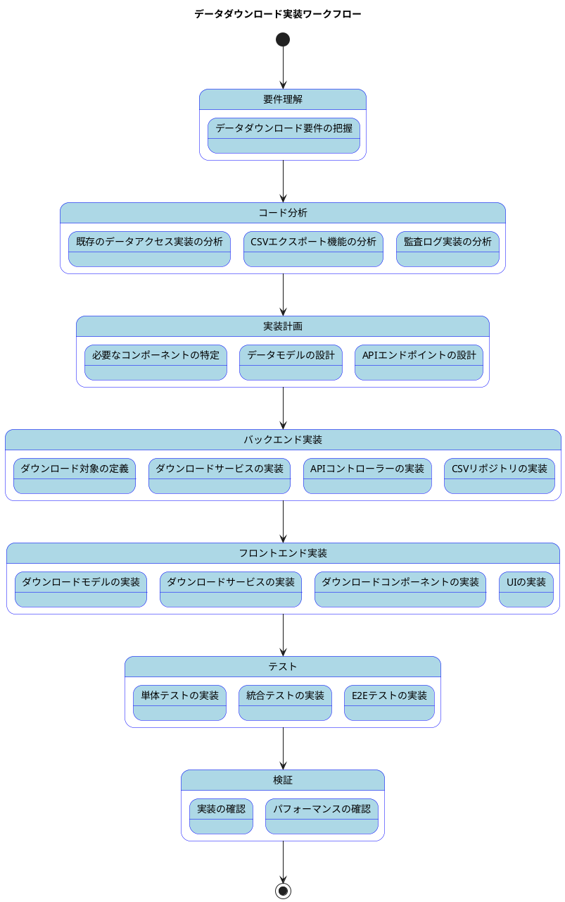

# データダウンロード実装手順

## 概要
本ドキュメントでは、アプリケーションからデータをCSVファイルとしてダウンロードする機能の実装手順について説明します。データダウンロード機能は、マスタデータや取引データをCSV形式でエクスポートするために使用されます。

## 実装の構成

### フロントエンド実装

#### コンポーネント構成
1. **DownloadContainer**
   - ダウンロード機能のメインコンテナ
   - DownloadProviderコンテキストを提供
   - ローディング状態の管理

2. **DownloadSingle**
   - ダウンロード対象の選択インターフェース
   - ダウンロード処理の実行
   - エラーハンドリング

3. **DownloadProvider**
   - ダウンロード関連の状態管理
   - ダウンロードサービスの提供
   - メッセージとエラーの管理

### バックエンド実装

#### APIエンドポイント
- **POST /api/downloads/count**
  - ダウンロード対象のレコード数を取得
  - ダウンロード前の確認に使用

- **POST /api/downloads/download**
  - 指定されたデータをCSVとしてダウンロード
  - 監査ログの記録

#### 主な機能
1. ダウンロード対象の選択
2. ダウンロード件数の確認
3. CSVファイルの生成
4. ファイルダウンロード処理
5. 監査ログの記録

## データフロー
1. ユーザーがダウンロード対象を選択
2. フロントエンドでダウンロード件数を確認
3. ユーザーがダウンロードを確認
4. バックエンドでCSVファイルを生成
5. ブラウザにファイルをダウンロード
6. 監査ログに記録

## エラーハンドリング
- フロントエンド
  - ダウンロード対象未選択のチェック
  - ダウンロード処理中のエラー表示
  - ネットワークエラーの処理

- バックエンド
  - 権限チェックエラー
  - データ取得エラー
  - ファイル生成エラー

## セキュリティ
- 権限に基づくアクセス制御
- 監査ログの記録
- エラーメッセージの適切な管理

## 実装サンプル

### フロントエンド実装サンプル

#### ダウンロードモデル
```typescript
export enum DownloadTarget {
    部門 = "0",
    社員 = "1",
    商品分類 = "2",
    商品 = "3",
    取引先グループ = "4",
    取引先  = "5",
    顧客 = "6",
    仕入先 = "7",
    受注 = "8",
    出荷 = "9",
    売上 = "10",
}

export type DownloadConditionType = {
    target: DownloadTarget;
};

export const mapToDownloadResource = (condition: DownloadConditionType) => {
    const isEmpty = (value: unknown) => value === "" || value === null || value === undefined;

    type Resource = {
        target: string;
    };

    if (isEmpty(condition.target)) {
        throw new Error("Target is required.");
    }

    const resource: Resource = {
        target: condition.target,
    };

    return resource;
};
```

#### ダウンロードサービス
```typescript
export interface DownloadServiceType {
    download: (condition: DownloadConditionType) => Promise<Blob>;
    count: (condition: DownloadConditionType) => Promise<number>;
}

export const DownloadService = (): DownloadServiceType => {
    const config = Config();
    const apiUtils = Utils.apiUtils;
    const endPoint = `${config.apiUrl}/downloads`;

    const download = (condition: DownloadConditionType): Promise<Blob> => {
        const url = `${endPoint}/download`;
        const resource = mapToDownloadResource(condition);
        return apiUtils.fetchPostDownload(url, resource);
    };

    const count = (condition: DownloadConditionType): Promise<number> => {
        const url = `${endPoint}/count`;
        const resource = mapToDownloadResource(condition);
        return apiUtils.fetchPost(url, resource);
    };

    return {
        download,
        count,
    };
};
```

#### DownloadProvider
```typescript
type DownloadContextType = {
    loading: boolean;
    setLoading: Dispatch<SetStateAction<boolean>>;
    message: string | null;
    setMessage: Dispatch<SetStateAction<string | null>>;
    error: string | null;
    setError: Dispatch<SetStateAction<string | null>>;
    selectedTarget: DownloadTarget | null;
    setSelectedTarget: Dispatch<SetStateAction<DownloadTarget | null>>;
    downloadService: ReturnType<typeof DownloadService>;
};

export const DownloadProvider: React.FC<Props> = ({ children }) => {
    const [loading, setLoading] = useState<boolean>(false);
    const { message, setMessage, error, setError } = useMessage();
    const [selectedTarget, setSelectedTarget] = useState<DownloadTarget | null>(null);
    const downloadService = DownloadService();

    const value = useMemo(
        () => ({
            loading,
            setLoading,
            message,
            setMessage,
            error,
            setError,
            selectedTarget,
            setSelectedTarget,
            downloadService,
        }),
        [loading, message, setMessage, error, setError, selectedTarget, downloadService]
    );

    return <DownloadContext.Provider value={value}>{children}</DownloadContext.Provider>;
};
```

#### DownloadSingle
```typescript
export const DownloadSingle: React.FC = () => {
    const {
        setLoading,
        message,
        setMessage,
        error,
        setError,
        selectedTarget,
        setSelectedTarget,
        downloadService,
    } = useDownloadContext();

    const handleDownload = async () => {
        if (!selectedTarget) {
            setError("ダウンロード対象を選択してください。");
            return;
        }
        setLoading(true);
        setMessage("");
        setError("");

        try {
            const condition = { target: selectedTarget };
            const downloadCount = await downloadService.count(condition);
            const isProceed = confirm(`${downloadCount}件ダウンロードします。よろしいですか？`);
            if (!isProceed) return;

            const blob = await downloadService.download(condition);
            const currentDate = new Date().toISOString().split("T")[0];
            const symbol = getSymbolByValue(DownloadTarget, selectedTarget);
            const symbolName = getKeyBySymbol(DownloadTarget, symbol?.toString() as DownloadTarget) ?? "unknown";
            const downloadFileName = `${symbolName}-${currentDate}.csv`;

            const url = window.URL.createObjectURL(blob);
            const a = document.createElement("a");
            a.href = url;
            a.download = downloadFileName;
            a.click();
            window.URL.revokeObjectURL(url);

            setMessage(`${symbolName} データをダウンロードしました。`);
        } catch (error: any) {
            showErrorMessage(
                `ダウンロードに失敗しました: ${error?.message}`,
                setError
            );
        } finally {
            setLoading(false);
        }
    };

    return (
        <SingleView
            error={error}
            message={message}
            formItems={{
                selectedTarget,
                setSelectedTarget,
            }}
            headerActions={{
                handleDownload,
            }}
        />
    );
}
```

### バックエンド実装サンプル

#### DownloadTarget
```java
/**
 * ダウンロード対象
 */
@Getter
public enum DownloadTarget {
    部門("department"),
    社員("employee"),
    商品分類("product_category"),
    商品("product"),
    取引先グループ("partner_group"),
    取引先("partner"),
    顧客("customer"),
    仕入先("vendor"),
    受注("order"),
    出荷("shipment"),
    売上("sales");

    private final String value;

    DownloadTarget(String value) {
        this.value = value;
    }
}
```

#### DownloadApiController
```java
/**
 * データダウンロードAPI
 */
@Slf4j
@RestController
@RequestMapping("/api/downloads")
@Tag(name = "Download", description = "データダウンロード")
public class DownloadApiController {
    final DownloadService downloadService;
    final MessageSource messageSource;

    public DownloadApiController(DownloadService downloadService, MessageSource messageSource) {
        this.downloadService = downloadService;
        this.messageSource = messageSource;
    }

    @Operation(summary = "ダウンロード件数", description = "ダウンロード件数を取得する")
    @PostMapping("/count")
    public ResponseEntity<?> count(@RequestBody DownloadCriteriaResource resource) {
        try {
            DownloadCriteria condition = DownloadCriteriaResource.of(resource.getTarget());
            return ResponseEntity.ok(downloadService.count(condition));
        } catch (RuntimeException e) {
            return ResponseEntity.badRequest().body(new MessageResponse(e.getMessage()));
        }
    }

    @Operation(summary = "ダウンロード", description = "ダウンロードする")
    @PostMapping("/download")
    @AuditAnnotation(process = ApplicationExecutionProcessType.データダウンロード, type = ApplicationExecutionHistoryType.同期)
    public void download(@RequestBody DownloadCriteriaResource resource, HttpServletResponse response) {
        DownloadCriteria condition = DownloadCriteriaResource.of(resource.getTarget());
        response.setHeader(HttpHeaders.CONTENT_DISPOSITION, "attachment; filename=" + condition.getFileName());
        try (OutputStreamWriter streamWriter = new OutputStreamWriter(response.getOutputStream(), "Windows-31J")) {
            downloadService.download(streamWriter, condition);
        } catch (Exception e) {
            log.error("ダウンロードエラー", e);
        }
    }
}
```

#### DownloadService
```java
/**
 * データダウンロードサービス
 */
@Service
public class DownloadService {
    private final DepartmentCSVRepository departmentCSVRepository;
    private final EmployeeCSVRepository employeeCSVRepository;
    // 他のリポジトリ...

    public DownloadService(DepartmentCSVRepository departmentCSVRepository, EmployeeCSVRepository employeeCSVRepository, /* 他のリポジトリ... */) {
        this.departmentCSVRepository = departmentCSVRepository;
        this.employeeCSVRepository = employeeCSVRepository;
        // 他のリポジトリの初期化...
    }

    /**
     * ダウンロード件数取得
     */
    public int count(DownloadCriteria condition) {
        return switch (condition.getTarget()) {
            case 部門 -> {
                checkPermission("ROLE_ADMIN");
                yield countDepartments(condition);
            }
            case 社員 -> {
                checkPermission("ROLE_ADMIN");
                yield countEmployees(condition);
            }
            // 他のケース...
        };
    }

    /**
     * ダウンロード
     */
    public void download(OutputStreamWriter streamWriter, DownloadCriteria condition) throws Exception {
        switch (condition.getTarget()) {
            case 部門 -> writeCsv(DepartmentDownloadCSV.class).accept(streamWriter, convert(condition));
            case 社員 -> writeCsv(EmployeeDownloadCSV.class).accept(streamWriter, convert(condition));
            // 他のケース...
        }
    }

    /**
     * CSV変換
     */
    public <T> List<T> convert(DownloadCriteria condition) {
        return switch (condition.getTarget()) {
            case 部門 -> (List<T>) convertDepartments(condition);
            case 社員 -> (List<T>) convertEmployees(condition);
            // 他のケース...
        };
    }

    // 各ダウンロード対象ごとの実装...
}
```

## 実装フロー



## 実装手順

1. バックエンド実装
   - DownloadTarget enumの定義
   - DownloadCriteriaインターフェースとその実装クラスの作成
   - CSVリポジトリの実装
   - DownloadServiceの実装
   - DownloadApiControllerの実装

2. フロントエンド実装
   - DownloadTarget enumの定義
   - ダウンロードモデルの実装
   - ダウンロードサービスの実装
   - DownloadProviderの実装
   - ダウンロードコンポーネントの実装
   - UIの実装

3. テスト実装
   - バックエンドの単体テスト
   - フロントエンドの単体テスト
   - 統合テスト
   - E2Eテスト

## まとめ

データダウンロード機能は、アプリケーションのデータをCSV形式でエクスポートするための重要な機能です。本ドキュメントでは、データダウンロード機能の実装手順について説明しました。バックエンドではダウンロード対象ごとにCSVリポジトリを実装し、フロントエンドではユーザーがダウンロード対象を選択してダウンロードを実行するためのUIを提供します。また、監査ログを記録することで、誰がいつどのデータをダウンロードしたかを追跡できるようにしています。