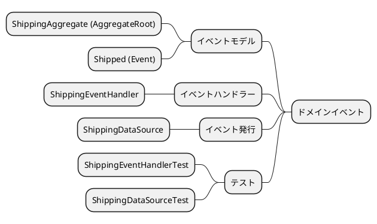
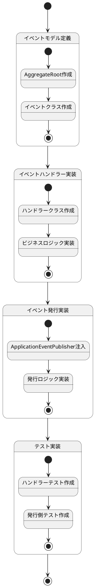
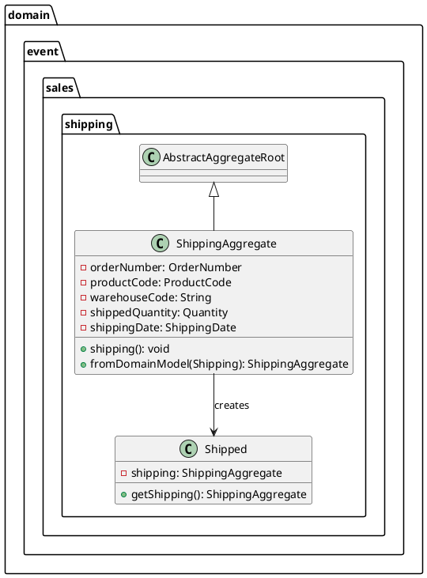
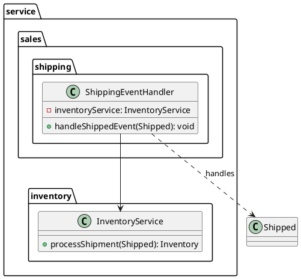
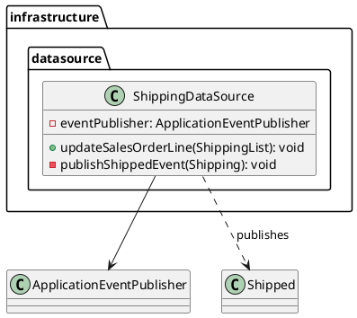
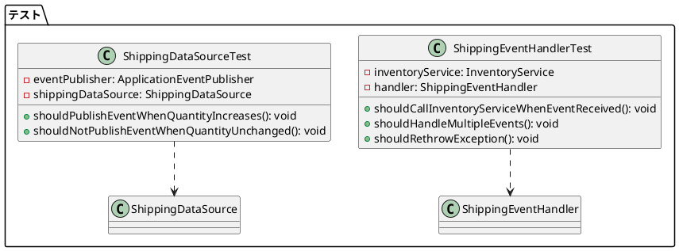
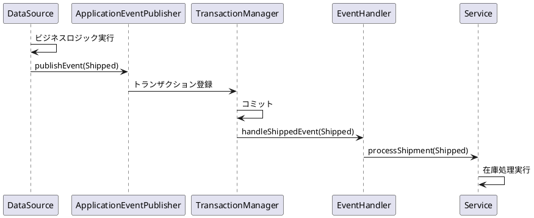
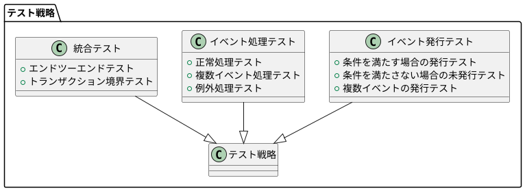

# ドメインイベント実装手順



## ドメインイベント実装手順

ドメインイベントは、ビジネス上の重要な出来事を表現し、システム内の異なるコンポーネント間の疎結合な通信を実現します。以下の手順で実装されます。

## 実装ステップ

以下は実装ステップの状態遷移を示すステートチャートです：



### 1. イベントモデル定義

まず、ドメインイベントを表現するためのモデルクラスを作成します。AbstractAggregateRootを継承してイベント発行機能を実装します。



#### サンプルコード - ShippingAggregate.java

```java
package com.example.sms.domain.event.sales.shipping;

@Value
@Builder
@EqualsAndHashCode(callSuper=false)
public class ShippingAggregate extends AbstractAggregateRoot<ShippingAggregate> {
    OrderNumber orderNumber;
    ProductCode productCode;
    String warehouseCode;
    Quantity shippedQuantity;
    ShippingDate shippingDate;

    public static ShippingAggregate fromDomainModel(Shipping domainModel) {
        return ShippingAggregate.builder()
                .orderNumber(domainModel.getOrderNumber())
                .productCode(domainModel.getProductCode())
                .warehouseCode(domainModel.getWarehouseCode())
                .shippedQuantity(domainModel.getShippedQuantity())
                .shippingDate(domainModel.getShippingDate())
                .build();
    }
}
```

#### サンプルコード - Shipped.java

```java
package com.example.sms.domain.event.sales.shipping;

public record Shipped(ShippingAggregate shipping) {
    public ShippingAggregate getShipping() {
        return shipping;
    }
}
```

### 2. イベントハンドラー実装

次に、イベントを受信して処理するハンドラークラスを作成します。@TransactionalEventListenerを使用してトランザクション完了後にイベントを処理します。



#### サンプルコード - ShippingEventHandler.java

```java
package com.example.sms.service.sales.shipping;

@Component
@Slf4j
public class ShippingEventHandler {

    /** 在庫を管理するアプリケーションサービス */
    private final InventoryService inventoryService;

    public ShippingEventHandler(InventoryService inventoryService) {
        this.inventoryService = inventoryService;
    }

    /**
     * 出荷完了時のイベントハンドラー
     */
    @TransactionalEventListener(phase = TransactionPhase.AFTER_COMMIT)
    public void handleShippedEvent(Shipped shipped) {
        // 出荷が完了したら在庫を減らす
        this.inventoryService.processShipment(shipped);
    }
}
```

### 3. イベント発行実装

イベントの発行は、ビジネスロジックが実行される場所（リポジトリやサービス）で行います。ApplicationEventPublisherを使用してイベントを発行します。



#### サンプルコード - ShippingDataSource.java（抜粋）

```java
@Repository
public class ShippingDataSource implements ShippingRepository {
    final ApplicationEventPublisher eventPublisher;

    public void updateSalesOrderLine(ShippingList shippingList) {
        shippingList.asList().forEach(shipping -> {
            // ... データ更新処理 ...

            // 出荷済数量が増加した場合にイベントを発行
            Integer currentShippedQuantity = shipping.getShippedQuantity().getAmount();
            if (currentShippedQuantity > previousShippedQuantity) {
                // domain.event.ShippingAggregateを作成してShippedイベントを発行
                com.example.sms.domain.event.sales.shipping.ShippingAggregate eventShipping =
                    ShippingAggregate.fromDomainModel(shipping);
                eventPublisher.publishEvent(new Shipped(eventShipping));
            }
        });
    }
}
```

### 4. テスト実装

イベントハンドラーと発行側の両方にテストを実装し、イベント駆動アーキテクチャが正しく機能することを確認します。



## ドメインイベント実装のポイント

1. **イベントモデルの分離**: ドメインモデルとイベントモデルを分離し、イベント専用の軽量なモデルを定義します。
2. **AbstractAggregateRoot**: Spring Dataの機能を活用してイベント発行を管理します。
3. **トランザクション境界**: @TransactionalEventListenerでトランザクション完了後にイベントを処理します。
4. **レイヤー分離**: イベントハンドラーはサービス層に配置し、アーキテクチャルールを遵守します。

## イベント処理フロー



## テスト戦略

ドメインイベントのテストは、以下の方針で実施されています：



### テスト実装のポイント

1. **モック利用**: ApplicationEventPublisherやサービスをモック化し、イベント発行と処理を個別にテストします。
2. **ArgumentCaptor**: 発行されたイベントの内容を検証するためにArgumentCaptorを使用します。
3. **条件分岐のテスト**: イベント発行条件（出荷数量の増加など）を満たす場合と満たさない場合の両方をテストします。
4. **例外処理**: イベント処理中の例外が適切に伝播されることを確認します。

## 実装手順のまとめ

ドメインイベントの実装は、以下の4つのステップで行われます：

1. **イベントモデル定義**: AbstractAggregateRootを継承したイベントモデルとイベントクラスの作成
2. **イベントハンドラー実装**: @TransactionalEventListenerを使用したハンドラークラスの作成
3. **イベント発行実装**: ApplicationEventPublisherを使用したイベント発行ロジックの実装
4. **テスト実装**: イベント発行と処理の両方を検証するテストケースの作成

この実装アプローチにより、疎結合で拡張性の高いイベント駆動アーキテクチャが実現されています。

## アーキテクチャ上の注意点

1. **レイヤー違反の防止**: イベントハンドラーはドメイン層ではなくサービス層に配置します。
2. **循環参照の回避**: イベント処理で新たなイベントを発行する場合は無限ループに注意します。
3. **イベントの冪等性**: 同じイベントが複数回処理されても問題ないように設計します。
4. **イベントの順序性**: イベントの処理順序に依存しない設計を心がけます。