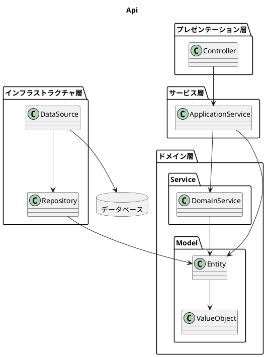
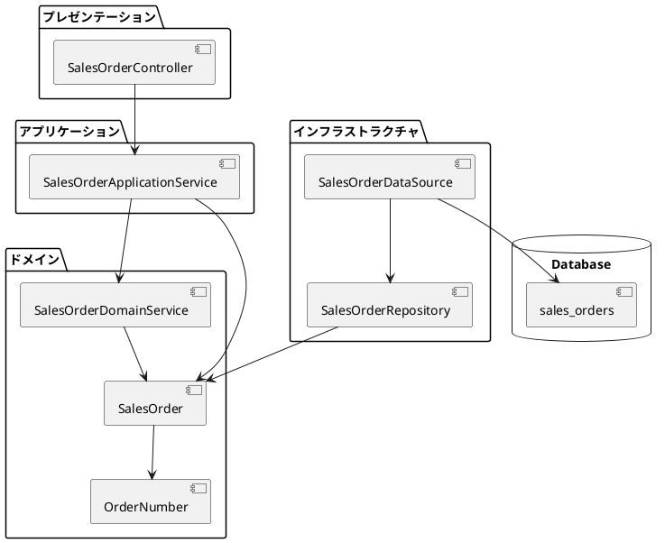
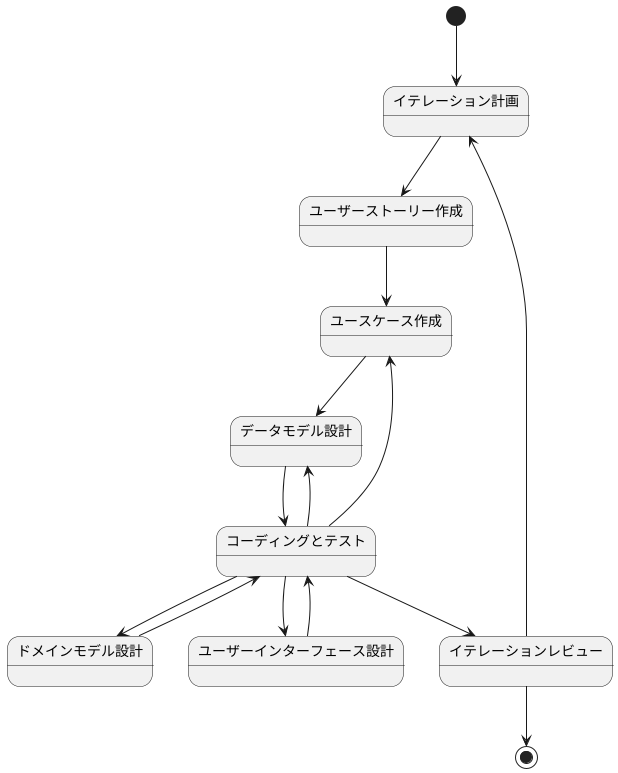
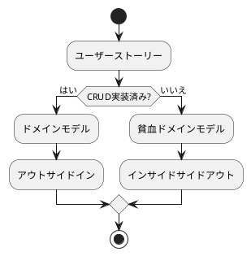
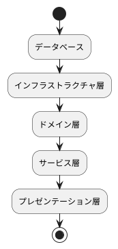
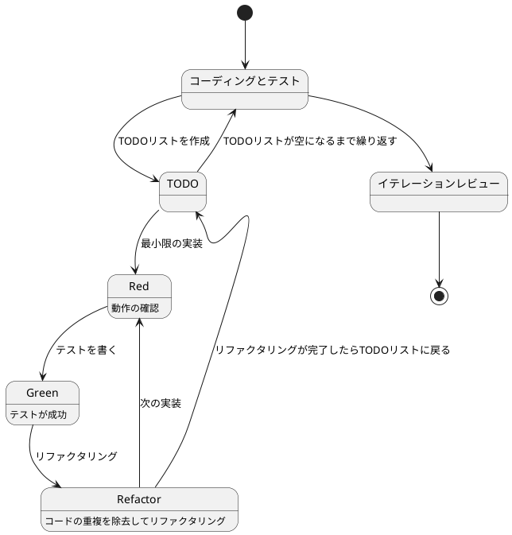
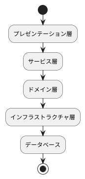
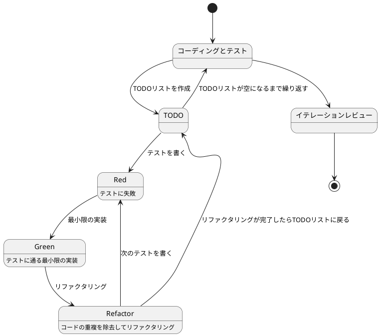
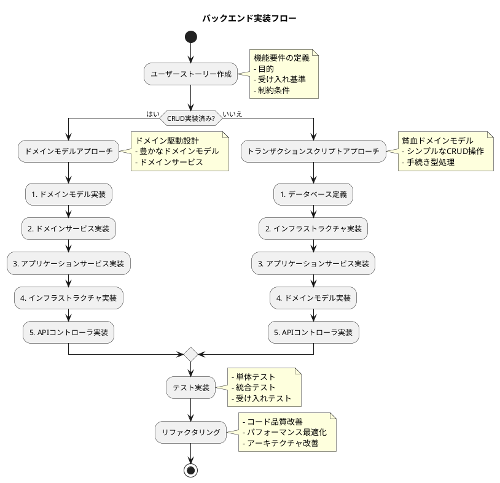

## アーキテクチャ



### 1. ディレクトリ構成

```
app/backend/sms/src/
├── main/
│   └── java/
│       └── com/
│           └── example/
│               └── sms/
│                   ├── presentation/         # プレゼンテーション層
│                   │   └── api/
│                   │       └── sales_order/  # 受注APIコントローラ
│                   ├── service/             # アプリケーションサービス層
│                   │   └── sales_order/     # 受注サービス
│                   ├── domain/             # ドメイン層
│                   │   ├── model/
│                   │   │   └── sales_order/ # 受注ドメインモデル
│                   │   └── service/
│                   │       └── sales_order/ # 受注ドメインサービス
│                   └── infrastructure/     # インフラストラクチャ層
│                       └── datasource/
│                           └── sales_order/ # 受注データソース
└── test/                  # テストコード
    └── resources/
        └── features/      # 受け入れテスト
            └── sales_order/
```

### 2. アーキテクチャの概要



### 3. 主要なインターフェース

```java
// ドメインモデル
public class SalesOrder {
    private OrderNumber orderNumber;
    private OrderDate orderDate;
    private CustomerCode customerCode;
    private List<SalesOrderLine> orderLines;
    private OrderStatus status;

    // ビジネスロジック
    public void addOrderLine(SalesOrderLine line) {
        if (status != OrderStatus.DRAFT) {
            throw new IllegalStateException("Cannot modify confirmed order");
        }
        orderLines.add(line);
    }

    public Money calculateTotalAmount() {
        return orderLines.stream()
                .map(SalesOrderLine::getAmount)
                .reduce(Money.ZERO, Money::add);
    }
}

// リポジトリインターフェース
public interface SalesOrderRepository {
    void save(SalesOrder order);
    Optional<SalesOrder> findByOrderNumber(OrderNumber orderNumber);
    List<SalesOrder> findByCustomerCode(CustomerCode customerCode);
}

// アプリケーションサービス
public interface SalesOrderApplicationService {
    void createOrder(SalesOrderCommand command);
    void updateOrder(SalesOrderCommand command);
    void deleteOrder(String orderNumber);
    SalesOrderResponse getOrder(String orderNumber);
    List<SalesOrderResponse> searchOrders(SalesOrderSearchCriteria criteria);
}

// APIコントローラ
@RestController
@RequestMapping("/api/sales-orders")
public interface SalesOrderController {
    @PostMapping
    ResponseEntity<SalesOrderResponse> createOrder(@RequestBody @Valid SalesOrderRequest request);

    @PutMapping("/{orderNumber}")
    ResponseEntity<SalesOrderResponse> updateOrder(
        @PathVariable String orderNumber,
        @RequestBody @Valid SalesOrderRequest request
    );

    @DeleteMapping("/{orderNumber}")
    ResponseEntity<Void> deleteOrder(@PathVariable String orderNumber);

    @GetMapping("/{orderNumber}")
    ResponseEntity<SalesOrderResponse> getOrder(@PathVariable String orderNumber);

    @GetMapping
    ResponseEntity<List<SalesOrderResponse>> searchOrders(SalesOrderSearchCriteria criteria);
}
```

## 開発プロセス

### 開発フロー


### 実装アプローチ



1. インサイドアウト
   - データベースから実装開始
   - ドメインモデルの実装
   - APIエンドポイントの実装





2. アウトサイドイン
   - APIインターフェースから実装開始
   - モックを活用した開発
   - 内部実装の段階的な追加





### 実装フロー



インフラストラクチャ実装の詳細は以下を参照。
- [データアクセス実装手順](./データアクセス実装手順.md)

アプリケーションサービス実装の詳細は以下を参照。
- [サービス実装手順](./サービス実装手順.md)
- [データップロード実装手順](./データアップロード実装手順.md)

APIコントローラ実装の詳細は以下を参照。
- [プレゼンテーション実装手順](./プレゼンテーション実装手順.md)

### テスト戦略

1. 単体テスト
   - ドメインモデルのテスト
   - ビジネスロジックのテスト
   - バリデーションのテスト

2. 統合テスト
   - リポジトリのテスト
   - トランザクションのテスト
   - APIエンドポイントのテスト

3. 受け入れテスト
   - シナリオベースのテスト
   - エンドツーエンドテスト
   - 性能テスト

受け入れテスト実装の詳細は以下を参照。
- [受け入れテスト実装手順](./受け入れテスト実装手順.md) 
- [プレゼンテーション実装手順](./プレゼンテーション実装手順.md)

### コーディング規約

1. 命名規則
   - クラス名: パスカルケース（例: SalesOrder）
   - メソッド名: キャメルケース（例: createOrder）
   - 変数名: キャメルケース（例: orderNumber）
   - 定数: アッパースネークケース（例: MAX_ORDER_AMOUNT）

2. コード構造
   - 単一責任の原則
   - インターフェース分離の原則
   - 依存関係逆転の原則

3. ドキュメント
   - Javadocコメント
   - APIドキュメント
   - コミットメッセージ

### 実装例

1. ドメインモデル
   ```java
   @Value
   public class OrderNumber {
       String value;

       public OrderNumber(String value) {
           if (value == null || !value.matches("^ORD\\d{6}$")) {
               throw new IllegalArgumentException("Invalid order number format");
           }
           this.value = value;
       }
   }
   ```

2. アプリケーションサービス
   ```java
   @Service
   @Transactional
   public class SalesOrderService {
       private final SalesOrderRepository repository;
       private final OrderValidator validator;

       public void createOrder(OrderCommand command) {
           var order = new SalesOrder(command.toOrderNumber());
           validator.validate(order);
           repository.save(order);
       }
   }
   ```

3. APIコントローラ
   ```java
   @RestController
   @RequestMapping("/api/sales-orders")
   public class SalesOrderController {
       @PostMapping
       public ResponseEntity<OrderResponse> createOrder(
           @RequestBody @Valid OrderRequest request
       ) {
           var order = service.createOrder(request.toCommand());
           return ResponseEntity.ok(OrderResponse.from(order));
       }
   }
   ```

4. インフラストラクチャ
   ```java
   // リポジトリインターフェース
   public interface SalesOrderRepository {
       void save(SalesOrder order);
       Optional<SalesOrder> findByOrderNumber(OrderNumber orderNumber);
       List<SalesOrder> findByCustomerCode(CustomerCode customerCode);
   }

   // MyBatisマッパー
   @Mapper
   public interface SalesOrderMapper {
       @Insert("""
           INSERT INTO sales_orders (
               order_number, order_date, customer_code, status
           ) VALUES (
               #{orderNumber}, #{orderDate}, #{customerCode}, #{status}
           )
           """)
       void insert(SalesOrderRecord record);

       @Select("""
           SELECT * FROM sales_orders
           WHERE order_number = #{orderNumber}
           """)
       SalesOrderRecord findByOrderNumber(String orderNumber);

       @Select("""
           SELECT * FROM sales_orders
           WHERE customer_code = #{customerCode}
           ORDER BY order_date DESC
           """)
       List<SalesOrderRecord> findByCustomerCode(String customerCode);
   }

   // データソース
   @Repository
   public class SalesOrderDataSource implements SalesOrderRepository {
       private final SalesOrderMapper mapper;
       private final SalesOrderLineMapper lineMapper;

       @Override
       @Transactional
       public void save(SalesOrder order) {
           // エンティティをレコードに変換
           var record = new SalesOrderRecord(
               order.getOrderNumber().getValue(),
               order.getOrderDate().getValue(),
               order.getCustomerCode().getValue(),
               order.getStatus().name()
           );

           // メインテーブルに保存
           mapper.insert(record);

           // 明細行を保存
           order.getOrderLines().forEach(line -> {
               var lineRecord = new SalesOrderLineRecord(
                   order.getOrderNumber().getValue(),
                   line.getLineNumber(),
                   line.getProductCode().getValue(),
                   line.getQuantity().getValue(),
                   line.getUnitPrice().getValue()
               );
               lineMapper.insert(lineRecord);
           });
       }

       @Override
       public Optional<SalesOrder> findByOrderNumber(OrderNumber orderNumber) {
           // メインレコードを取得
           var record = mapper.findByOrderNumber(orderNumber.getValue());
           if (record == null) {
               return Optional.empty();
           }

           // 明細行を取得
           var lines = lineMapper.findByOrderNumber(orderNumber.getValue());

           // レコードをエンティティに変換
           return Optional.of(new SalesOrder(
               new OrderNumber(record.getOrderNumber()),
               new OrderDate(record.getOrderDate()),
               new CustomerCode(record.getCustomerCode()),
               lines.stream()
                   .map(this::toOrderLine)
                   .collect(Collectors.toList()),
               OrderStatus.valueOf(record.getStatus())
           ));
       }

       private SalesOrderLine toOrderLine(SalesOrderLineRecord record) {
           return new SalesOrderLine(
               record.getLineNumber(),
               new ProductCode(record.getProductCode()),
               new Quantity(record.getQuantity()),
               new UnitPrice(record.getUnitPrice())
           );
       }
   }
   ```

5. テストコード
   ```java
   // リポジトリテスト
   @SpringBootTest
   class SalesOrderRepositoryTest {
       @Autowired
       private SalesOrderRepository repository;

       @Test
       void 受注を保存して取得できる() {
           // Given
           var orderNumber = new OrderNumber("ORD000001");
           var orderDate = new OrderDate(LocalDate.now());
           var customerCode = new CustomerCode("CUST001");
           var orderLines = List.of(
               new SalesOrderLine(
                   1,
                   new ProductCode("PROD001"),
                   new Quantity(10),
                   new UnitPrice(1000)
               )
           );
           var order = new SalesOrder(orderNumber, orderDate, customerCode, orderLines);

           // When
           repository.save(order);
           var found = repository.findByOrderNumber(orderNumber);

           // Then
           assertThat(found).isPresent();
           assertThat(found.get().getOrderNumber()).isEqualTo(orderNumber);
           assertThat(found.get().getOrderLines()).hasSize(1);
       }
   }

   // データソーステスト
   @DataJpaTest
   class SalesOrderDataSourceTest {
       @Autowired
       private SalesOrderMapper mapper;

       @Autowired
       private SalesOrderLineMapper lineMapper;

       @Test
       void 受注データを保存して取得できる() {
           // Given
           var record = new SalesOrderRecord(
               "ORD000001",
               LocalDate.now(),
               "CUST001",
               "DRAFT"
           );

           // When
           mapper.insert(record);
           var found = mapper.findByOrderNumber("ORD000001");

           // Then
           assertThat(found).isNotNull();
           assertThat(found.getOrderNumber()).isEqualTo("ORD000001");
       }

       @Test
       void 顧客コードで受注を検索できる() {
           // Given
           var record1 = new SalesOrderRecord("ORD000001", LocalDate.now(), "CUST001", "DRAFT");
           var record2 = new SalesOrderRecord("ORD000002", LocalDate.now(), "CUST001", "DRAFT");
           mapper.insert(record1);
           mapper.insert(record2);

           // When
           var found = mapper.findByCustomerCode("CUST001");

           // Then
           assertThat(found).hasSize(2);
       }
   }
   ```

### 追加手順

#### 1. データソース

##### a. データソースの基本構造

MyBatisを使用したデータソースは以下の要素で構成されています：

1. Mapperインターフェース
2. XMLマッピングファイル
3. 型ハンドラー
4. 動的SQL

##### b. データソースの実装手順

1. Mapperインターフェースを定義します
2. XMLマッピングファイルを作成します
3. 型ハンドラーを実装します
4. 動的SQLを実装します

```java
// infrastructure/datasource/example/ExampleMapper.java

@Mapper
public interface ExampleMapper {
    // 1. Mapperインターフェース
    @Insert("""
        INSERT INTO examples (
            id,
            name,
            status,
            created_at,
            updated_at
        ) VALUES (
            #{id},
            #{name},
            #{status},
            #{createdAt},
            #{updatedAt}
        )
    """)
    void insert(ExampleRecord record);

    @Select("SELECT * FROM examples WHERE id = #{id}")
    ExampleRecord findById(String id);

    // 2. 動的SQL
    @SelectProvider(type = ExampleSqlProvider.class, method = "findByCriteria")
    List<ExampleRecord> findByCriteria(ExampleSearchCriteria criteria);
}

// infrastructure/datasource/example/ExampleSqlProvider.java

public class ExampleSqlProvider {
    public String findByCriteria(ExampleSearchCriteria criteria) {
        return new SQL() {{
            SELECT("*");
            FROM("examples");
            if (criteria.getName() != null) {
                WHERE("name LIKE #{name}");
            }
            if (criteria.getStatus() != null) {
                WHERE("status = #{status}");
            }
            if (criteria.getFromDate() != null) {
                WHERE("created_at >= #{fromDate}");
            }
            if (criteria.getToDate() != null) {
                WHERE("created_at <= #{toDate}");
            }
            ORDER_BY("created_at DESC");
        }}.toString();
    }
}

// infrastructure/datasource/example/ExampleTypeHandler.java

// 3. 型ハンドラー
public class ExampleStatusTypeHandler extends BaseTypeHandler<ExampleStatus> {
    @Override
    public void setNonNullParameter(PreparedStatement ps, int i, ExampleStatus parameter, JdbcType jdbcType)
            throws SQLException {
        ps.setString(i, parameter.name());
    }

    @Override
    public ExampleStatus getNullableResult(ResultSet rs, String columnName) throws SQLException {
        String status = rs.getString(columnName);
        return status == null ? null : ExampleStatus.valueOf(status);
    }

    @Override
    public ExampleStatus getNullableResult(ResultSet rs, int columnIndex) throws SQLException {
        String status = rs.getString(columnIndex);
        return status == null ? null : ExampleStatus.valueOf(status);
    }

    @Override
    public ExampleStatus getNullableResult(CallableStatement cs, int columnIndex) throws SQLException {
        String status = cs.getString(columnIndex);
        return status == null ? null : ExampleStatus.valueOf(status);
    }
}

// 4. XMLマッピングファイル
// resources/mybatis/mapper/ExampleMapper.xml
```
```xml
<?xml version="1.0" encoding="UTF-8" ?>
<!DOCTYPE mapper PUBLIC "-//mybatis.org//DTD Mapper 3.0//EN"
        "http://mybatis.org/dtd/mybatis-3-mapper.dtd">
<mapper namespace="com.example.infrastructure.datasource.example.ExampleMapper">
    <resultMap id="exampleResultMap" type="com.example.infrastructure.datasource.example.ExampleRecord">
        <id property="id" column="id"/>
        <result property="name" column="name"/>
        <result property="status" column="status" typeHandler="com.example.infrastructure.datasource.example.ExampleStatusTypeHandler"/>
        <result property="createdAt" column="created_at"/>
        <result property="updatedAt" column="updated_at"/>
    </resultMap>

    <select id="findByStatus" resultMap="exampleResultMap">
        SELECT * FROM examples
        WHERE status = #{status}
        ORDER BY created_at DESC
    </select>

    <select id="findAll" resultMap="exampleResultMap">
        SELECT * FROM examples
        ORDER BY created_at DESC
    </select>
</mapper>
```

```java
// infrastructure/datasource/example/ExampleDataSource.java

@Repository
public class ExampleDataSource implements ExampleRepository {
    private final ExampleMapper mapper;

    public ExampleDataSource(ExampleMapper mapper) {
        this.mapper = mapper;
    }

    @Override
    public void save(Example example) {
        var record = toRecord(example);
        mapper.insert(record);
    }

    @Override
    public Optional<Example> findById(ExampleId id) {
        var record = mapper.findById(id.getValue());
        return Optional.ofNullable(record).map(this::toEntity);
    }

    @Override
    public List<Example> findByStatus(ExampleStatus status) {
        var records = mapper.findByStatus(status.name());
        return records.stream()
            .map(this::toEntity)
            .collect(Collectors.toList());
    }

    @Override
    public List<Example> findByCriteria(ExampleSearchCriteria criteria) {
        var records = mapper.findByCriteria(criteria);
        return records.stream()
            .map(this::toEntity)
            .collect(Collectors.toList());
    }

    private ExampleRecord toRecord(Example example) {
        return new ExampleRecord(
            example.getId().getValue(),
            example.getName().getValue(),
            example.getStatus().name(),
            example.getCreatedAt(),
            example.getUpdatedAt()
        );
    }

    private Example toEntity(ExampleRecord record) {
        return new Example(
            new ExampleId(record.getId()),
            new ExampleName(record.getName()),
            ExampleStatus.valueOf(record.getStatus()),
            record.getCreatedAt(),
            record.getUpdatedAt()
        );
    }
}
```

#### リポジトリ

##### a. リポジトリの基本構造

リポジトリは以下の要素で構成されています：

1. インターフェース定義
2. 永続化操作
3. 検索条件
4. 集約の管理

##### b. リポジトリの実装手順

1. リポジトリインターフェースを定義します
2. 永続化操作を実装します
3. 検索条件を実装します
4. 集約の管理を実装します

```java
// domain/repository/ExampleRepository.java

public interface ExampleRepository {
    // 1. インターフェース定義
    void save(Example example);
    Optional<Example> findById(ExampleId id);
    List<Example> findByStatus(ExampleStatus status);
    void delete(ExampleId id);

    // 2. 永続化操作
    @Transactional
    default void saveAll(List<Example> examples) {
        examples.forEach(this::save);
    }

    // 3. 検索条件
    List<Example> findByCriteria(ExampleSearchCriteria criteria);

    // 4. 集約の管理
    @Transactional
    default void saveWithDetails(Example example) {
        save(example);
        example.getDetails().forEach(this::saveDetail);
    }
}
```

#### ドメインモデル

##### a. ドメインモデルの基本構造

ドメインモデルは以下の要素で構成されています：

1. エンティティの定義
2. 値オブジェクトの定義
3. ドメインイベントの定義
4. ビジネスルールの実装

##### b. ドメインモデルの実装手順

1. エンティティを実装します
2. 値オブジェクトを実装します
3. ドメインイベントを定義します
4. ビジネスルールを実装します

```java
// domain/model/example/Example.java

@Entity
public class Example {
    @EmbeddedId
    private ExampleId id;

    @Embedded
    private ExampleName name;

    @Enumerated(EnumType.STRING)
    private ExampleStatus status;

    private List<ExampleEvent> events = new ArrayList<>();

    // 1. エンティティの実装
    public Example(ExampleParameters params) {
        this.id = new ExampleId();
        this.name = new ExampleName(params.getName());
        this.status = ExampleStatus.DRAFT;
    }

    // 2. 値オブジェクトの利用
    public void updateName(ExampleName name) {
        if (status == ExampleStatus.COMPLETED) {
            throw new IllegalStateException("Cannot update completed example");
        }
        this.name = name;
    }

    // 3. ドメインイベントの発行
    public void complete() {
        this.status = ExampleStatus.COMPLETED;
        this.events.add(new ExampleCompletedEvent(this));
    }

    // 4. ビジネスルールの実装
    public boolean canProcess() {
        return status == ExampleStatus.DRAFT;
    }
}
```

#### ドメインサービス

##### a. ドメインサービスの基本構造

ドメインサービスは以下の要素で構成されています：

1. ドメインルールの実装
2. 複数エンティティ間の調整
3. 外部サービスとの連携
4. バリデーション

##### b. ドメインサービスの実装手順

1. サービスインターフェースを定義します
2. ドメインルールを実装します
3. 外部サービス連携を実装します
4. バリデーションを実装します

```java
// domain/service/example/ExampleDomainService.java

@Service
public class ExampleDomainService {
    private final ExampleRepository repository;
    private final ExternalService externalService;

    // 1. ドメインルール実装
    public void process(Example example) {
        if (!example.canProcess()) {
            throw new IllegalStateException("Example cannot be processed");
        }
        example.process();
    }

    // 2. 複数エンティティ間の調整
    public void merge(Example source, Example target) {
        validateMerge(source, target);
        target.mergeFrom(source);
        source.markAsMerged();
    }

    // 3. 外部サービス連携
    public void validate(Example example) {
        var validationResult = externalService.validate(example);
        if (!validationResult.isValid()) {
            throw new ValidationException(validationResult.getErrors());
        }
    }

    // 4. バリデーション
    private void validateMerge(Example source, Example target) {
        if (source.equals(target)) {
            throw new IllegalArgumentException("Cannot merge same example");
        }
        if (!source.canBeMerged() || !target.canBeMerged()) {
            throw new IllegalStateException("Examples cannot be merged");
        }
    }
}
```

#### アプリケーションサービス

##### a. アプリケーションサービスの基本構造

アプリケーションサービスは以下の要素で構成されています：

1. ユースケースの実装
2. トランザクション管理
3. ドメインサービスの利用
4. イベント処理

##### b. アプリケーションサービスの実装手順

1. サービスインターフェースを定義します
2. トランザクション境界を設定します
3. ドメインサービスを注入します
4. イベントハンドラーを実装します

```java
// services/example/ExampleApplicationService.java

@Service
@Transactional
public class ExampleApplicationService {
    private final ExampleRepository repository;
    private final ExampleDomainService domainService;
    private final ApplicationEventPublisher eventPublisher;

    // 1. ユースケース実装
    public Example create(ExampleCommand command) {
        var example = new Example(command.toParameters());
        domainService.validate(example);
        repository.save(example);
        publishEvent(new ExampleCreatedEvent(example));
        return example;
    }

    // 2. トランザクション管理
    @Transactional(readOnly = true)
    public Example find(String id) {
        return repository.findById(id)
            .orElseThrow(() -> new ExampleNotFoundException(id));
    }

    // 3. ドメインサービス利用
    public void process(String id) {
        var example = find(id);
        domainService.process(example);
        repository.save(example);
    }

    // 4. イベント処理
    private void publishEvent(ApplicationEvent event) {
        eventPublisher.publishEvent(event);
    }
}
```

#### コントローラー

##### a. コントローラーの基本構造

コントローラーは以下の要素で構成されています：

1. APIエンドポイントの定義
2. リクエスト/レスポンスの定義
3. バリデーション
4. エラーハンドリング

##### b. コントローラーの実装手順

1. APIエンドポイントを定義します
2. リクエスト/レスポンスクラスを実装します
3. バリデーションを実装します
4. エラーハンドリングを実装します

```java
// controllers/example/ExampleController.java

@RestController
@RequestMapping("/api/examples")
public class ExampleController {
    private final ExampleApplicationService service;

    // 1. APIエンドポイント定義
    @GetMapping("/{id}")
    public ResponseEntity<ExampleResponse> find(@PathVariable String id) {
        var example = service.find(id);
        return ResponseEntity.ok(ExampleResponse.from(example));
    }

    // 2. リクエスト/レスポンス定義
    @PostMapping
    public ResponseEntity<ExampleResponse> create(
        @RequestBody @Valid ExampleCreateRequest request
    ) {
        var command = request.toCommand();
        var example = service.create(command);
        return ResponseEntity.ok(ExampleResponse.from(example));
    }

    // 3. バリデーション
    @PutMapping("/{id}")
    public ResponseEntity<ExampleResponse> update(
        @PathVariable String id,
        @RequestBody @Valid ExampleUpdateRequest request
    ) {
        var command = request.toCommand(id);
        var example = service.update(command);
        return ResponseEntity.ok(ExampleResponse.from(example));
    }

    // 4. エラーハンドリング
    @ExceptionHandler(ExampleNotFoundException.class)
    public ResponseEntity<ErrorResponse> handleNotFoundException(
        ExampleNotFoundException e
    ) {
        var response = new ErrorResponse(
            HttpStatus.NOT_FOUND.value(),
            e.getMessage()
        );
        return ResponseEntity.status(HttpStatus.NOT_FOUND)
            .body(response);
    }
}
```
