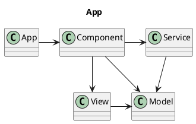
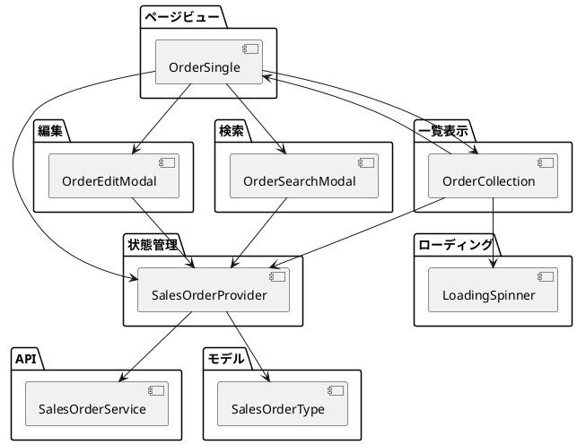
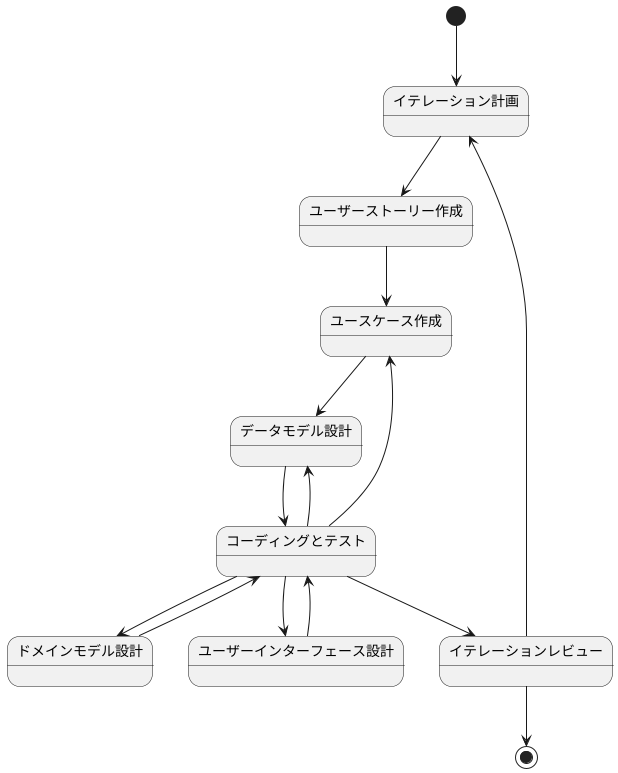
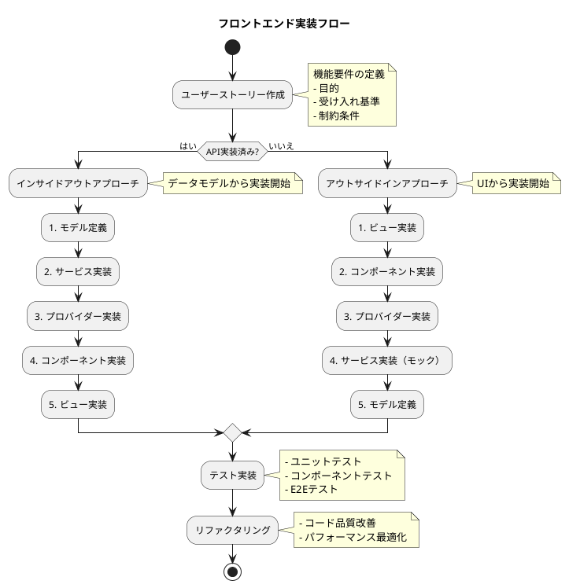

## アーキテクチャ


### 1. ディレクトリ構成

```
src/
├── components/  # 再利用可能なUIコンポーネント
│   └── sales/
│       └── sales_order/
│           ├── types.ts                  # 型定義
│           ├── LoadingSpinner.tsx        # ローディング表示
│           ├── SalesOrderTable.tsx       # 受注データテーブル
│           ├── OrderCollection.tsx  # 受注一覧
│           ├── OrderEditModal.tsx   # 編集モーダル
│           └── OrderSearchModal.tsx # 検索モーダル
├── models/     # データモデルの定義
│   └── sales/
│       └── order.ts
├── providers/  # 状態管理
│   └── sales/
│       └── Order.tsx
├── services/   # APIクライアント
│   └── sales/
│       └── order.ts
└── views/      # ページコンポーネント
    └── sales/
        └── sales_order/
            └── OrderSingle.tsx
```

### 2. アーキテクチャの概要



### 3. 主要なインターフェース

```typescript
// モデル層: データ構造の定義
interface SalesOrderType {
  orderNumber: string;      // 受注番号
  orderDate: string;        // 受注日
  customerCode: string;     // 顧客コード
  totalOrderAmount: number; // 受注金額
}

// プロバイダー層: 状態管理
interface SalesOrderContextType {
  // 状態
  orders: SalesOrderType[];  // 受注一覧
  loading: boolean;               // 読み込み中
  error: Error | null;            // エラー情報

  // 操作
  fetchSalesOrders: () => Promise<void>;
  createSalesOrder: (data: SalesOrderType) => Promise<void>;
  updateSalesOrder: (data: SalesOrderType) => Promise<void>;
  deleteSalesOrder: (id: string) => Promise<void>;
}

// サービス層: API通信
interface SalesOrderServiceType {
  select: () => Promise<SalesOrderType[]>;
  search: (criteria: any) => Promise<SalesOrderType[]>;
  create: (data: SalesOrderType) => Promise<void>;
  update: (data: SalesOrderType) => Promise<void>;
  delete: (id: string) => Promise<void>;
}
```

## 開発プロセス

### 開発フロー



### 実装アプローチ

フロントエンド実装は以下の2つのアプローチで行います：

1. インサイドアウトアプローチ
   - APIが実装済みの場合に使用
   - データモデルから実装を開始
   - 実装の流れ：
     1. モデル定義
     2. サービス実装
     3. プロバイダー実装
     4. コンポーネント実装
     5. ビュー実装

2. アウトサイドインアプローチ
   - APIが未実装の場合に使用
   - UIから実装を開始
   - 実装の流れ：
     1. ビュー実装
     2. コンポーネント実装
     3. プロバイダー実装
     4. サービス実装（モック）
     5. モデル定義

### 実装フロー



### テスト戦略

1. ユニットテスト
   - Jest + React Testing Library
   - 個々のコンポーネントの機能テスト
   - カスタムフックのテスト
   - ユーティリティ関数のテスト

2. コンポーネントテスト
   - React Testing Library
   - コンポーネントの統合テスト
   - ユーザー操作のシミュレーション
   - 状態管理のテスト

3. E2Eテスト
   - Cypress
   - 実際のブラウザ環境でのテスト
   - ユーザーシナリオのテスト
   - APIとの統合テスト

### コーディング規約

1. コンポーネントの命名規則
   - パスカルケース: `UserList.tsx`
   - 機能名+役割: `UserListCollection.tsx`

2. 変数・関数の命名規則
   - キャメルケース: `getUserList`
   - 動詞+名詞: `fetchUserData`

3. ファイル構成
   - 1ファイル1コンポーネント
   - インデント: 2スペース
   - コメント: JSDoc形式

4. 品質基準
   - TypeScriptの型定義を適切に行う
   - コンポーネントの責務を適切に分離する
   - エラーハンドリングを適切に実装する
   - テストカバレッジを確保する
   - パフォーマンスとアクセシビリティに配慮する

### 実装例

#### a. モデル実装例

```typescript
// models/sales/order.ts

// 型定義
export type SalesOrderStatus = 'draft' | 'confirmed' | 'cancelled';

export interface SalesOrderType {
  id: string;
  orderNumber: string;
  orderDate: string;
  customerCode: string;
  totalOrderAmount: number;
  status: SalesOrderStatus;
  items: SalesOrderItemType[];
  createdAt: string;
  updatedAt: string;
}

export interface SalesOrderItemType {
  id: string;
  productCode: string;
  quantity: number;
  unitPrice: number;
  amount: number;
}

// バリデーション
export const validateSalesOrder = (order: Partial<SalesOrderType>): string[] => {
  const errors: string[] = [];

  if (!order.orderNumber) errors.push('受注番号は必須です');
  if (!order.orderDate) errors.push('受注日は必須です');
  if (!order.customerCode) errors.push('顧客コードは必須です');
  if (!order.items?.length) errors.push('明細は1件以上必要です');

  return errors;
};
```

#### b. サービス実装例

```typescript
// services/sales/order.ts

import { SalesOrderType } from '../../models/sales/sales_order';

export class SalesOrderService {
  private baseUrl = '/api/sales-orders';

  async select(page = 1, limit = 10): Promise<{ list: SalesOrderType[]; total: number }> {
    const response = await fetch(`${this.baseUrl}?page=${page}&limit=${limit}`);
    if (!response.ok) throw new Error('Failed to fetch sales orders');
    return response.json();
  }

  async search(criteria: {
    orderNumber?: string;
    customerCode?: string;
    dateFrom?: string;
    dateTo?: string;
  }): Promise<SalesOrderType[]> {
    const params = new URLSearchParams(criteria as Record<string, string>);
    const response = await fetch(`${this.baseUrl}/search?${params}`);
    if (!response.ok) throw new Error('Search failed');
    return response.json();
  }

  async create(data: Omit<SalesOrderType, 'id'>): Promise<SalesOrderType> {
    const response = await fetch(this.baseUrl, {
      method: 'POST',
      headers: { 'Content-Type': 'application/json' },
      body: JSON.stringify(data)
    });
    if (!response.ok) throw new Error('Create failed');
    return response.json();
  }

  async update(id: string, data: Partial<SalesOrderType>): Promise<SalesOrderType> {
    const response = await fetch(`${this.baseUrl}/${id}`, {
      method: 'PUT',
      headers: { 'Content-Type': 'application/json' },
      body: JSON.stringify(data)
    });
    if (!response.ok) throw new Error('Update failed');
    return response.json();
  }

  async delete(id: string): Promise<void> {
    const response = await fetch(`${this.baseUrl}/${id}`, {
      method: 'DELETE'
    });
    if (!response.ok) throw new Error('Delete failed');
  }
}
```

#### c. プロバイダー実装例

```typescript
// providers/sales/Order.tsx

import { createContext, useContext, useState, useCallback } from 'react';
import { SalesOrderType, validateSalesOrder } from '../../models/sales/sales_order';
import { SalesOrderService } from '../../services/sales/sales_order';

interface SalesOrderContextValue {
  orders: SalesOrderType[];
  loading: boolean;
  error: Error | null;
  fetchSalesOrders: (page?: number) => Promise<void>;
  createSalesOrder: (data: Omit<SalesOrderType, 'id'>) => Promise<void>;
  updateSalesOrder: (id: string, data: Partial<SalesOrderType>) => Promise<void>;
  deleteSalesOrder: (id: string) => Promise<void>;
}

const SalesOrderContext = createContext<SalesOrderContextValue | null>(null);

export const useSalesOrder = () => {
  const context = useContext(SalesOrderContext);
  if (!context) throw new Error('useSalesOrder must be used within SalesOrderProvider');
  return context;
};

export const SalesOrderProvider: React.FC = ({ children }) => {
  const [orders, setSalesOrders] = useState<SalesOrderType[]>([]);
  const [loading, setLoading] = useState(false);
  const [error, setError] = useState<Error | null>(null);

  const service = new SalesOrderService();

  const fetchSalesOrders = useCallback(async (page = 1) => {
    setLoading(true);
    setError(null);
    try {
      const { list } = await service.select(page);
      setSalesOrders(list);
    } catch (err) {
      setError(err instanceof Error ? err : new Error('Unknown error'));
    } finally {
      setLoading(false);
    }
  }, []);

  const createSalesOrder = useCallback(async (data: Omit<SalesOrderType, 'id'>) => {
    const errors = validateSalesOrder(data);
    if (errors.length) throw new Error(errors.join(', '));

    setLoading(true);
    setError(null);
    try {
      await service.create(data);
      await fetchSalesOrders();
    } catch (err) {
      setError(err instanceof Error ? err : new Error('Unknown error'));
      throw err;
    } finally {
      setLoading(false);
    }
  }, [fetchSalesOrders]);

  const value = {
    orders,
    loading,
    error,
    fetchSalesOrders,
    createSalesOrder,
    updateSalesOrder: async (id, data) => {
      // 実装省略
    },
    deleteSalesOrder: async (id) => {
      // 実装省略
    }
  };

  return {
    type: SalesOrderContext.Provider,
    props: {
      value,
      children
    }
  };
};
```

#### d. コンポーネント実装例

```typescript
// components/sales/sales_order/SalesOrderList.ts

import { useSalesOrder } from '../../../providers/sales/SalesOrder';
import { formatDate, formatCurrency } from '../../../utils/formatters';

// コンポーネントのプロパティ定義
interface SalesOrderListProps {
  onEdit?: (id: string) => void;
  onDelete?: (id: string) => void;
}

// 受注一覧テーブルコンポーネント
export class SalesOrderList {
  private props: SalesOrderListProps;
  private context: ReturnType<typeof useSalesOrder>;

  constructor(props: SalesOrderListProps) {
    this.props = props;
    this.context = useSalesOrder();
  }

  // ローディング表示
  private renderLoading() {
    return { type: 'div', props: { children: 'Loading...' } };
  }

  // エラー表示
  private renderError(error: Error) {
    return { type: 'div', props: { children: `Error: ${error.message}` } };
  }

  // テーブルヘッダー
  private renderHeader() {
    return {
      type: 'thead',
      props: {
        children: {
          type: 'tr',
          props: {
            children: [
              '受注番号',
              '受注日',
              '顧客コード',
              '受注金額',
              '操作'
            ].map(text => ({
              type: 'th',
              props: { children: text }
            }))
          }
        }
      }
    };
  }

  // テーブル行
  private renderRow(order: SalesOrderType) {
    const { onEdit, onDelete } = this.props;

    return {
      type: 'tr',
      props: {
        key: order.id,
        children: [
          { type: 'td', props: { children: order.orderNumber } },
          { type: 'td', props: { children: formatDate(order.orderDate) } },
          { type: 'td', props: { children: order.customerCode } },
          { type: 'td', props: { children: formatCurrency(order.totalOrderAmount) } },
          {
            type: 'td',
            props: {
              children: [
                onEdit && {
                  type: 'button',
                  props: {
                    onClick: () => onEdit(order.id),
                    children: '編集'
                  }
                },
                onDelete && {
                  type: 'button',
                  props: {
                    onClick: () => onDelete(order.id),
                    children: '削除'
                  }
                }
              ].filter(Boolean)
            }
          }
        ]
      }
    };
  }

  // メインレンダリング
  render() {
    const { orders, loading, error } = this.context;

    if (loading) return this.renderLoading();
    if (error) return this.renderError(error);
    if (!orders.length) {
      return { type: 'div', props: { children: 'No orders found' } };
    }

    return {
      type: 'table',
      props: {
        className: 'table',
        children: [
          this.renderHeader(),
          {
            type: 'tbody',
            props: {
              children: orders.map(order => this.renderRow(order))
            }
          }
        ]
      }
    };
  }
}
```

#### e. ビュー実装例

```typescript
// views/sales/sales_order/SalesOrderListView.ts

import { useState } from 'react';
import { SalesOrderList } from '../../../components/sales/sales_order/SalesOrderList';
import { OrderEditModal } from '../../../components/sales/sales_order/OrderEditModal';
import { SalesOrderDeleteConfirm } from '../../../components/sales/sales_order/SalesOrderDeleteConfirm';

// ビューコンポーネント
export class SalesOrderListView {
  private editingId: string | null = null;
  private deletingId: string | null = null;

  // イベントハンドラー
  private handleEdit = (id: string) => {
    this.editingId = id;
  };

  private handleDelete = (id: string) => {
    this.deletingId = id;
  };

  private handleCloseModals = () => {
    this.editingId = null;
    this.deletingId = null;
  };

  // メインレンダリング
  render() {
    return {
      type: 'div',
      props: {
        className: 'container',
        children: [
          { type: 'h1', props: { children: '受注一覧' } },

          // 一覧表示
          new SalesOrderList({
            onEdit: this.handleEdit,
            onDelete: this.handleDelete
          }).render(),

          // モーダル表示
          this.editingId && new OrderEditModal({
            orderId: this.editingId,
            onClose: this.handleCloseModals
          }).render(),

          this.deletingId && new SalesOrderDeleteConfirm({
            orderId: this.deletingId,
            onClose: this.handleCloseModals
          }).render()
        ].filter(Boolean)
      }
    };
  }
}
```

#### f. テスト実装例

```typescript
// components/sales/sales_order/__tests__/SalesOrderList.test.ts

import { SalesOrderList } from '../SalesOrderList';
import { useSalesOrder } from '../../../../providers/sales/SalesOrder';

// モックデータ
const mockSalesOrders = [
  {
    id: '1',
    orderNumber: 'ORD001',
    orderDate: '2023-01-01',
    customerCode: 'CUST001',
    totalOrderAmount: 10000
  }
];

// テストスイート
describe('SalesOrderList', () => {
  let orderList: SalesOrderList;
  let mockContext: ReturnType<typeof useSalesOrder>;

  beforeEach(() => {
    // コンテキストのモック
    mockContext = {
      orders: mockSalesOrders,
      loading: false,
      error: null
    };

    // コンポーネントの初期化
    orderList = new SalesOrderList({
      onEdit: jest.fn(),
      onDelete: jest.fn()
    });
  });

  describe('render()', () => {
    it('通常表示のテスト', () => {
      // 実行
      const result = orderList.render();

      // 検証
      expect(result.type).toBe('table');
      expect(result.props.className).toBe('table');

      // ヘッダーの検証
      const headers = result.props.children[0];
      expect(headers.type).toBe('thead');
      expect(headers.props.children.type).toBe('tr');

      // データ行の検証
      const tbody = result.props.children[1];
      expect(tbody.type).toBe('tbody');
      expect(tbody.props.children).toHaveLength(1);

      const row = tbody.props.children[0];
      expect(row.props.children[0].props.children).toBe('ORD001');
      expect(row.props.children[2].props.children).toBe('CUST001');
    });

    it('ローディング表示のテスト', () => {
      // コンテキストを変更
      mockContext.loading = true;

      // 実行
      const result = orderList.render();

      // 検証
      expect(result.type).toBe('div');
      expect(result.props.children).toBe('Loading...');
    });

    it('エラー表示のテスト', () => {
      // コンテキストを変更
      mockContext.error = new Error('Test error');

      // 実行
      const result = orderList.render();

      // 検証
      expect(result.type).toBe('div');
      expect(result.props.children).toBe('Error: Test error');
    });

    it('データなしの表示テスト', () => {
      // コンテキストを変更
      mockContext.orders = [];

      // 実行
      const result = orderList.render();

      // 検証
      expect(result.type).toBe('div');
      expect(result.props.children).toBe('No orders found');
    });
  });

  describe('イベントハンドリング', () => {
    it('編集ボタンクリックのテスト', () => {
      const onEdit = jest.fn();
      orderList = new SalesOrderList({ onEdit });

      // 実行
      const result = orderList.render();
      const editButton = result.props.children[1].props.children[0].props.children[4].props.children[0];
      editButton.props.onClick();

      // 検証
      expect(onEdit).toHaveBeenCalledWith('1');
    });

    it('削除ボタンクリックのテスト', () => {
      const onDelete = jest.fn();
      orderList = new SalesOrderList({ onDelete });

      // 実行
      const result = orderList.render();
      const deleteButton = result.props.children[1].props.children[0].props.children[4].props.children[1];
      deleteButton.props.onClick();

      // 検証
      expect(onDelete).toHaveBeenCalledWith('1');
    });
  });
});
```

#### g. E2Eテスト実装例

```typescript
// cypress/e2e/sales/sales_order.cy.ts

describe('受注一覧画面', () => {
  beforeEach(() => {
    // APIモックの設定
    cy.intercept('GET', '/api/sales-orders*', {
      statusCode: 200,
      fixture: 'sales_orders.json'
    }).as('getSalesOrders');

    // 画面遷移
    cy.visit('/sales/orders');
  });

  it('基本的な画面表示とデータ読み込みのテスト', () => {
    // ローディング表示の確認
    cy.get('.loading').should('be.visible');

    // データ読み込み完了の待機
    cy.wait('@getSalesOrders');

    // テーブルの表示確認
    cy.get('table.table').should('be.visible');
    cy.get('th').should('have.length', 5);
    cy.get('tbody tr').should('have.length.gt', 0);

    // データの内容確認
    cy.get('tbody tr').first().within(() => {
      cy.get('td').eq(0).should('contain', 'ORD');  // 受注番号
      cy.get('td').eq(2).should('contain', 'CUST'); // 顧客コード
    });
  });

  it('検索機能のテスト', () => {
    // 検索モーダルを開く
    cy.get('[data-cy=search-button]').click();

    // 検索条件の入力
    cy.get('[data-cy=order-number-input]').type('ORD001');
    cy.get('[data-cy=search-submit]').click();

    // 検索APIリクエストの確認
    cy.wait('@getSalesOrders')
      .its('request.url')
      .should('include', 'orderNumber=ORD001');

    // 検索結果の確認
    cy.get('tbody tr').should('have.length', 1);
    cy.get('tbody tr').first().should('contain', 'ORD001');
  });

  it('編集機能のテスト', () => {
    // 編集モーダルを開く
    cy.get('tbody tr').first().find('[data-cy=edit-button]').click();

    // フォームの入力
    cy.get('[data-cy=customer-code-input]').clear().type('CUST999');
    cy.get('[data-cy=edit-submit]').click();

    // 更新APIリクエストの確認
    cy.intercept('PUT', '/api/sales-orders/*').as('updateOrder');
    cy.wait('@updateOrder').then((interception) => {
      expect(interception.request.body).to.include({
        customerCode: 'CUST999'
      });
    });

    // 更新後のデータ確認
    cy.get('tbody tr').first().should('contain', 'CUST999');
  });

  it('削除機能のテスト', () => {
    // 削除確認モーダルを開く
    cy.get('tbody tr').first().find('[data-cy=delete-button]').click();

    // 削除の実行
    cy.intercept('DELETE', '/api/sales-orders/*').as('deleteOrder');
    cy.get('[data-cy=delete-confirm]').click();

    // 削除APIリクエストの確認
    cy.wait('@deleteOrder');

    // 削除後のUI更新確認
    cy.get('tbody tr').should('have.length.lt', 1);
  });

  it('エラーハンドリングのテスト', () => {
    // APIエラーのシミュレーション
    cy.intercept('GET', '/api/sales-orders*', {
      statusCode: 500,
      body: { message: 'Internal Server Error' }
    }).as('getOrdersError');

    // ページのリロード
    cy.reload();

    // エラー表示の確認
    cy.get('[data-cy=error-message]')
      .should('be.visible')
      .and('contain', 'Error');
  });

  it('レスポンシブデザインのテスト', () => {
    // モバイル表示のテスト
    cy.viewport('iphone-x');
    cy.get('.table-responsive').should('be.visible');

    // 操作ボタンのドロップダウン化確認
    cy.get('[data-cy=action-dropdown]').should('be.visible');
    cy.get('[data-cy=action-dropdown]').click();
    cy.get('[data-cy=edit-button]').should('be.visible');
    cy.get('[data-cy=delete-button]').should('be.visible');
  });

  it('アクセシビリティのテスト', () => {
    // テーブルのアクセシビリティ
    cy.get('table').should('have.attr', 'role', 'grid');
    cy.get('th').each($th => {
      cy.wrap($th).should('have.attr', 'scope', 'col');
    });

    // ボタンのアクセシビリティ
    cy.get('[data-cy=edit-button]').should('have.attr', 'aria-label');
    cy.get('[data-cy=delete-button]').should('have.attr', 'aria-label');

    // モーダルのアクセシビリティ
    cy.get('[data-cy=edit-button]').click();
    cy.get('[role=dialog]').should('have.attr', 'aria-modal', 'true');
  });
});

```

テストで使用するフィクスチャーデータ（cypress/fixtures/sales_orders.json）:

```json
{
  "list": [
    {
      "id": "1",
      "orderNumber": "ORD001",
      "orderDate": "2023-01-01",
      "customerCode": "CUST001",
      "totalOrderAmount": 10000
    },
    {
      "id": "2",
      "orderNumber": "ORD002",
      "orderDate": "2023-01-02",
      "customerCode": "CUST002",
      "totalOrderAmount": 20000
    }
  ],
  "total": 2
}
```

### 追加手順

#### 1. ナビゲーション

##### a. ナビゲーションの基本構造

アプリケーションのナビゲーションは以下の2つのコンポーネントで構成されています：

1. HeaderNavigation - ヘッダー部分のナビゲーション
2. SideNavigation - サイドバー部分のナビゲーション

ナビゲーションアイテムには以下の2種類があります：

1. NavItem - 基本的なナビゲーションアイテム
2. SubNavItem - サブメニューのナビゲーションアイテム

##### b. Navigation.tsxへのリンク追加手順

1. NaveItemsコンポーネント内の適切な位置にナビゲーションアイテムを追加します
2. 権限に応じた表示制御が必要な場合は、RoleTypeに基づいて条件分岐を行います

```typescript
// 基本的なナビゲーションアイテムの追加
<NavItem id="side-nav-example-nav" to="/example" className="nav-item">
    例示
</NavItem>

// サブメニューを持つナビゲーションアイテムの追加
<li className="nav-item">
    カテゴリ
    <ul className="nav-sub-list">
        <SubNavItem id="side-nav-sub-example-nav" to="/sub-example">
            サブ例示
        </SubNavItem>
    </ul>
</li>

// 権限による表示制御
{role === RoleType.ADMIN ? (
    <SubNavItem id="side-nav-admin-nav" to="/admin">
        管理者メニュー
    </SubNavItem>
) : null}
```

##### c. RouteConfig.tsxの編集手順

1. 新しいコンポーネントをインポートします
2. 必要に応じてページコンポーネントを作成します
3. Routesに新しいルートを追加します

```typescript
// 1. コンポーネントのインポート
import { ExampleComponent } from "../example/ExampleComponent";

// 2. ページコンポーネントの作成
const ExamplePage = () => {
    return (
        <SiteLayout>
            <ExampleComponent />
        </SiteLayout>
    );
}

// 3. ルートの追加
<Routes>
    {/* 既存のルート */}
    <Route 
        path="/example" 
        element={
            <RouteAuthGuard 
                component={<ExamplePage />} 
                redirectPath="/"
                allowedRoles={[RoleType.ADMIN, RoleType.USER]}
            />
        }
    />
</Routes>
```

##### d. 実装例

以下は、新しい管理機能を追加する場合の実装例です：

1. Navigation.tsxの編集:

```typescript
// 管理者メニューにサブアイテムを追加
{role === RoleType.ADMIN ? (
    <li className="nav-item">
        システム
        <ul className="nav-sub-list">
            <SubNavItem id="side-nav-user-nav" to="/user">ユーザー</SubNavItem>
            <SubNavItem id="side-nav-admin-tool-nav" to="/admin-tool">管理ツール</SubNavItem>
        </ul>
    </li>
) : null}
```

2. RouteConfig.tsxの編集:

```typescript
import { AdminToolContainer } from "../system/admin/AdminToolContainer";

const AdminToolPage = () => {
    return (
        <SiteLayout>
            <AdminToolContainer />
        </SiteLayout>
    );
}

// Routesコンポーネント内に追加
<Route 
    path="/admin-tool" 
    element={
        <RouteAuthGuard 
            component={<AdminToolPage />} 
            redirectPath="/"
            allowedRoles={[RoleType.ADMIN]}
        />
    }
/>
```
#### 2. モデル

##### a. モデルの基本構造

モデルは以下の要素で構成されています：

1. 列挙型（Enum）の定義 - 固定値の定義
2. データ型（Type）の定義 - データ構造の定義
3. マッピング関数 - データ変換処理の定義

##### b. モデルの実装手順

1. 必要な列挙型を定義します
2. データ型を定義します
3. 必要に応じてマッピング関数を実装します

```typescript
// models/example/example.ts

// 1. 列挙型の定義
export enum StatusType {
    有効 = "有効",
    無効 = "無効"
}

// 2. データ型の定義
export type ExampleType = {
    id: string;
    name: string;
    status: StatusType;
    createdAt: string;
    updatedAt: string;
}

export type ExampleResourceType = {
    id: string;
    name: string;
    status: StatusType;
    createdAt: string;
    updatedAt: string;
}

// 3. マッピング関数の実装
export const mapToExampleResource = (example: ExampleType): ExampleResourceType => {
    return {
        id: example.id,
        name: example.name,
        status: example.status,
        createdAt: example.createdAt,
        updatedAt: example.updatedAt
    };
};
```

#### 3. サービス

##### a. サービスの基本構造

サービスは以下の要素で構成されています：

1. インターフェース定義 - APIの型定義
2. サービス関数の実装 - APIとの通信処理
3. ユーティリティ関数の利用 - 共通処理の利用

##### b. サービスの実装手順

1. サービスのインターフェースを定義します
2. APIエンドポイントを定義します
3. サービス関数を実装します

```typescript
// services/example/example.ts

import Config from "../config";
import Utils from "../utils";
import { ExampleType, mapToExampleResource } from "../../models/example/example";

// 1. インターフェース定義
export interface ExampleServiceType {
    select: () => Promise<ExampleType[]>;
    find: (id: string) => Promise<ExampleType>;
    create: (example: ExampleType) => Promise<void>;
    update: (example: ExampleType) => Promise<void>;
    destroy: (id: string) => Promise<void>;
}

// 2. サービス実装
export const ExampleService = () => {
    const config = Config();
    const apiUtils = Utils.apiUtils;
    const endPoint = `${config.apiUrl}/examples`;

    const select = async (): Promise<ExampleType[]> => {
        return await apiUtils.fetchGet<ExampleType[]>(endPoint);
    };

    const find = async (id: string): Promise<ExampleType> => {
        const url = `${endPoint}/${id}`;
        return await apiUtils.fetchGet<ExampleType>(url);
    };

    const create = async (example: ExampleType): Promise<void> => {
        await apiUtils.fetchPost<void>(endPoint, mapToExampleResource(example));
    };

    const update = async (example: ExampleType): Promise<void> => {
        const url = `${endPoint}/${example.id}`;
        await apiUtils.fetchPut<void>(url, mapToExampleResource(example));
    };

    const destroy = async (id: string): Promise<void> => {
        const url = `${endPoint}/${id}`;
        await apiUtils.fetchDelete<void>(url);
    };

    return {
        select,
        find,
        create,
        update,
        destroy
    };
}
```

#### 4. プロバイダー

##### a. プロバイダーの基本構造

プロバイダーは以下の要素で構成されています：

1. コンテキストの定義 - 状態管理の型定義
2. カスタムフックの実装 - 状態管理のロジック
3. プロバイダーコンポーネント - 状態の提供

##### b. プロバイダーの実装手順

1. コンテキストの型を定義します
2. 必要なカスタムフックを実装します
3. プロバイダーコンポーネントを実装します

```typescript
// providers/example/Example.tsx

import React, { createContext, useContext, ReactNode, useState } from "react";
import { ExampleType } from "../../models/example/example";
import { ExampleService, ExampleServiceType } from "../../services/example/example";

// 1. コンテキストの型定義
type ExampleContextType = {
    loading: boolean;
    setLoading: React.Dispatch<React.SetStateAction<boolean>>;
    examples: ExampleType[];
    setExamples: React.Dispatch<React.SetStateAction<ExampleType[]>>;
    exampleService: ExampleServiceType;
};

const ExampleContext = createContext<ExampleContextType | undefined>(undefined);

// 2. カスタムフックの実装
const useExample = () => {
    const [examples, setExamples] = useState<ExampleType[]>([]);
    const exampleService = ExampleService();

    return {
        examples,
        setExamples,
        exampleService
    };
};

// 3. プロバイダーコンポーネントの実装
type Props = {
    children: ReactNode;
};

export const ExampleProvider: React.FC<Props> = ({ children }) => {
    const [loading, setLoading] = useState(false);
    const { examples, setExamples, exampleService } = useExample();

    const value = {
        loading,
        setLoading,
        examples,
        setExamples,
        exampleService
    };

    return (
        <ExampleContext.Provider value={value}>
            {children}
        </ExampleContext.Provider>
    );
};

export const useExampleContext = () => {
    const context = useContext(ExampleContext);
    if (!context) {
        throw new Error("useExampleContext must be used within a ExampleProvider");
    }
    return context;
};
```

#### 5. コンポーネント

##### a. コンポーネントの基本構造

コンポーネントは以下の要素で構成されています：

1. プレゼンテーショナルコンポーネント - UIの表示
2. コンテナコンポーネント - ロジックの管理
3. 共通コンポーネント - 再利用可能なUI部品

##### b. コンポーネントの実装手順

1. プレゼンテーショナルコンポーネントを実装します
2. コンテナコンポーネントを実装します
3. 必要に応じて共通コンポーネントを実装します

```typescript
// components/example/ExampleCollection.tsx

import React from "react";
import { ExampleType } from "../../models/example/example";
import { ExampleCollectionView } from "../../views/example/ExampleCollection";

// 1. プレゼンテーショナルコンポーネント
type Props = {
    examples: ExampleType[];
    onEdit: (id: string) => void;
    onDelete: (id: string) => void;
};

export const ExampleCollection: React.FC<Props> = ({
    examples,
    onEdit,
    onDelete
}) => {
    return (
        <ExampleCollectionView
            examples={examples}
            onEdit={onEdit}
            onDelete={onDelete}
        />
    );
};

// 2. コンテナコンポーネント
export const ExampleContainer: React.FC = () => {
    const { loading, examples, setExamples, exampleService } = useExampleContext();

    const handleEdit = (id: string) => {
        // 編集処理
    };

    const handleDelete = async (id: string) => {
        try {
            await exampleService.destroy(id);
            setExamples(examples.filter(example => example.id !== id));
        } catch (error) {
            console.error(error);
        }
    };

    if (loading) {
        return <LoadingSpinner />;
    }

    return (
        <ExampleCollection
            examples={examples}
            onEdit={handleEdit}
            onDelete={handleDelete}
        />
    );
};
```

#### 6. ビュー

##### a. ビューの基本構造

ビューは以下の要素で構成されています：

1. 表示用コンポーネント - UIの定義
2. スタイル定義 - CSSの定義
3. イベントハンドラ - ユーザー操作の処理

##### b. ビューの実装手順

1. 表示用コンポーネントを実装します
2. スタイルを定義します
3. イベントハンドラを実装します

```typescript
// views/example/ExampleCollection.tsx

import React from "react";
import { ExampleType } from "../../models/example/example";
import "./Example.css";

type Props = {
    examples: ExampleType[];
    onEdit: (id: string) => void;
    onDelete: (id: string) => void;
};

export const ExampleCollectionView: React.FC<Props> = ({
    examples,
    onEdit,
    onDelete
}) => {
    return (
        <div className="example-container">
            <h2>例示一覧</h2>
            <table className="example-table">
                <thead>
                    <tr>
                        <th>ID</th>
                        <th>名前</th>
                        <th>状態</th>
                        <th>操作</th>
                    </tr>
                </thead>
                <tbody>
                    {examples.map(example => (
                        <tr key={example.id}>
                            <td>{example.id}</td>
                            <td>{example.name}</td>
                            <td>{example.status}</td>
                            <td>
                                <button onClick={() => onEdit(example.id)}>
                                    編集
                                </button>
                                <button onClick={() => onDelete(example.id)}>
                                    削除
                                </button>
                            </td>
                        </tr>
                    ))}
                </tbody>
            </table>
        </div>
    );
};
```

