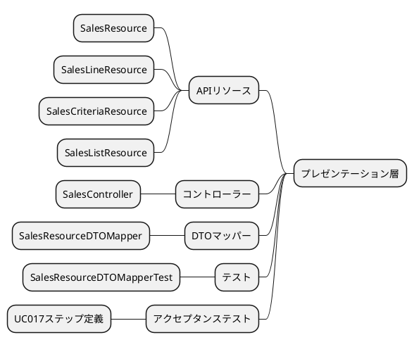
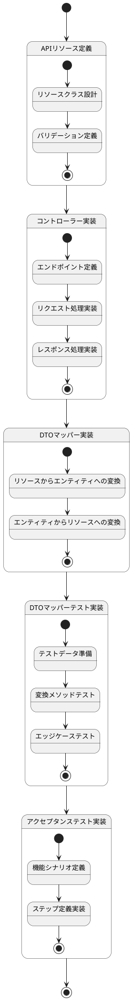
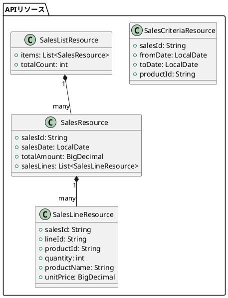
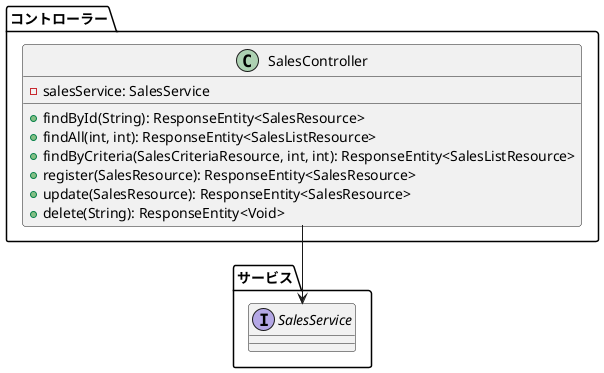
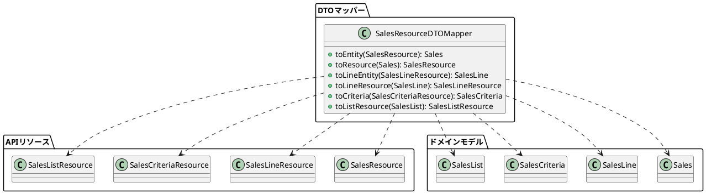
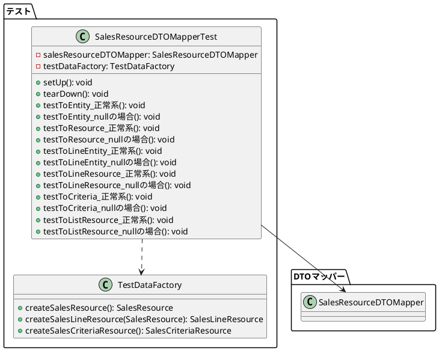
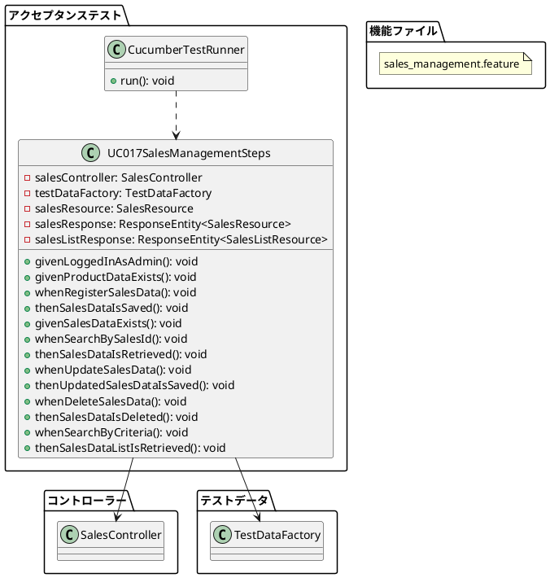
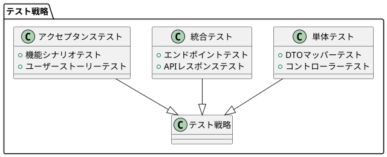

## プレゼンテーション実装手順

売上管理機能のプレゼンテーション部分は、以下の手順で実装されました。各ステップは特定の責務を持つコンポーネントを追加し、全体として堅牢なプレゼンテーション層を構築しています。

## 実装ステップ

以下は実装ステップの状態遷移を示すステートチャートです：



## 詳細実装手順

### 1. APIリソース定義

最初のステップでは、売上管理機能に関連するAPIリソースを定義します。これにより、クライアントとサーバー間のデータ交換の形式が明確になります。



### 2. コントローラー実装

次に、APIエンドポイントを提供するコントローラーを実装します。コントローラーはクライアントからのリクエストを受け取り、適切なサービスを呼び出し、結果をレスポンスとして返します。



関連するメッセージキーをリソースバンドルに登録します。

- `app/backend/sms/src/main/resources/messages.properties` 英語メッセージ
- `app/backend/sms/src/main/resources/messages_ja.properties` 日本語メッセージ

### 3. DTOマッパー実装

DTOマッパーは、APIリソース（DTO）とドメインモデルの間のデータ変換を担当します。これにより、各層の独立性が保たれます。



### 4. DTOマッパーテスト実装

DTOマッパーの機能を検証するテストを実装します。これにより、変換ロジックの正確性が保証されます。



### 5. アクセプタンステスト実装

最後に、売上管理機能のアクセプタンステストを実装します。これにより、機能全体の動作が検証されます。アクセプタンステストは、ユーザーの視点からシステムの動作を検証するテストで、Cucumberを使用して実装されています。

#### アクセプタンステストの構成

アクセプタンステストは、以下の要素で構成されています：

1. **機能ファイル（Feature File）**: Gherkin構文で書かれたテストシナリオを定義するファイル
2. **ステップ定義（Step Definitions）**: 機能ファイルのステップを実装するJavaクラス
3. **テストランナー（Test Runner）**: テストを実行するためのJUnitクラス



#### 機能ファイルの実装

機能ファイルは、Gherkin構文を使用して、ユーザーストーリーやシナリオを定義します。以下は、売上管理機能の機能ファイルの例です：

```gherkin
# sales_management.feature
# language: ja
機能: 売上管理
  システム管理者として
  売上データを管理したい
  売上の登録、検索、更新、削除ができるようにするため

  背景:
    前提 システム管理者としてログインしている

  シナリオ: 売上データの登録
    前提 商品データが登録されている
    もし 売上データを登録する
    ならば 売上データが保存される

  シナリオ: 売上データの検索
    前提 売上データが登録されている
    もし 売上IDで検索する
    ならば 該当する売上データが取得できる

  シナリオ: 売上データの更新
    前提 売上データが登録されている
    もし 売上データを更新する
    ならば 更新された売上データが保存される

  シナリオ: 売上データの削除
    前提 売上データが登録されている
    もし 売上データを削除する
    ならば 売上データが削除される

  シナリオ: 条件による売上データの検索
    前提 複数の売上データが登録されている
    もし 検索条件で検索する
    ならば 条件に合致する売上データのリストが取得できる
```

#### ステップ定義の実装

ステップ定義は、機能ファイルのステップを実装するJavaクラスです。以下は、売上管理機能のステップ定義の例です：

```java
// UC017StepDefs.java
package com.example.sms.stepdefinitions;

import com.example.sms.api.resource.SalesResource;
import com.example.sms.api.resource.SalesCriteriaResource;
import com.example.sms.api.resource.SalesListResource;
import com.example.sms.stepdefinitions.utils.ResponseResults;
import com.example.sms.stepdefinitions.utils.SpringAcceptanceTest;
import com.example.sms.test.TestDataFactory;
import com.fasterxml.jackson.databind.ObjectMapper;
import io.cucumber.java.ja.前提;
import io.cucumber.java.ja.もし;
import io.cucumber.java.ja.ならば;
import org.springframework.beans.factory.annotation.Autowired;
import org.springframework.http.HttpStatus;

import java.math.BigDecimal;
import java.time.LocalDate;

import static org.junit.jupiter.api.Assertions.*;

public class UC017StepDefs extends SpringAcceptanceTest {

    private static final String BASE_URL = "http://localhost:8080/api/v1";
    private static final String SALES_API_URL = BASE_URL + "/sales";
    private static final String AUTH_URL = BASE_URL + "/auth/signin";

    @Autowired
    private TestDataFactory testDataFactory;

    @Autowired
    private ObjectMapper objectMapper;

    private SalesResource salesResource;
    private String salesId;

    @前提("システム管理者としてログインしている")
    public void givenLoggedInAsAdmin() {
        // 管理者としてログイン
        signin("admin", "password", AUTH_URL);
    }

    @前提("商品データが登録されている")
    public void givenProductDataExists() {
        // テスト用の商品データが既に登録されていると仮定
    }

    @前提("売上データが登録されている")
    public void givenSalesDataExists() throws Exception {
        // テスト用の売上データを作成
        salesResource = testDataFactory.createSalesResource();

        // 売上データを登録
        executePost(SALES_API_URL, objectMapper.writeValueAsString(salesResource));

        // 登録が成功したことを確認
        assertEquals(HttpStatus.OK.value(), latestResponse.getStatusCode());

        // レスポンスから売上IDを取得
        SalesResource response = objectMapper.readValue(latestResponse.getBody(), SalesResource.class);
        salesId = response.getSalesId();
        assertNotNull(salesId);
    }

    @前提("複数の売上データが登録されている")
    public void givenMultipleSalesDataExists() throws Exception {
        // 複数の売上データを登録
        for (int i = 0; i < 3; i++) {
            SalesResource resource = testDataFactory.createSalesResource();
            executePost(SALES_API_URL, objectMapper.writeValueAsString(resource));
            assertEquals(HttpStatus.OK.value(), latestResponse.getStatusCode());
        }
    }

    @もし("売上データを登録する")
    public void whenRegisterSalesData() throws Exception {
        // テスト用の売上データを作成
        salesResource = testDataFactory.createSalesResource();

        // 売上データを登録
        executePost(SALES_API_URL, objectMapper.writeValueAsString(salesResource));
    }

    @もし("売上IDで検索する")
    public void whenSearchBySalesId() {
        // 売上IDで検索
        executeGet(SALES_API_URL + "/" + salesId);
    }

    @もし("売上データを更新する")
    public void whenUpdateSalesData() throws Exception {
        // 売上データを更新
        salesResource.setTotalAmount(salesResource.getTotalAmount().add(new BigDecimal("1000")));
        executePut(SALES_API_URL, objectMapper.writeValueAsString(salesResource));
    }

    @もし("売上データを削除する")
    public void whenDeleteSalesData() {
        // 売上データを削除
        executeDelete(SALES_API_URL + "/" + salesId);
    }

    @もし("検索条件で検索する")
    public void whenSearchByCriteria() throws Exception {
        // 検索条件を作成
        SalesCriteriaResource criteria = new SalesCriteriaResource();
        criteria.setFromDate(LocalDate.now().minusDays(7));
        criteria.setToDate(LocalDate.now());

        // 検索条件で検索
        executePost(SALES_API_URL + "/search?page=0&size=10", objectMapper.writeValueAsString(criteria));
    }

    @ならば("売上データが保存される")
    public void thenSalesDataIsSaved() throws Exception {
        // レスポンスのステータスコードが200であることを確認
        assertEquals(HttpStatus.OK.value(), latestResponse.getStatusCode());

        // レスポンスのボディが存在することを確認
        assertNotNull(latestResponse.getBody());

        // 売上IDが生成されていることを確認
        SalesResource response = objectMapper.readValue(latestResponse.getBody(), SalesResource.class);
        assertNotNull(response.getSalesId());
    }

    @ならば("該当する売上データが取得できる")
    public void thenSalesDataIsRetrieved() throws Exception {
        // レスポンスのステータスコードが200であることを確認
        assertEquals(HttpStatus.OK.value(), latestResponse.getStatusCode());

        // レスポンスのボディが存在することを確認
        assertNotNull(latestResponse.getBody());

        // 取得した売上データのIDが一致することを確認
        SalesResource response = objectMapper.readValue(latestResponse.getBody(), SalesResource.class);
        assertEquals(salesId, response.getSalesId());
    }

    @ならば("更新された売上データが保存される")
    public void thenUpdatedSalesDataIsSaved() throws Exception {
        // レスポンスのステータスコードが200であることを確認
        assertEquals(HttpStatus.OK.value(), latestResponse.getStatusCode());

        // レスポンスのボディが存在することを確認
        assertNotNull(latestResponse.getBody());

        // 更新した売上金額が反映されていることを確認
        SalesResource response = objectMapper.readValue(latestResponse.getBody(), SalesResource.class);
        assertEquals(salesResource.getTotalAmount(), response.getTotalAmount());
    }

    @ならば("売上データが削除される")
    public void thenSalesDataIsDeleted() {
        // 削除した売上データを検索
        executeGet(SALES_API_URL + "/" + salesId);

        // レスポンスのステータスコードが404であることを確認
        assertEquals(HttpStatus.NOT_FOUND.value(), latestResponse.getStatusCode());
    }

    @ならば("条件に合致する売上データのリストが取得できる")
    public void thenSalesDataListIsRetrieved() throws Exception {
        // レスポンスのステータスコードが200であることを確認
        assertEquals(HttpStatus.OK.value(), latestResponse.getStatusCode());

        // レスポンスのボディが存在することを確認
        assertNotNull(latestResponse.getBody());

        // 売上データのリストが取得できていることを確認
        SalesListResource response = objectMapper.readValue(latestResponse.getBody(), SalesListResource.class);
        assertNotNull(response.getItems());
    }
}
```

#### テストランナーの実装

テストランナーは、Cucumberテストを実行するためのJUnitクラスです。以下は、売上管理機能のテストランナーの例です：

```java
// CucumberTestRunner.java
package com.example.sms.acceptance;

import io.cucumber.junit.Cucumber;
import io.cucumber.junit.CucumberOptions;
import org.junit.runner.RunWith;

@RunWith(Cucumber.class)
@CucumberOptions(
    features = "classpath:features",
    glue = {"com.example.sms.acceptance.steps"},
    plugin = {"pretty", "html:target/cucumber-reports"},
    tags = "@sales"
)
public class CucumberTestRunner {
}
```

#### アクセプタンステストの実行手順

アクセプタンステストは、以下の手順で実行されます：

1. テスト環境のセットアップ
   - テストデータベースの準備
   - テスト用のアプリケーションコンテキストの構築

2. テストの実行
   - CucumberTestRunnerを使用してテストを実行
   - 各シナリオのステップが順番に実行される

3. テスト結果の確認
   - テスト結果レポートの生成
   - 失敗したテストの分析

#### アクセプタンステストのポイント

1. **ユーザーストーリー駆動**: 機能ファイルはユーザーストーリーに基づいて作成され、ビジネス要件を直接反映しています。
2. **自然言語での記述**: Gherkin構文を使用することで、技術的な知識がなくても理解できるテストシナリオを作成できます。
3. **再利用可能なステップ**: ステップ定義は再利用可能で、複数のシナリオで同じステップを使用できます。
4. **エンドツーエンドテスト**: アクセプタンステストはシステム全体の動作を検証するため、統合的な問題を発見できます。
5. **ドキュメントとしての役割**: 機能ファイルはシステムの動作を説明するドキュメントとしても機能し、開発者とステークホルダー間のコミュニケーションを促進します。

## プレゼンテーション実装のポイント

1. **レイヤー分離**: プレゼンテーション層はアプリケーション層とクライアント層の間の橋渡しをし、各層の責務を明確に分離しています。
2. **RESTful API設計**: リソース中心の設計、HTTPメソッドの適切な使用、ページングと検索条件のサポートにより、標準的なRESTful APIを提供しています。
3. **DTOパターン**: リソースクラス（DTO）を使用して、プレゼンテーション層とドメイン層の間のデータ変換を行っています。
4. **例外処理**: 適切な例外クラスを定義し、エラー状況を明確に伝えています。
5. **テスト駆動開発**: プレゼンテーション層の機能を検証するテストケースを実装しています。

## テスト戦略

プレゼンテーション層のテストは、以下の方針で実施されています：



### テスト実装のポイント

1. **モック利用**: サービスをモック化し、プレゼンテーション層のロジックのみをテストしています。
2. **テストデータファクトリ**: テストデータの作成を一元管理し、テストコードの可読性と保守性を向上させています。
3. **CRUD操作の網羅**: 全てのコントローラー操作（検索、登録、更新、削除）に対するテストを実装しています。
4. **エッジケースのテスト**: エラーレスポンス、バリデーションエラーなど、エラーケースも適切にテストしています。

## 実装手順のまとめ

売上管理機能のプレゼンテーション部分の実装は、以下の5つのステップで行われました：

1. **APIリソース定義**: クライアントとサーバー間のデータ交換形式を定義するリソースクラスの作成
2. **コントローラー実装**: APIエンドポイントを提供し、クライアントリクエストを処理するコントローラーの実装
3. **DTOマッパー実装**: プレゼンテーション層とドメイン層の間のデータ変換を行うマッパーの実装
4. **DTOマッパーテスト実装**: マッパーの変換ロジックを検証するテストケースの作成
5. **アクセプタンステスト実装**: 機能全体の動作を検証するアクセプタンステストの実装

この実装アプローチにより、保守性が高く、拡張性のあるプレゼンテーション層が実現されています。

## リビジョンf3007b119428b96ec68b08ff68d063e1d1d9045fからa754cb8f66501923a560c8d10a530d2fac27c8acの作業内容

このリビジョン間では、主に以下の作業が行われました：

1. **売上管理APIリソースの追加**:
   - SalesResource、SalesLineResource、SalesCriteriaResource、SalesListResourceの定義
   - リソースクラスのバリデーション設定

2. **売上管理コントローラーの実装**:
   - SalesControllerの実装
   - CRUD操作とページング機能のエンドポイント提供
   - 例外処理とレスポンスマッピング

3. **DTOマッパーの実装と改善**:
   - SalesResourceDTOMapperの実装
   - エンティティとリソース間の変換メソッドの実装
   - 変換ロジックの単体テスト追加

4. **UC017ステップ定義と機能の追加**:
   - 売上管理機能のアクセプタンステスト定義
   - ステップ実装とシナリオテスト

これらの変更により、売上管理機能のプレゼンテーション層が完成し、フロントエンドからバックエンドの売上管理機能へのアクセスが可能になりました。また、テストによって機能の品質が保証されています。
