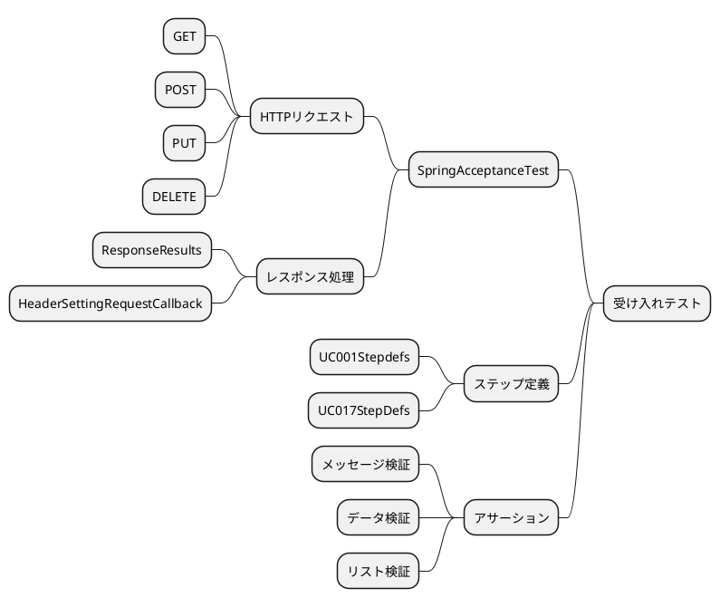
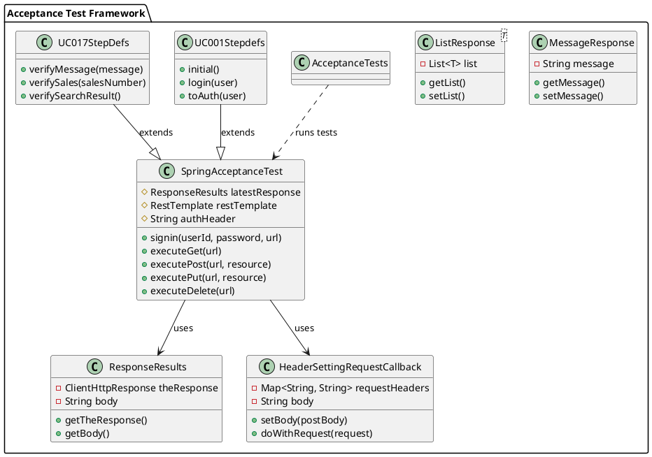
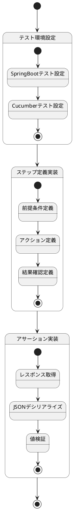

## 受け入れテスト概要

受け入れテストは、アプリケーションが要件を満たしているかを検証するためのテストです。このプロジェクトでは、SpringBootアプリケーションの受け入れテストを実行するための`SpringAcceptanceTest`クラスを使用しています。

### アーキテクチャ

受け入れテストのアーキテクチャは以下のクラス図で表されます：



このアーキテクチャでは、`SpringAcceptanceTest`が中心的な役割を果たし、HTTP通信とレスポンス処理を担当します。各ユースケースのステップ定義クラスは`SpringAcceptanceTest`を継承し、特定のユースケースのテストを実装します。

`ResponseResults`クラスはHTTPレスポンスをラップし、レスポンスボディへの簡単なアクセスを提供します。`HeaderSettingRequestCallback`クラスはHTTPリクエストにヘッダーとボディを設定するために使用されます。

`MessageResponse`と`ListResponse`は、APIからのレスポンスをデシリアライズするためのクラスです。これらのクラスを使用することで、JSONレスポンスを簡単にJavaオブジェクトに変換できます。

`AcceptanceTests`クラスは、Cucumberテストを実行するためのエントリーポイントとなります。このクラスは、Cucumberの設定を行い、すべての受け入れテストを実行します。

### SpringAcceptanceTestとの関連

`SpringAcceptanceTest`クラスは、SpringBootアプリケーションの受け入れテストを実行するための基底クラスです。このクラスは以下の機能を提供します：

1. SpringBootアプリケーションの起動と設定
2. RESTful APIへのHTTPリクエスト（GET、POST、PUT、DELETE）の送信
3. レスポンスの取得と検証

各ユースケースのステップ定義クラス（例：`UC001Stepdefs`、`UC017StepDefs`など）は、この`SpringAcceptanceTest`クラスを継承して、特定のユースケースのテストを実装します。

### 使い方

`SpringAcceptanceTest`クラスを使用するには、以下の手順に従います：

1. ステップ定義クラスで`SpringAcceptanceTest`を継承する
2. 必要に応じて認証を行う（`signin`メソッド）
3. APIエンドポイントにリクエストを送信する（`executeGet`、`executePost`、`executePut`、`executeDelete`メソッド）
4. レスポンスを検証する（`latestResponse`を使用）

## 実装ステップ

以下は受け入れテスト実装の状態遷移を示すステートチャートです：



## 詳細実装手順

### 1. テスト環境設定

受け入れテストを実行するためには、適切なテスト環境を設定する必要があります。このプロジェクトでは、SpringBootとCucumberを組み合わせて受け入れテストを実装しています。

#### SpringBootテスト設定

`SpringAcceptanceTest`クラスは、`@CucumberContextConfiguration`と`@SpringBootTest`アノテーションを使用して、SpringBootアプリケーションのテスト環境を設定します。

```java
@CucumberContextConfiguration
@SpringBootTest(classes = SmsApplication.class, webEnvironment = WebEnvironment.DEFINED_PORT)
public class SpringAcceptanceTest {
    protected static ResponseResults latestResponse = null;

    @Autowired
    protected RestTemplate restTemplate;

    String authHeader = null;

    // メソッド実装...
}
```

#### Cucumberテスト設定

Cucumberテストを実行するために、`AcceptanceTests`クラスを定義します。このクラスは、Cucumberの設定を行い、テストを実行するためのエントリーポイントとなります。

```java
@RunWith(Cucumber.class)
@CucumberOptions(
        features = "classpath:features/",
        glue = {"com.example.sms"},
        plugin = {
                "io.qameta.allure.cucumber7jvm.AllureCucumber7Jvm"
        }
)
public class AcceptanceTests {
}
```

### 2. ステップ定義実装

Cucumberのステップ定義は、特定のユースケースに対応するクラスで実装します。各ステップ定義クラスは`SpringAcceptanceTest`を継承し、Cucumberのアノテーション（`@前提`、`@もし`、`@ならば`、`@かつ`）を使用してステップを定義します。

#### 前提条件定義

前提条件は、テストの初期状態を設定するためのステップです。例えば、ユーザーの登録やデータの初期化などが含まれます。

```java
@前提(":UC001 ユーザーが登録されている")
public void initial() {
    userRepository.deleteAll();
    userRepository.save(User.of("U999999", "$2a$10$oxSJl.keBwxmsMLkcT9lPeAIxfNTPNQxpeywMrF7A3kVszwUTqfTK", "first", "last", RoleName.USER));
    userRepository.save(User.of("U888888", "$2a$10$oxSJl.keBwxmsMLkcT9lPeAIxfNTPNQxpeywMrF7A3kVszwUTqfTK", "first", "last", RoleName.ADMIN));
}
```

#### アクション定義

アクションは、テスト対象のシステムに対して行う操作を定義するステップです。例えば、ログインやデータの登録などが含まれます。

```java
@もし(":UC001 {string} でログインする")
public void login(String user) {
    String url = AUTH_API_URL + "/signin";
    if (user.equals("管理者権限")) {
        signin("U888888", "demo", url);
    } else {
        signin("U999999", "demo", url);
    }
}
```

#### 結果確認定義

結果確認は、アクションの結果を検証するためのステップです。例えば、レスポンスのステータスコードやボディの内容を検証します。

```java
@ならば(":UC001 {string} として認証される")
public void toAuth(String user) throws IOException {
    if (user.equals("管理者")) {
        executeGet(TEST_API_URL + "/admin");
    } else {
        executeGet(TEST_API_URL + "/user");
    }
}
```

### 3. アサーション実装

アサーションは、テストの結果を検証するための処理です。`SpringAcceptanceTest`クラスを使用したテストでは、主に以下の3つのタイプのアサーションが実装されています。

#### メッセージ検証

メッセージ検証は、APIからのレスポンスメッセージを検証するためのアサーションです。例えば、成功メッセージやエラーメッセージの内容を検証します。

```java
@ならば(":UC017 {string} が表示される")
public void verifyMessage(String message) throws JsonProcessingException {
    String result = latestResponse.getBody();
    ObjectMapper objectMapper = new ObjectMapper();
    MessageResponse response = objectMapper.readValue(result, MessageResponse.class);
    assertEquals(message, response.getMessage());
}
```

#### データ検証

データ検証は、APIからのレスポンスデータを検証するためのアサーションです。例えば、取得したデータの内容や構造を検証します。

```java
@ならば(":UC017 売上番号 {string} の売上データが取得できる")
public void verifySales(String salesNumber) throws JsonProcessingException {
    String result = latestResponse.getBody();
    ObjectMapper objectMapper = new ObjectMapper();
    objectMapper.registerModule(new JavaTimeModule());

    SalesResource salesResource = objectMapper.readValue(result, SalesResource.class);
    assertEquals(salesNumber, salesResource.getSalesNumber());
}
```

#### リスト検証

リスト検証は、APIからのレスポンスリストを検証するためのアサーションです。例えば、リストのサイズや内容を検証します。

```java
@ならば(":UC017 検索結果として売上一覧を取得できる")
public void verifySearchResult() throws JsonProcessingException {
    ObjectMapper objectMapper = new ObjectMapper();
    objectMapper.registerModule(new JavaTimeModule());

    String result = latestResponse.getBody();
    ListResponse<SalesResource> response = objectMapper.readValue(result, new TypeReference<>() {
    });
    List<SalesResource> actual = response.getList();
    assertEquals(3, actual.size());
}
```

## SpringAcceptanceTestの詳細

`SpringAcceptanceTest`クラスは、RESTful APIのテストを簡単に行うための基底クラスです。以下に、主要なメソッドとその使用方法を示します。

### 認証

`signin`メソッドを使用して、APIの認証を行います。このメソッドは、ユーザーIDとパスワードを使用して認証を行い、認証トークンを取得します。

```java
protected void signin(String userId, String password, String url) {
    RestTemplate restTemplate = new RestTemplate();
    HttpHeaders headers = new HttpHeaders();
    headers.setContentType(MediaType.APPLICATION_JSON);
    Map<String, Object> map = new HashMap<>();
    map.put("userId", userId);
    map.put("password", password);
    HttpEntity<Map<String, Object>> entity = new HttpEntity<>(map, headers);

    ResponseEntity<JwtResponse> response = restTemplate.postForEntity(url, entity, JwtResponse.class);

    JwtResponse jwtResponse = response.getBody();
    authHeader = Objects.requireNonNull(jwtResponse).getTokenType() + " " + jwtResponse.getAccessToken();
}
```

### GETリクエスト

`executeGet`メソッドを使用して、GETリクエストを送信します。このメソッドは、指定されたURLにGETリクエストを送信し、レスポンスを`latestResponse`に格納します。

```java
protected void executeGet(String url) {
    final Map<String, String> headers = new HashMap<>();
    headers.put("Accept", "application/json");
    headers.put("Authorization", authHeader);
    final HeaderSettingRequestCallback requestCallback = new HeaderSettingRequestCallback(headers);
    final ResponseResultErrorHandler errorHandler = new ResponseResultErrorHandler();

    restTemplate.setErrorHandler(errorHandler);
    latestResponse = restTemplate.execute(url, HttpMethod.GET, requestCallback, response -> {
        if (errorHandler.hadError) {
            return (errorHandler.getResults());
        } else {
            return (new ResponseResults(response));
        }
    });
}
```

### POSTリクエスト

`executePost`メソッドを使用して、POSTリクエストを送信します。このメソッドは、指定されたURLにJSONデータをPOSTし、レスポンスを`latestResponse`に格納します。

```java
protected void executePost(String url, String resource) {
    final Map<String, String> headers = new HashMap<>();
    headers.put("Accept", "application/json");
    headers.put("Content-Type", "application/json");
    headers.put("Authorization", authHeader);
    final HeaderSettingRequestCallback requestCallback = new HeaderSettingRequestCallback(headers);
    requestCallback.setBody(resource);
    final ResponseResultErrorHandler errorHandler = new ResponseResultErrorHandler();

    if (restTemplate == null) {
        restTemplate = new RestTemplate();
    }

    restTemplate.setErrorHandler(errorHandler);
    latestResponse = restTemplate
            .execute(url, HttpMethod.POST, requestCallback, response -> {
                if (errorHandler.hadError) {
                    return (errorHandler.getResults());
                } else {
                    return (new ResponseResults(response));
                }
            });
}

### PUTリクエスト

`executePut`メソッドを使用して、PUTリクエストを送信します。このメソッドは、指定されたURLにJSONデータをPUTし、レスポンスを`latestResponse`に格納します。

```java
protected void executePut(String url, String resource) {
    final Map<String, String> headers = new HashMap<>();
    headers.put("Accept", "application/json");
    headers.put("Content-Type", "application/json");
    headers.put("Authorization", authHeader);
    final HeaderSettingRequestCallback requestCallback = new HeaderSettingRequestCallback(headers);
    requestCallback.setBody(resource);
    final ResponseResultErrorHandler errorHandler = new ResponseResultErrorHandler();

    if (restTemplate == null) {
        restTemplate = new RestTemplate();
    }

    restTemplate.setErrorHandler(errorHandler);
    latestResponse = restTemplate
            .execute(url, HttpMethod.PUT, requestCallback, response -> {
                if (errorHandler.hadError) {
                    return (errorHandler.getResults());
                } else {
                    return (new ResponseResults(response));
                }
            });
}
```

### DELETEリクエスト

`executeDelete`メソッドを使用して、DELETEリクエストを送信します。このメソッドは、指定されたURLにDELETEリクエストを送信し、レスポンスを`latestResponse`に格納します。

```java
protected void executeDelete(String url) {
    final Map<String, String> headers = new HashMap<>();
    headers.put("Accept", "application/json");
    headers.put("Content-Type", "application/json");
    headers.put("Authorization", authHeader);
    final HeaderSettingRequestCallback requestCallback = new HeaderSettingRequestCallback(headers);
    final ResponseResultErrorHandler errorHandler = new ResponseResultErrorHandler();

    if (restTemplate == null) {
        restTemplate = new RestTemplate();
    }

    restTemplate.setErrorHandler(errorHandler);
    latestResponse = restTemplate
            .execute(url, HttpMethod.DELETE, requestCallback, response -> {
                if (errorHandler.hadError) {
                    return (errorHandler.getResults());
                } else {
                    return (new ResponseResults(response));
                }
            });
}
```

## まとめ

受け入れテストは、アプリケーションが要件を満たしているかを検証するための重要なテストです。このプロジェクトでは、`SpringAcceptanceTest`クラスを使用して、RESTful APIの受け入れテストを効率的に実装しています。

このドキュメントでは、`SpringAcceptanceTest`クラスの概要と使い方、ステップ定義の実装方法、アサーションの実装方法について説明しました。これらの知識を活用して、新しいユースケースの受け入れテストを実装することができます。

受け入れテストを実装する際は、以下の点に注意してください：

1. テストの前提条件、アクション、結果確認を明確に定義する
2. 適切なアサーションを使用して、期待される結果を検証する
3. エッジケースやエラーケースも考慮してテストを実装する

これらのガイドラインに従うことで、堅牢な受け入れテストを実装し、アプリケーションの品質を確保することができます。
