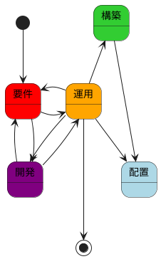
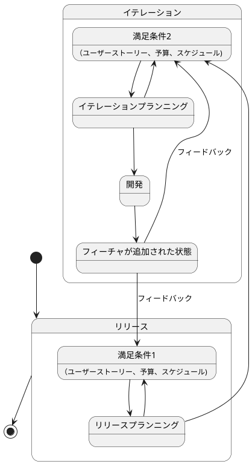
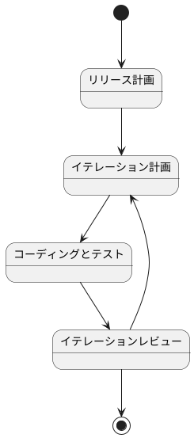
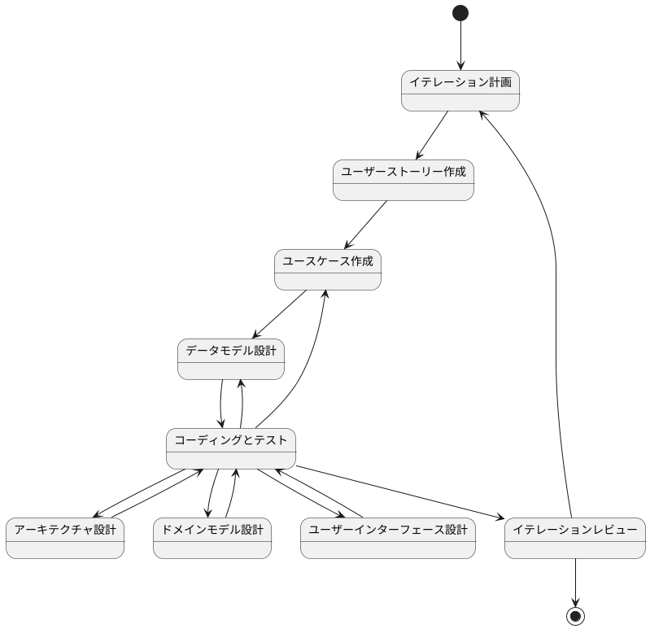
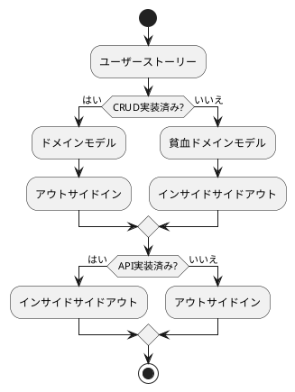
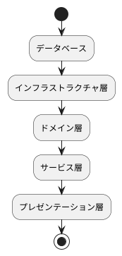
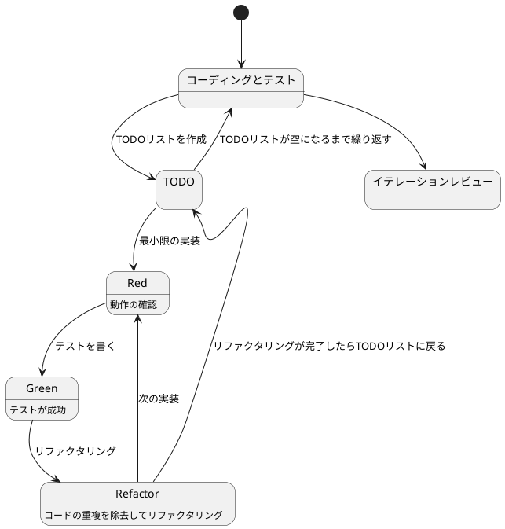
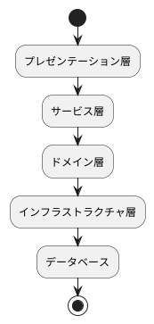
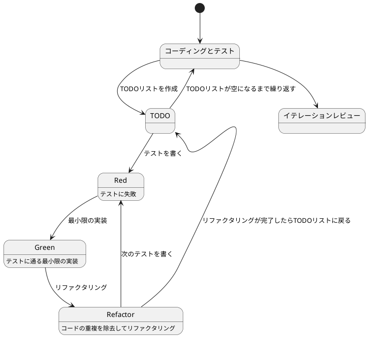

# 開発ガイド

## ライフサイクル

要件では、アプリケーションの機能や性能、品質、セキュリティ、運用、保守などの要件をまとめる活動を行います。開発では要件を満たすための設計、実装、テストなどの活動を行います。運用では、アプリケーションの運用、保守、改善などの活動を行います。構築では、アプリケーションの環境設定を行います。配置では、アプリケーションのビルドとデプロイを行います。これらの活動は相互に影響し合い、連携して行われるため、それぞれの活動において、開発者が守るべき規則やガイドラインをまとめたドキュメントを参照してください。

## 開発プロセス

アプリケーション開発は、アジャイル開発手法（XP）に基づいて進めます。

詳細は [エクストリームプログラミング](エクストリームプログラミング.md) を参照。

### 開発サイクル

計画づくりの詳細は [アジャイルな見積と計画づくり](アジャイルな見積と計画づくり.md)	 を参照。

### 開発フロー

## コーディングとテスト

実装は、以下の2つのアプローチを状況に応じて使い分けます：

**インサイドアウトアプローチ**

- データモデルから実装を開始
- ドメイン駆動設計に適合
- テストファーストな開発

**アウトサイドインアプローチ**

- UIから実装を開始
- プロトタイプ駆動開発に適合
- モックを活用した開発

#### インサイドアウト

#### アウトサイドイン

